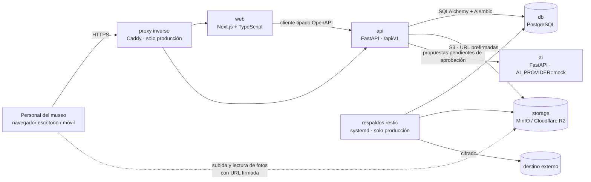

# MATP · Sistema de Gestión y Digitalización de Colecciones Museográficas

Herramienta **interna** (fase 1) para el Museo de Artes y Tradiciones Populares "Luis Repetto Málaga" (Dirección de Cultura, PUCP). Proyecto del Grupo 4, 1INF47, PUCP 2026-2.

## Visión

El MATP custodia más de 10 000 piezas registradas durante décadas en libros, Word, Access y hojas Excel con criterios distintos: una misma pieza puede tener código de inventario general (I), código de colección, código INC/Registro Nacional, código PUCP y otros históricos, escritos de formas diferentes, y unas 6 000 piezas no tienen código I. El sistema busca:

1. **Una ficha única por pieza** con identificador interno y todos sus códigos históricos conservados y normalizados (el código I nunca cambia; el comodato nunca recibe I).
2. **Importar las sábanas históricas sin duplicar ni pisar datos**, con reconciliación, previsualización y aprobación humana.
3. **Saber dónde está cada pieza** y qué información le falta (alertas y KPI de completitud).
4. **Encontrar cualquier pieza por cualquier código** y exportar en formatos abiertos.
5. **Trazabilidad total**: nada se borra, todo se audita y se puede revertir.
6. **IA asistiva opcional**, siempre con revisión humana.

## Empezar

- **Integrante nuevo**: [`docs/ONBOARDING.md`](docs/ONBOARDING.md) (setup en 5 comandos, OpenSpec en 1 minuto, flujo diario).
- Contexto para personas y agentes: [`CLAUDE.md`](CLAUDE.md)
- Specs (fuente de verdad): `openspec/specs/` · backlog y changes en curso: `openspec list` · asignación por célula: [`docs/ownership.md`](docs/ownership.md)
- Decisiones: [`docs/adr/`](docs/adr/) · preguntas abiertas al museo: [`docs/preguntas-contraparte.md`](docs/preguntas-contraparte.md) · estado del arranque: [`docs/estado-arranque.md`](docs/estado-arranque.md)

## Arquitectura



Servicios web desacoplados y contenerizados (Docker Compose), parametrizados por variables de entorno para desplegarse en la VM PUCP o, como contingencia, en free tier (Vercel, Render, Neon, R2). El proxy y los respaldos se definen en el change `despliegue-vm-y-respaldos` (aún no implementado).

| Servicio | Tecnología | Puerto local |
|---|---|---|
| `web` | Next.js + TypeScript (`apps/web`) | 3000 |
| `api` | FastAPI + SQLAlchemy (`apps/api`) | 8000 |
| `ai` | FastAPI, proveedor `mock` por defecto (`services/ai`) | 8100 |
| `db` | PostgreSQL 18 | 5432 |
| `storage` | MinIO (API S3) | 9000 (consola 9001) |

Estructura y motivos: [ADR-001](docs/adr/ADR-001-estructura-repo.md). Herramientas y versiones: [ADR-003](docs/adr/ADR-003-herramientas-base.md). Modelo de datos: [docs/modelo-datos.md](docs/modelo-datos.md) y [ADR-004](docs/adr/ADR-004-modelo-datos-auditoria.md). Contratos de API: [docs/api/](docs/api/README.md) y [ADR-005](docs/adr/ADR-005-contratos-api-identidad-provisional.md). Maqueta: [ADR-006](docs/adr/ADR-006-maqueta-arquitectura-frontend.md) y [guion de demo](docs/maqueta/recorrido-demo.md). Almacenamiento: [ADR-007](docs/adr/ADR-007-almacenamiento-objetos.md). IA: [ADR-008](docs/adr/ADR-008-estrategia-ia-desacoplada.md). Autenticación (propuesta): [ADR-009](docs/adr/ADR-009-autenticacion-sesiones.md). Backlog paralelo: [ADR-010](docs/adr/ADR-010-organizacion-backlog-paralelo.md). Despliegue y respaldos (propuesta): [ADR-011](docs/adr/ADR-011-despliegue-proxy-respaldos.md).

## Requisitos

- Git, Node.js 24 LTS, Python 3.14 (3.13 también sirve), Docker Desktop / Docker Engine con Compose v2.
- No se necesita `make` (ver [ADR-000](docs/adr/ADR-000-herramientas-y-comandos.md)).

## Inicio rápido

```bash
cp .env.example .env        # revise los valores; nunca suba .env
npm install                 # dependencias del frontend (npm workspaces)
npm run setup               # crea .venv de apps/api y services/ai e instala dependencias
npm run dev                 # docker compose up --build -d
npm run migrate             # crea el esquema (Alembic)
npm run seed                # ~300 piezas sintéticas con fotos placeholder
```

Luego abra http://localhost:3000 (estado de servicios), http://localhost:8000/health y http://localhost:8000/docs.
En PowerShell existen equivalentes: `scripts/setup.ps1`, `scripts/dev.ps1`, `scripts/test.ps1`.

## Comandos

| Propósito | Comando |
|---|---|
| Preparar entornos Python | `npm run setup` |
| Levantar / detener / logs | `npm run dev` · `npm run down` · `npm run logs` |
| Desarrollo sin contenedores de app | `npm run dev:api` · `npm run dev:ai` · `npm run dev:web` (con `docker compose up -d db storage`; exporte las variables de `.env` cambiando los hosts `db`/`storage`/`ai` por `localhost`) |
| Lint (ruff, eslint, tsc) | `npm run lint` |
| Pruebas (pytest, vitest) | `npm test` |
| Formatear Python | `npm run format` |
| Migraciones / datos semilla | `npm run migrate` · `npm run seed` |
| Contratos OpenAPI y cliente tipado | `npm run openapi` · `npm run openapi:client` · `npm run openapi:check` |
| Validar specs | `npm run validate:specs` |

## Flujo de trabajo

Spec primero: `openspec list` → `/opsx:apply <change>` en la rama `feat/<change>` → `npm run lint && npm test && npm run validate:specs` → PR. Detalle en `CLAUDE.md`.

## Estado y backlog

- **Hecho en el arranque**: specs de 12 capacidades, monorepo, modelo de datos con auditoría y soft-delete, contrato OpenAPI de todos los módulos (con stubs explícitos), maqueta navegable de 11 pantallas en modo simulado, CI configurado (primer run pendiente).
- **Pendiente de entorno**: verificación con Docker (compose, migraciones y seed contra PostgreSQL). Detalle en [`docs/estado-arranque.md`](docs/estado-arranque.md).
- **Backlog**: 15 changes propuestos en `openspec/changes/` (catálogo, importación, consulta y control, plataforma, IA), listos para `/opsx:apply`; asignación propuesta en [`docs/ownership.md`](docs/ownership.md).
- **Manual de usuario**: se completa por change en [`docs/manual-usuario/`](docs/manual-usuario/README.md).

## Datos

Solo datos **sintéticos** (Ley 29733, RNF-014). Nada de datos reales del museo en el repositorio.
