# Modelo de datos núcleo (MATP)

> Generado desde los modelos SQLAlchemy (`apps/api/app/models.py`) del change `modelo-datos-nucleo` (2026-09-17). Migración: `apps/api/alembic/versions/0001_core_data_model.py`. Decisiones: `openspec/changes/modelo-datos-nucleo/design.md` (se archiva en `openspec/changes/archive/`) y `docs/adr/ADR-004-modelo-datos-auditoria.md`.

## Diagrama vigente y extensiones

- **Diagrama del modelo vigente**: [`docs/diagramas/modelo-datos/er.puml`](diagramas/modelo-datos/er.puml), generado desde los modelos SQLAlchemy con `npm run diagrams:er` y verificado en CI con `npm run diagrams:check`.
- **Extensiones previstas en el expediente**: [`docs/diagramas/cap6/er_extensiones.puml`](diagramas/cap6/er_extensiones.puml) (capítulo 6). Todas están planificadas, **ninguna está implementada todavía**; cada una indica su change o spec de origen.

### Extensiones planificadas

| Extensión | Requisito | Origen |
|---|---|---|
| `loan`, `loan_item`, `exhibition`, `exhibition_piece` | RF-018 | change por proponer: `prestamos-y-exposiciones` |
| `piece_document` | RF-015 | spec `multimedia` |
| `valuation` | RF-037 | change `reportes-inventario`, D6 |
| `piece.version` | — | change `ficha-pieza-crud`, D2 |
| `location.space_kind`, `piece_movement.corrects_movement_id`, `idempotency_key` | — | change `ubicacion-jerarquica-y-movimientos` |
| `collection.default_usage_restriction_term_id` | — | change `fotografias-multiples-por-pieza` |
| `user_session`, `sensitive_access_log` | — | change `autenticacion-y-matriz-permisos` |
| `quality_job`, `quality_setting` | — | change `deteccion-duplicados-y-cola-revision` |

## Principios

- **RN-001**: toda entidad usa un UUID interno como clave primaria; los códigos del museo viven en `piece_identifier` (1:N) con valor original, valor normalizado, vigencia y fuente.
- **RN-002/RN-003/RN-004**: código I único entre identificadores vigentes no eliminados (índice parcial), bloqueado al asignarse y solo para piezas en propiedad; préstamo temporal sin I ni código de colección.
- **RN-005**: soft-delete (`deleted_at`, `deleted_by_id`, `deletion_reason`) y auditoría campo a campo automática; `audit_log`, `piece_movement`, `piece_source_record` y `conservation_assessment` son de solo inserción (guardas ORM + triggers).
- **RN-009**: `ai_suggestion` no admite aprobación o rechazo sin revisor (CHECK en la base).
- **RN-010**: vocabularios (`vocabulary`/`term`) y tipos de identificador (`identifier_type`) son datos, no código.
- Nada de binarios en la base: `media_asset.storage_key` apunta al almacenamiento S3.

## Diagrama entidad-relación

```mermaid
erDiagram
    COLLECTION ||--o{ COLLECTION : "subcolección (parent_id)"
    COLLECTION ||--o{ PIECE : agrupa
    PIECE ||--o{ PIECE : "conjunto (parent_piece_id) / fusión (merged_into_id)"
    PIECE ||--o{ PIECE_IDENTIFIER : "tiene 0..N códigos"
    IDENTIFIER_TYPE ||--o{ PIECE_IDENTIFIER : "tipo (code)"
    PIECE_IDENTIFIER |o--o| PIECE_IDENTIFIER : "replaced_by_id"
    VOCABULARY ||--o{ TERM : contiene
    TERM ||--o{ PIECE : "categoría, tipo de bien, adquisición, conservación, disponibilidad"
    PIECE ||--o{ PIECE_MATERIAL : materiales
    TERM ||--o{ PIECE_MATERIAL : material
    PIECE ||--o{ CONSERVATION_ASSESSMENT : "historial (solo inserción)"
    PIECE ||--o{ PIECE_SOURCE_RECORD : "datos de origen (solo inserción)"
    LOCATION ||--o{ LOCATION : "sede > espacio > mueble > nivel > contenedor"
    LOCATION ||--o{ PIECE : "ubicación actual"
    PIECE ||--o{ PIECE_MOVEMENT : "movimientos (solo inserción)"
    PIECE ||--o{ MEDIA_ASSET : "fotos (archivo en S3)"
    TERM ||--o{ MEDIA_ASSET : "tipo de vista, restricción"
    IMPORT_MAPPING_TEMPLATE ||--o{ IMPORT_BATCH : plantilla
    IMPORT_BATCH ||--o{ IMPORT_ROW : filas
    IMPORT_BATCH ||--o{ PIECE_SOURCE_RECORD : origen
    IMPORT_ROW }o--o| PIECE : "pieza objetivo"
    PIECE ||--o{ DUPLICATE_CANDIDATE : "par A/B"
    IMPORT_ROW ||--o{ DUPLICATE_CANDIDATE : "fila vs pieza"
    PIECE ||--o{ AI_SUGGESTION : sugerencias
    APP_USER ||--o{ USER_ROLE : roles
    ROLE ||--o{ USER_ROLE : asignado
    ROLE ||--o{ ROLE_PERMISSION : permisos
    PERMISSION ||--o{ ROLE_PERMISSION : otorgado
    APP_USER ||--o{ AUDIT_LOG : "autor del cambio"

    PIECE {
        uuid id PK
        string title "denominación (obligatoria)"
        string tenure_regime "OWNED | LOAN_FOR_USE | TEMPORARY_LOAN"
        string legal_owner "PUCP si OWNED (RN-006)"
        string period_text "texto original"
        string period_type
        int period_from
        int period_to
        text dimensions_text
        jsonb dimensions "estructuradas"
        uuid collection_id FK
        uuid current_location_id FK
        timestamptz deleted_at "soft-delete"
    }
    PIECE_IDENTIFIER {
        uuid id PK
        uuid piece_id FK
        string identifier_type_code FK
        text original_value "nunca se modifica"
        string normalized_value
        string normalization_status
        string detected_format
        bool is_current
        bool is_locked "I bloqueado (RN-002)"
        string source
    }
    IDENTIFIER_TYPE {
        uuid id PK
        string code UK "I, COLECCION, INC_RN, PUCP, PROPIETARIO, OTRO"
        string normalization_rule
        bool is_unique_when_current
        bool locks_on_assignment
        bool owned_pieces_only
        bool allowed_for_temporary_loan
    }
    MEDIA_ASSET {
        uuid id PK
        uuid piece_id FK
        string storage_key UK "clave en S3"
        string content_sha256
        int sort_order
        bool is_primary
    }
    AUDIT_LOG {
        uuid id PK
        uuid change_set_id
        string entity_type
        uuid entity_id
        string field
        jsonb old_value
        jsonb new_value
        string action "CREATE | UPDATE | SOFT_DELETE | RESTORE | CORRECTION | MERGE | REVERT"
        string origin "MANUAL | IMPORT | AI | SYSTEM"
        string origin_ref "lote o sugerencia"
        uuid user_id FK
        text reason
    }
    AI_SUGGESTION {
        uuid id PK
        string function_code "RIA_01..RIA_05"
        string status "PENDING | APPROVED | PARTIALLY_APPROVED | REJECTED"
        jsonb output_data
        jsonb approved_data
        uuid reviewed_by_id FK
    }
```

## Tablas

Tipos expresados en PostgreSQL. `ck_*` = restricción CHECK; los enumerados se guardan como `VARCHAR(40)` con CHECK.

### `app_user`

| Columna | Tipo | Nulo | Referencia |
|---|---|---|---|
| `email` | VARCHAR(254) | no |  |
| `full_name` | VARCHAR(200) | no |  |
| `password_hash` | VARCHAR(255) | sí |  |
| `is_active` | BOOLEAN | no |  |
| `is_synthetic` | BOOLEAN | no |  |
| `external_subject` | VARCHAR(255) | sí |  |
| `last_login_at` | TIMESTAMP WITH TIME ZONE | sí |  |
| `failed_login_count` | INTEGER | no |  |
| `locked_until` | TIMESTAMP WITH TIME ZONE | sí |  |
| `id` | UUID | no | PK |
| `created_at` | TIMESTAMP WITH TIME ZONE | no |  |
| `updated_at` | TIMESTAMP WITH TIME ZONE | no |  |
| `deleted_at` | TIMESTAMP WITH TIME ZONE | sí |  |
| `deleted_by_id` | UUID | sí | `app_user.id` |
| `deletion_reason` | TEXT | sí |  |

Índices y restricciones: `ix_app_user_deleted_at` sobre (deleted_at); `uq_app_user_email_active` (único) sobre (lower) WHERE deleted_at IS NULL.

### `permission`

| Columna | Tipo | Nulo | Referencia |
|---|---|---|---|
| `code` | VARCHAR(80) | no |  |
| `description` | TEXT | no |  |
| `id` | UUID | no | PK |
| `created_at` | TIMESTAMP WITH TIME ZONE | no |  |
| `updated_at` | TIMESTAMP WITH TIME ZONE | no |  |

Índices y restricciones: `uq_permission_code` (único) sobre (code).

### `audit_log`

| Columna | Tipo | Nulo | Referencia |
|---|---|---|---|
| `occurred_at` | TIMESTAMP WITH TIME ZONE | no |  |
| `change_set_id` | UUID | no |  |
| `entity_type` | VARCHAR(60) | no |  |
| `entity_id` | UUID | no |  |
| `field` | VARCHAR(100) | sí |  |
| `old_value` | JSONB | sí |  |
| `new_value` | JSONB | sí |  |
| `action` | VARCHAR(40) | no |  |
| `origin` | VARCHAR(40) | no |  |
| `origin_ref` | VARCHAR(100) | sí |  |
| `user_id` | UUID | sí | `app_user.id` |
| `actor_label` | VARCHAR(100) | sí |  |
| `reason` | TEXT | sí |  |
| `id` | UUID | no | PK |

Índices y restricciones: `ix_audit_log_change_set_id` sobre (change_set_id); `ix_audit_log_entity` sobre (entity_type, entity_id, occurred_at); `ix_audit_log_user_id` sobre (user_id).

### `collection`

| Columna | Tipo | Nulo | Referencia |
|---|---|---|---|
| `parent_id` | UUID | sí | `collection.id` |
| `name` | VARCHAR(300) | no |  |
| `acronym` | VARCHAR(40) | sí |  |
| `acronym_normalized` | VARCHAR(40) | sí |  |
| `description` | TEXT | sí |  |
| `default_tenure_regime` | VARCHAR(40) | no |  |
| `origin_description` | TEXT | sí |  |
| `is_active` | BOOLEAN | no |  |
| `id` | UUID | no | PK |
| `created_at` | TIMESTAMP WITH TIME ZONE | no |  |
| `updated_at` | TIMESTAMP WITH TIME ZONE | no |  |
| `deleted_at` | TIMESTAMP WITH TIME ZONE | sí |  |
| `deleted_by_id` | UUID | sí | `app_user.id` |
| `deletion_reason` | TEXT | sí |  |

Índices y restricciones: `ix_collection_deleted_at` sobre (deleted_at); `ix_collection_parent_id` sobre (parent_id); `uq_collection_acronym_active` (único) sobre (acronym_normalized) WHERE deleted_at IS NULL AND acronym_normalized IS NOT NULL.

### `identifier_type`

Parametrizable identifier type (RN-010).

| Columna | Tipo | Nulo | Referencia |
|---|---|---|---|
| `code` | VARCHAR(40) | no |  |
| `label` | VARCHAR(200) | no |  |
| `description` | TEXT | sí |  |
| `normalization_rule` | VARCHAR(40) | no |  |
| `is_unique_when_current` | BOOLEAN | no |  |
| `locks_on_assignment` | BOOLEAN | no |  |
| `owned_pieces_only` | BOOLEAN | no |  |
| `allowed_for_temporary_loan` | BOOLEAN | no |  |
| `sort_order` | INTEGER | no |  |
| `is_active` | BOOLEAN | no |  |
| `id` | UUID | no | PK |
| `created_at` | TIMESTAMP WITH TIME ZONE | no |  |
| `updated_at` | TIMESTAMP WITH TIME ZONE | no |  |
| `deleted_at` | TIMESTAMP WITH TIME ZONE | sí |  |
| `deleted_by_id` | UUID | sí | `app_user.id` |
| `deletion_reason` | TEXT | sí |  |

Índices y restricciones: `ix_identifier_type_deleted_at` sobre (deleted_at); `uq_identifier_type_code` (único) sobre (code).

### `import_mapping_template`

| Columna | Tipo | Nulo | Referencia |
|---|---|---|---|
| `name` | VARCHAR(200) | no |  |
| `source_name` | VARCHAR(200) | no |  |
| `header_signature` | VARCHAR(64) | no |  |
| `mapping` | JSONB | no |  |
| `description` | TEXT | sí |  |
| `id` | UUID | no | PK |
| `created_at` | TIMESTAMP WITH TIME ZONE | no |  |
| `updated_at` | TIMESTAMP WITH TIME ZONE | no |  |
| `deleted_at` | TIMESTAMP WITH TIME ZONE | sí |  |
| `deleted_by_id` | UUID | sí | `app_user.id` |
| `deletion_reason` | TEXT | sí |  |

Índices y restricciones: `ix_import_mapping_template_deleted_at` sobre (deleted_at); `ix_import_mapping_template_header_signature` sobre (header_signature).

### `location`

| Columna | Tipo | Nulo | Referencia |
|---|---|---|---|
| `parent_id` | UUID | sí | `location.id` |
| `level` | VARCHAR(40) | no |  |
| `code` | VARCHAR(80) | no |  |
| `name` | VARCHAR(200) | no |  |
| `description` | TEXT | sí |  |
| `is_active` | BOOLEAN | no |  |
| `id` | UUID | no | PK |
| `created_at` | TIMESTAMP WITH TIME ZONE | no |  |
| `updated_at` | TIMESTAMP WITH TIME ZONE | no |  |
| `deleted_at` | TIMESTAMP WITH TIME ZONE | sí |  |
| `deleted_by_id` | UUID | sí | `app_user.id` |
| `deletion_reason` | TEXT | sí |  |

Índices y restricciones: `ix_location_deleted_at` sobre (deleted_at); `ix_location_parent_id` sobre (parent_id); `uq_location_code` (único) sobre (code).

### `role`

| Columna | Tipo | Nulo | Referencia |
|---|---|---|---|
| `code` | VARCHAR(40) | no |  |
| `name` | VARCHAR(120) | no |  |
| `description` | TEXT | sí |  |
| `is_enabled` | BOOLEAN | no |  |
| `id` | UUID | no | PK |
| `created_at` | TIMESTAMP WITH TIME ZONE | no |  |
| `updated_at` | TIMESTAMP WITH TIME ZONE | no |  |
| `deleted_at` | TIMESTAMP WITH TIME ZONE | sí |  |
| `deleted_by_id` | UUID | sí | `app_user.id` |
| `deletion_reason` | TEXT | sí |  |

Índices y restricciones: `ix_role_deleted_at` sobre (deleted_at); `uq_role_code` (único) sobre (code).

### `vocabulary`

| Columna | Tipo | Nulo | Referencia |
|---|---|---|---|
| `code` | VARCHAR(60) | no |  |
| `name` | VARCHAR(200) | no |  |
| `description` | TEXT | sí |  |
| `id` | UUID | no | PK |
| `created_at` | TIMESTAMP WITH TIME ZONE | no |  |
| `updated_at` | TIMESTAMP WITH TIME ZONE | no |  |
| `deleted_at` | TIMESTAMP WITH TIME ZONE | sí |  |
| `deleted_by_id` | UUID | sí | `app_user.id` |
| `deletion_reason` | TEXT | sí |  |

Índices y restricciones: `ix_vocabulary_deleted_at` sobre (deleted_at); `uq_vocabulary_code` (único) sobre (code).

### `import_batch`

| Columna | Tipo | Nulo | Referencia |
|---|---|---|---|
| `source_name` | VARCHAR(200) | no |  |
| `file_name` | VARCHAR(300) | no |  |
| `file_storage_key` | VARCHAR(500) | sí |  |
| `file_sha256` | VARCHAR(64) | sí |  |
| `template_id` | UUID | sí | `import_mapping_template.id` |
| `status` | VARCHAR(40) | no |  |
| `status_reason` | TEXT | sí |  |
| `uploaded_by_id` | UUID | sí | `app_user.id` |
| `approved_by_id` | UUID | sí | `app_user.id` |
| `approved_at` | TIMESTAMP WITH TIME ZONE | sí |  |
| `stage_timestamps` | JSONB | sí |  |
| `counts` | JSONB | sí |  |
| `id` | UUID | no | PK |
| `created_at` | TIMESTAMP WITH TIME ZONE | no |  |
| `updated_at` | TIMESTAMP WITH TIME ZONE | no |  |
| `deleted_at` | TIMESTAMP WITH TIME ZONE | sí |  |
| `deleted_by_id` | UUID | sí | `app_user.id` |
| `deletion_reason` | TEXT | sí |  |

Índices y restricciones: `ix_import_batch_deleted_at` sobre (deleted_at).

### `role_permission`

| Columna | Tipo | Nulo | Referencia |
|---|---|---|---|
| `role_id` | UUID | no | `role.id` |
| `permission_id` | UUID | no | `permission.id` |
| `id` | UUID | no | PK |
| `created_at` | TIMESTAMP WITH TIME ZONE | no |  |
| `updated_at` | TIMESTAMP WITH TIME ZONE | no |  |
| `deleted_at` | TIMESTAMP WITH TIME ZONE | sí |  |
| `deleted_by_id` | UUID | sí | `app_user.id` |
| `deletion_reason` | TEXT | sí |  |

Índices y restricciones: `ix_role_permission_deleted_at` sobre (deleted_at); `ix_role_permission_permission_id` sobre (permission_id); `ix_role_permission_role_id` sobre (role_id); `uq_role_permission_active` (único) sobre (role_id, permission_id) WHERE deleted_at IS NULL.

### `term`

| Columna | Tipo | Nulo | Referencia |
|---|---|---|---|
| `vocabulary_id` | UUID | no | `vocabulary.id` |
| `code` | VARCHAR(80) | no |  |
| `label` | VARCHAR(200) | no |  |
| `description` | TEXT | sí |  |
| `sort_order` | INTEGER | no |  |
| `is_active` | BOOLEAN | no |  |
| `external_uri` | VARCHAR(500) | sí |  |
| `id` | UUID | no | PK |
| `created_at` | TIMESTAMP WITH TIME ZONE | no |  |
| `updated_at` | TIMESTAMP WITH TIME ZONE | no |  |
| `deleted_at` | TIMESTAMP WITH TIME ZONE | sí |  |
| `deleted_by_id` | UUID | sí | `app_user.id` |
| `deletion_reason` | TEXT | sí |  |

Índices y restricciones: `ix_term_deleted_at` sobre (deleted_at); `ix_term_vocabulary_id` sobre (vocabulary_id); `uq_term_vocabulary_id_code` (único) sobre (vocabulary_id, code).

### `user_role`

| Columna | Tipo | Nulo | Referencia |
|---|---|---|---|
| `user_id` | UUID | no | `app_user.id` |
| `role_id` | UUID | no | `role.id` |
| `id` | UUID | no | PK |
| `created_at` | TIMESTAMP WITH TIME ZONE | no |  |
| `updated_at` | TIMESTAMP WITH TIME ZONE | no |  |
| `deleted_at` | TIMESTAMP WITH TIME ZONE | sí |  |
| `deleted_by_id` | UUID | sí | `app_user.id` |
| `deletion_reason` | TEXT | sí |  |

Índices y restricciones: `ix_user_role_deleted_at` sobre (deleted_at); `ix_user_role_role_id` sobre (role_id); `ix_user_role_user_id` sobre (user_id); `uq_user_role_active` (único) sobre (user_id, role_id) WHERE deleted_at IS NULL.

### `piece`

A museum piece. Its only key is the internal UUID; museum codes are identifiers (RN-001).

| Columna | Tipo | Nulo | Referencia |
|---|---|---|---|
| `title` | VARCHAR(500) | no |  |
| `description` | TEXT | sí |  |
| `collection_id` | UUID | sí | `collection.id` |
| `tenure_regime` | VARCHAR(40) | no |  |
| `legal_owner` | VARCHAR(200) | sí |  |
| `lender_name` | VARCHAR(300) | sí |  |
| `loan_agreement_ref` | VARCHAR(200) | sí |  |
| `temporary_inventory_number` | VARCHAR(60) | sí |  |
| `acquisition_method_term_id` | UUID | sí | `term.id` |
| `entry_date` | DATE | sí |  |
| `author` | VARCHAR(300) | sí |  |
| `provenance` | VARCHAR(300) | sí |  |
| `period_text` | VARCHAR(200) | sí |  |
| `period_type` | VARCHAR(40) | sí |  |
| `period_from` | INTEGER | sí |  |
| `period_to` | INTEGER | sí |  |
| `object_type_term_id` | UUID | sí | `term.id` |
| `category_term_id` | UUID | sí | `term.id` |
| `dimensions_text` | TEXT | sí |  |
| `dimensions` | JSONB | sí |  |
| `conservation_status_term_id` | UUID | sí | `term.id` |
| `recorded_by` | VARCHAR(200) | sí |  |
| `notes` | TEXT | sí |  |
| `parent_piece_id` | UUID | sí | `piece.id` |
| `merged_into_id` | UUID | sí | `piece.id` |
| `availability_term_id` | UUID | sí | `term.id` |
| `current_location_id` | UUID | sí | `location.id` |
| `id` | UUID | no | PK |
| `created_at` | TIMESTAMP WITH TIME ZONE | no |  |
| `updated_at` | TIMESTAMP WITH TIME ZONE | no |  |
| `deleted_at` | TIMESTAMP WITH TIME ZONE | sí |  |
| `deleted_by_id` | UUID | sí | `app_user.id` |
| `deletion_reason` | TEXT | sí |  |

Índices y restricciones: `ix_piece_category_term_id` sobre (category_term_id); `ix_piece_collection_id` sobre (collection_id); `ix_piece_current_location_id` sobre (current_location_id); `ix_piece_deleted_at` sobre (deleted_at); `ix_piece_parent_piece_id` sobre (parent_piece_id); `ix_piece_title` sobre (title); `ck_piece_period_range`: CHECK (period_from IS NULL OR period_to IS NULL OR period_from <= period_to).

### `ai_suggestion`

| Columna | Tipo | Nulo | Referencia |
|---|---|---|---|
| `function_code` | VARCHAR(40) | no |  |
| `status` | VARCHAR(40) | no |  |
| `provider` | VARCHAR(60) | no |  |
| `model` | VARCHAR(120) | sí |  |
| `piece_id` | UUID | sí | `piece.id` |
| `import_batch_id` | UUID | sí | `import_batch.id` |
| `input_data` | JSONB | no |  |
| `output_data` | JSONB | no |  |
| `approved_data` | JSONB | sí |  |
| `requested_by_id` | UUID | sí | `app_user.id` |
| `reviewed_by_id` | UUID | sí | `app_user.id` |
| `reviewed_at` | TIMESTAMP WITH TIME ZONE | sí |  |
| `rejection_reason` | TEXT | sí |  |
| `id` | UUID | no | PK |
| `created_at` | TIMESTAMP WITH TIME ZONE | no |  |
| `updated_at` | TIMESTAMP WITH TIME ZONE | no |  |

Índices y restricciones: `ix_ai_suggestion_piece_id` sobre (piece_id); `ck_ai_suggestion_decision_requires_reviewer`: CHECK (status = 'PENDING' OR (reviewed_by_id IS NOT NULL AND reviewed_at IS NOT NULL)); `ck_ai_suggestion_rejection_requires_reason`: CHECK (status <> 'REJECTED' OR rejection_reason IS NOT NULL); `ck_ai_suggestion_approval_requires_data`: CHECK (status NOT IN ('APPROVED', 'PARTIALLY_APPROVED') OR approved_data IS NOT NULL).

### `conservation_assessment`

History of conservation status evaluations (RF-012). Append-only.

| Columna | Tipo | Nulo | Referencia |
|---|---|---|---|
| `piece_id` | UUID | no | `piece.id` |
| `status_term_id` | UUID | no | `term.id` |
| `assessed_at` | TIMESTAMP WITH TIME ZONE | no |  |
| `assessed_by_user_id` | UUID | sí | `app_user.id` |
| `assessed_by_label` | VARCHAR(200) | sí |  |
| `notes` | TEXT | sí |  |
| `id` | UUID | no | PK |

Índices y restricciones: `ix_conservation_assessment_piece_id` sobre (piece_id).

### `import_row`

| Columna | Tipo | Nulo | Referencia |
|---|---|---|---|
| `batch_id` | UUID | no | `import_batch.id` |
| `source_row_number` | INTEGER | no |  |
| `raw_data` | JSONB | no |  |
| `mapped_data` | JSONB | sí |  |
| `classification` | VARCHAR(40) | sí |  |
| `has_validation_errors` | BOOLEAN | no |  |
| `validation_errors` | JSONB | sí |  |
| `matches` | JSONB | sí |  |
| `diff` | JSONB | sí |  |
| `decision` | VARCHAR(40) | no |  |
| `decision_reason` | TEXT | sí |  |
| `target_piece_id` | UUID | sí | `piece.id` |
| `id` | UUID | no | PK |
| `created_at` | TIMESTAMP WITH TIME ZONE | no |  |
| `updated_at` | TIMESTAMP WITH TIME ZONE | no |  |

Índices y restricciones: `ix_import_row_batch_classification` sobre (batch_id, classification); `ix_import_row_batch_id` sobre (batch_id); `uq_import_row_batch_id_source_row_number` (único) sobre (batch_id, source_row_number).

### `media_asset`

| Columna | Tipo | Nulo | Referencia |
|---|---|---|---|
| `piece_id` | UUID | no | `piece.id` |
| `storage_key` | VARCHAR(500) | no |  |
| `original_filename` | VARCHAR(300) | sí |  |
| `content_type` | VARCHAR(100) | no |  |
| `size_bytes` | BIGINT | no |  |
| `content_sha256` | VARCHAR(64) | no |  |
| `width_px` | INTEGER | sí |  |
| `height_px` | INTEGER | sí |  |
| `view_type_term_id` | UUID | sí | `term.id` |
| `sort_order` | INTEGER | no |  |
| `is_primary` | BOOLEAN | no |  |
| `photographer` | VARCHAR(200) | sí |  |
| `taken_on` | DATE | sí |  |
| `usage_restriction_term_id` | UUID | sí | `term.id` |
| `restriction_note` | TEXT | sí |  |
| `extra_metadata` | JSONB | sí |  |
| `id` | UUID | no | PK |
| `created_at` | TIMESTAMP WITH TIME ZONE | no |  |
| `updated_at` | TIMESTAMP WITH TIME ZONE | no |  |
| `deleted_at` | TIMESTAMP WITH TIME ZONE | sí |  |
| `deleted_by_id` | UUID | sí | `app_user.id` |
| `deletion_reason` | TEXT | sí |  |

Índices y restricciones: `ix_media_asset_deleted_at` sobre (deleted_at); `ix_media_asset_piece_hash` sobre (piece_id, content_sha256); `ix_media_asset_piece_id` sobre (piece_id); `uq_media_asset_storage_key` (único) sobre (storage_key).

### `piece_identifier`

External identifier of a piece (1:N). Historical values are kept as not current.

| Columna | Tipo | Nulo | Referencia |
|---|---|---|---|
| `piece_id` | UUID | no | `piece.id` |
| `identifier_type_code` | VARCHAR(40) | no | `identifier_type.code` |
| `original_value` | TEXT | no |  |
| `normalized_value` | VARCHAR(200) | sí |  |
| `normalization_status` | VARCHAR(40) | no |  |
| `detected_format` | VARCHAR(40) | sí |  |
| `is_current` | BOOLEAN | no |  |
| `is_locked` | BOOLEAN | no |  |
| `source` | VARCHAR(200) | sí |  |
| `recorded_at` | TIMESTAMP WITH TIME ZONE | no |  |
| `replaced_by_id` | UUID | sí | `piece_identifier.id` |
| `notes` | TEXT | sí |  |
| `id` | UUID | no | PK |
| `created_at` | TIMESTAMP WITH TIME ZONE | no |  |
| `updated_at` | TIMESTAMP WITH TIME ZONE | no |  |
| `deleted_at` | TIMESTAMP WITH TIME ZONE | sí |  |
| `deleted_by_id` | UUID | sí | `app_user.id` |
| `deletion_reason` | TEXT | sí |  |

Índices y restricciones: `ix_piece_identifier_deleted_at` sobre (deleted_at); `ix_piece_identifier_identifier_type_code` sobre (identifier_type_code); `ix_piece_identifier_normalized_value` sobre (normalized_value); `ix_piece_identifier_piece_id` sobre (piece_id); `uq_piece_identifier_current_inventory_code` (único) sobre (normalized_value) WHERE identifier_type_code = 'I' AND is_current AND deleted_at IS NULL.

### `piece_material`

| Columna | Tipo | Nulo | Referencia |
|---|---|---|---|
| `piece_id` | UUID | no | `piece.id` |
| `term_id` | UUID | no | `term.id` |
| `id` | UUID | no | PK |
| `created_at` | TIMESTAMP WITH TIME ZONE | no |  |
| `updated_at` | TIMESTAMP WITH TIME ZONE | no |  |
| `deleted_at` | TIMESTAMP WITH TIME ZONE | sí |  |
| `deleted_by_id` | UUID | sí | `app_user.id` |
| `deletion_reason` | TEXT | sí |  |

Índices y restricciones: `ix_piece_material_deleted_at` sobre (deleted_at); `ix_piece_material_piece_id` sobre (piece_id); `ix_piece_material_term_id` sobre (term_id).

### `piece_movement`

| Columna | Tipo | Nulo | Referencia |
|---|---|---|---|
| `piece_id` | UUID | no | `piece.id` |
| `movement_type` | VARCHAR(40) | no |  |
| `from_location_id` | UUID | sí | `location.id` |
| `to_location_id` | UUID | sí | `location.id` |
| `reason` | TEXT | sí |  |
| `performed_by_user_id` | UUID | sí | `app_user.id` |
| `performed_by_label` | VARCHAR(200) | sí |  |
| `occurred_at` | TIMESTAMP WITH TIME ZONE | no |  |
| `id` | UUID | no | PK |

Índices y restricciones: `ix_piece_movement_occurred_at` sobre (occurred_at); `ix_piece_movement_piece_id` sobre (piece_id).

### `piece_source_record`

Unmapped source columns of each load, kept separately and read-only (RF-008).

| Columna | Tipo | Nulo | Referencia |
|---|---|---|---|
| `piece_id` | UUID | no | `piece.id` |
| `import_batch_id` | UUID | sí | `import_batch.id` |
| `source_name` | VARCHAR(200) | no |  |
| `source_file_name` | VARCHAR(300) | sí |  |
| `source_row_number` | INTEGER | sí |  |
| `payload` | JSONB | no |  |
| `recorded_at` | TIMESTAMP WITH TIME ZONE | no |  |
| `id` | UUID | no | PK |

Índices y restricciones: `ix_piece_source_record_piece_id` sobre (piece_id).

### `duplicate_candidate`

| Columna | Tipo | Nulo | Referencia |
|---|---|---|---|
| `piece_a_id` | UUID | no | `piece.id` |
| `piece_b_id` | UUID | sí | `piece.id` |
| `import_row_id` | UUID | sí | `import_row.id` |
| `score` | NUMERIC(5, 4) | no |  |
| `matched_fields` | JSONB | no |  |
| `status` | VARCHAR(40) | no |  |
| `compared_fingerprint` | VARCHAR(64) | sí |  |
| `detected_by` | VARCHAR(40) | no |  |
| `reviewed_by_id` | UUID | sí | `app_user.id` |
| `reviewed_at` | TIMESTAMP WITH TIME ZONE | sí |  |
| `resolution_note` | TEXT | sí |  |
| `id` | UUID | no | PK |
| `created_at` | TIMESTAMP WITH TIME ZONE | no |  |
| `updated_at` | TIMESTAMP WITH TIME ZONE | no |  |

Índices y restricciones: `ix_duplicate_candidate_piece_a_id` sobre (piece_a_id); `ix_duplicate_candidate_piece_b_id` sobre (piece_b_id); `ck_duplicate_candidate_one_counterpart`: CHECK ((piece_b_id IS NOT NULL) <> (import_row_id IS NOT NULL)); `ck_duplicate_candidate_review_requires_reviewer`: CHECK (status = 'PENDING' OR reviewed_by_id IS NOT NULL); `ck_duplicate_candidate_score_range`: CHECK (score >= 0 AND score <= 1).

## Extras de PostgreSQL en la migración

- Extensión `pg_trgm` e índices GIN `ix_piece_title_trgm`, `ix_piece_identifier_normalized_trgm`, `ix_piece_identifier_original_trgm` (búsqueda RF-031 y duplicados RF-030).
- Función `matp_reject_append_only_change()` y triggers `trg_<tabla>_append_only` (BEFORE UPDATE OR DELETE) y `trg_<tabla>_no_truncate` en las cuatro tablas de solo inserción.

## Datos semilla

`npm run seed` (= `docker compose exec api python -m app.seed`) carga ~300 piezas sintéticas; ver `openspec/changes/modelo-datos-nucleo/design.md` (D8) y `data/fixtures/README.md`. Supuestos de vocabularios, permisos y normalización en `docs/preguntas-contraparte.md` (secciones A, B y D).
