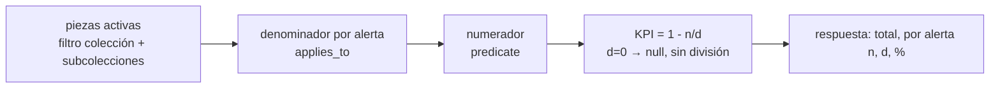

## Context

- Datos necesarios ya modelados: `piece.tenure_regime`, identificadores vigentes de tipo `I`, `media_asset` activo, `piece.current_location_id` → `location` (SITE/SPACE), campos de ficha, `piece_identifier.normalization_status`.
- Volumen objetivo: 20 000 piezas, 10 usuarios (RNF-015); búsqueda p95 ≤ 2 s [SUPUESTO C4].
- `busqueda-avanzada-y-exportacion` necesita filtrar por alertas con la misma definición.

## Goals / Non-Goals

**Goals:**
- Una sola definición de cada alerta, usada por ficha, reporte, KPI y búsqueda.
- Cifras siempre actuales tras corregir un dato (sin recálculos programados para lo vigente).
- Reglas de campos obligatorios/recomendados ajustables sin código.

**Non-Goals:**
- Motor genérico de reglas de calidad (solo las alertas de RF-019 + identificadores no normalizables).
- Notificaciones.

## Decisions

### D1. Predicados SQL por alerta
`quality/completeness.py` define `ALERTS: dict[AlertCode, AlertDefinition]` con:
- `predicate(piece_alias) -> ColumnElement[bool]` (SQLAlchemy, compatible con PostgreSQL y SQLite),
- `applies_to(piece_alias)` (denominador),
- `message`, `suggested_action` (texto claro en español, RNF-010) y `field` para enlazar al editor.

| Código | Aplica a | Condición |
|---|---|---|
| `MISSING_INVENTORY_CODE` | régimen `OWNED` | no existe identificador vigente no eliminado de tipo `I` |
| `MISSING_PHOTO` | todas | no existe `media_asset` activo |
| `MISSING_LOCATION` | todas | sin `current_location_id` o ubicación sin ancestro SITE y SPACE |
| `MISSING_REQUIRED_FIELDS` | todas | algún campo de `completeness_rule(kind=required)` vacío |
| `MISSING_RECOMMENDED_FIELDS` | todas | algún campo de `completeness_rule(kind=recommended)` vacío |
| `UNNORMALIZABLE_IDENTIFIER` | todas | existe identificador vigente con estado `UNPARSEABLE` |

Todas excluyen piezas eliminadas lógicamente o fusionadas.
*Alternativa descartada*: tabla `piece_alert` materializada actualizada por eventos → riesgo de desincronización con importaciones, fusiones y reversiones; se reconsidera solo si la medición en PostgreSQL supera el objetivo.

### D2. Reglas de campos configurables
Tabla `completeness_rule (field, kind: required|recommended, is_active)` con valores iniciales [SUPUESTO B1]: requerido `title`, `tenure_regime`; recomendados `collection_id`, `category_term_id`, `description`, `period_text`, `materials` (relación `piece_material`), `dimensions_text`, `conservation_status_term_id`, `provenance`. Solo se aceptan campos de una lista blanca de `piece` (validada). Cambios auditados; operación nueva `GET`/`PUT /api/v1/quality/completeness-rules` (Administrador).

### D3. KPI con numerador y denominador

Una sola consulta con `COUNT(*) FILTER (WHERE ...)` en PostgreSQL (`SUM(CASE ...)` en SQLite). `by_collection=true` agrupa por colección raíz con subcolecciones vía CTE recursiva. Porcentaje con denominador cero → `null` y la UI muestra "no aplica" (escenario catálogo vacío).

### D4. Reporte de incompletas
`GET /quality/incomplete?alert=&collection_id=&include_subcollections=true&page=` devuelve piezas con sus alertas activas (lista), ordenadas por número de alertas desc. `format=xlsx|csv` genera el archivo con cabecera de filtros y fecha (usa la utilidad de `busqueda-avanzada-y-exportacion` si existe; si no, CSV). Aplica enmascarado de campos sensibles.

### D5. Instantáneas diarias
Tabla `completeness_snapshot (taken_on, collection_id nullable, alert_code, numerator, denominator)`; comando idempotente `python -m app.quality.snapshot` (script npm `kpis:snapshot`; con Docker `docker compose exec api python -m app.quality.snapshot`) que reemplaza la instantánea del día. `GET /quality/kpis/history?from=&to=&collection_id=`. La programación diaria (cron/systemd timer) se documenta en `despliegue-vm-y-respaldos`.

### D6. Índices
Se verifica con `EXPLAIN ANALYZE` en PostgreSQL (tarea con Docker) y se añaden si hacen falta: índice parcial `piece_identifier (piece_id) WHERE identifier_type_code='I' AND is_current AND deleted_at IS NULL`, `media_asset (piece_id) WHERE deleted_at IS NULL`.

## Risks / Trade-offs

- **Rendimiento del cálculo en consulta** → índices parciales y medición obligatoria con 20 000 piezas; plan B: materialización (D1 alternativa).
- **Piezas en préstamo temporal ya devueltas** siguen contando como "sin ubicación" si no tienen sede y espacio (coherente con la spec vigente); si la contraparte pide excluirlas, se ajusta con un change `MODIFIED`.
- **Coordinación con búsqueda** → los predicados son la API interna; cambios en su firma exigen avisar a la célula (misma célula: Consulta y control).
