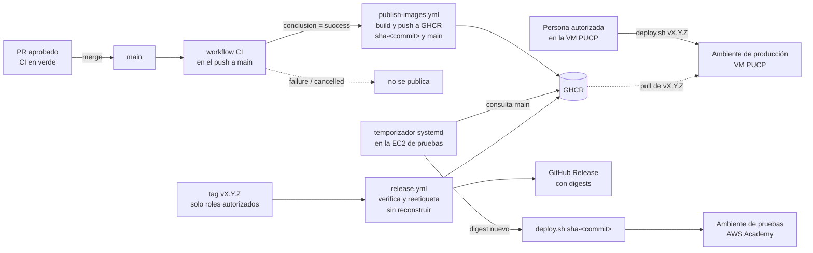

## Context

Motivación y alcance en `proposal.md`. Punto de partida:

- `.github/workflows/ci.yml` (workflow «CI») corre en cada PR y en cada push a `main`. Tiene cuatro jobs: API, IA, Web y OpenSpec. `ci-migraciones-postgresql` añadirá un quinto. La protección de `main` exige PR, CI en verde y una aprobación.
- Hay dos imágenes: `apps/api/Dockerfile` (la IA asistiva viaja dentro de la API, ADR-008) y `apps/web/Dockerfile`. La web usa un artefacto único entre entornos, con llamadas a la API por ruta relativa (D9 de `despliegue-vm-y-respaldos`), así que una misma imagen sirve en pruebas y en producción.
- `despliegue-vm-y-respaldos` define `scripts/deploy.sh <version>` (respaldo previo, migración en contenedor efímero, espera de salud, `--rollback` y registro en `deployments.log`) y un `release.yml` que hoy publica solo por tag. Este change reemplaza ese `release.yml` (ver D6).
- **Pruebas** es el entorno de integración de ADR-013: una EC2 en AWS Academy con RDS y S3. Funciona por sesiones de unas 4 horas y sus credenciales de AWS caducan en cada sesión. **Producción** es la VM PUCP. Aún no hay datos de acceso (G14), y D3 de `despliegue-vm-y-respaldos` prohíbe guardar secretos de la VM en GitHub.
- `GET /health` ya devuelve `version` (la versión de la aplicación en `pyproject`), pero no el commit.

## Goals / Non-Goals

**Goals:**
- Lo que se despliega en producción es, byte a byte, la imagen que ya pasó por pruebas (mismo digest).
- Que no haya secretos de nube ni de servidores en GitHub. El único secreto nuevo vive en la EC2 y solo permite leer paquetes.
- Que el pipeline no dependa de la lista de jobs de CI: si se añade un check, la publicación lo respeta sin tocar este pipeline.

**Non-Goals:**
- Pruebas de humo contra el ambiente desplegado. Las hace Josué Moreno en S3, según el plan de sprints, y se apoyarán en D5.
- Notificar a GitHub el estado del despliegue (API de *Deployments*). Con el modelo *pull*, exigiría otro token en la EC2. Se puede añadir más adelante sin cambiar las specs.

## Decisions

### D1. Ambientes y disparadores

| Ambiente | Disparador | Qué despliega | Quién o qué ejecuta |
|---|---|---|---|
| Pruebas | Push a `main` con CI en verde | `sha-<commit>` de la última imagen `main` | Temporizador en la EC2 (automático) |
| Producción | Una persona, después de crear un tag `vX.Y.Z` | La imagen `vX.Y.Z` (mismo digest que `sha-<commit>`) | `scripts/deploy.sh vX.Y.Z` en la VM (manual) |

Los nombres de los ambientes en la documentación y en los registros son `pruebas` y `produccion`. En ADR-013, «pruebas» se llama entorno de integración (staging).

### D2. Publicación tras CI con `workflow_run`

`publish-images.yml` se dispara con `workflow_run` del workflow «CI» (`types: [completed]`, `branches: [main]`) y solo actúa si `conclusion == 'success'` y `event == 'push'`. Construye las dos imágenes a partir de `head_sha` y las publica en GHCR como `ghcr.io/<org>/matp-api` y `ghcr.io/<org>/matp-web`, con las etiquetas `sha-<commit>` y `main`. Usa `GITHUB_TOKEN` con `packages: write` y ningún otro secreto. El commit se inyecta como argumento de build (`GIT_SHA`) para D5.

- *Por qué `workflow_run` y no un job `publish` dentro de `ci.yml` con `needs: [api, ai, web, openspec]`*: `workflow_run` depende de la conclusión del workflow completo. Cuando `ci-migraciones-postgresql` (u otro change) añada un job, la publicación lo exige automáticamente. Con `needs`, habría que acordarse de actualizar la lista, y olvidarlo publicaría imágenes sin pasar el check nuevo.
- *Coste*: `workflow_run` solo corre desde la versión del workflow que está en la rama por defecto, así que no se puede probar dentro de un PR. Se mitiga con `actionlint` en el PR y una primera ejecución observada después del merge (tarea 2.3).
- `concurrency: publish-main` con `cancel-in-progress: false`: dos merges seguidos publican en orden, y `main` termina apuntando al último.

### D3. Despliegue en pruebas por *pull*

En la EC2 hay un servicio `matp-pull-deploy.service` con su temporizador `matp-pull-deploy.timer` (`OnBootSec=2min`, `OnUnitActiveSec=5min`; intervalo configurable). En cada ejecución:

1. Toma un candado (`flock`) para no solaparse con otra ejecución.
2. Resuelve el digest actual de `matp-api:main` en GHCR y lo compara con el último desplegado, registrado en el host.
3. Si cambió, obtiene la etiqueta `sha-<commit>` de ese digest y ejecuta `scripts/deploy.sh sha-<commit>`. El despliegue se fija por commit, nunca por la etiqueta móvil `main`, para que sea reproducible.
4. Registra el resultado. Si `deploy.sh` falla, su propio `--rollback` deja la versión anterior (Req: Despliegue automático… — escenario «Despliegue fallido en pruebas»), y se avisa por `ALERT_WEBHOOK_URL` si está definida (D4 de `despliegue-vm-y-respaldos`).

`OnBootSec` cubre el caso de la instancia apagada: al encenderse para una sesión, despliega la última versión de `main`.

Credencial: un token de solo lectura de paquetes (`read:packages`) en `/opt/matp/.env.pruebas` (permisos 600). Lo crea y lo rota el Implantador, y nunca se guarda en GitHub.

- *Alternativa descartada: push desde GitHub Actions por SSH o SSM.* Obliga a guardar en GitHub credenciales de AWS Academy, que caducan en cada sesión, o una llave SSH, además de abrir el puerto 22. También falla siempre que el laboratorio está apagado, que es la mayor parte del tiempo.
- *Alternativa descartada: Watchtower u otro actualizador genérico.* No ejecuta el respaldo previo, la migración ni la vuelta atrás de `deploy.sh`, y en producción sería justo el automatismo que el change prohíbe.

### D4. Producción: tag, reetiquetado y despliegue manual

`release.yml` se dispara con `push` de tags `v*.*.*`:

1. Valida el formato `vMAYOR.MENOR.PARCHE`.
2. Comprueba que el commit está en `main` (`git merge-base --is-ancestor <sha> origin/main`).
3. Comprueba que existen `matp-api:sha-<commit>` y `matp-web:sha-<commit>` en GHCR. Si no existen, falla con el motivo: el CI de ese commit no terminó en verde.
4. **Reetiqueta sin reconstruir** los mismos manifiestos a `vX.Y.Z` (`docker buildx imagetools create`). Por eso el digest de producción es el mismo que el de pruebas.
5. Crea el GitHub Release con notas generadas desde los PR y una tabla de digests.

Después, una persona autorizada ejecuta `scripts/deploy.sh vX.Y.Z` en la VM, según D3 de `despliegue-vm-y-respaldos`. La VM **no** tiene temporizador de *pull*, y ningún workflow tiene acceso a ella.

Quién puede crear tags: una regla (*ruleset*) de tags `v*` en GitHub permite crearlos solo al Arquitecto, al Líder de Proyecto y a los Implantadores (ratificado por el Arquitecto de Software, 2026-09-30).

- *Alternativa descartada: reconstruir las imágenes al crear el tag.* Produciría otro digest, y producción ejecutaría algo que no se probó.
- *Alternativa descartada: job de despliegue con el environment `produccion` y revisores obligatorios.* Obliga a guardar secretos de la VM en GitHub, lo que contradice D3 de `despliegue-vm-y-respaldos`, y que GitHub llegue a una VM de red institucional.
- *Alternativa descartada: rama `develop` o `release/*` como fuente de producción.* Contradice la decisión del equipo de mantener GitHub Flow con `main` único, que queda fuera de alcance.

### D5. Versión identificable

- **Build**: los Dockerfiles aceptan `ARG GIT_SHA=dev`, que se expone como la variable de entorno `APP_COMMIT`.
- **Despliegue**: `deploy.sh` exporta `APP_RELEASE` con la etiqueta desplegada (`sha-<commit>` en pruebas, `vX.Y.Z` en producción). Así el contenedor conoce su versión sin reconstruir la imagen.
- **`GET /health`**: añade `commit` y `release` (`"dev"` y `null` en local) y mantiene `version`. No expone datos del catálogo. El proxy ya publica `/health` sin autenticación.
- **Registro**: `deployments.log` de `deploy.sh` (fecha, ambiente, versión, digest y resultado). El *pull* añade una línea también cuando no había cambios y se hace un chequeo de fondo, con rotación semanal.

El cambio en `/health` es aditivo. Se regenera `openapi.json` y el cliente tipado, y la prueba de conformidad no se ve afectada, porque `/health` es un añadido declarado en el mapeo.

### D6. Reparto con `despliegue-vm-y-respaldos`

| Pieza | Change |
|---|---|
| Dockerfiles sin root, `docker-compose.prod.yml`, `Caddyfile`, `deploy.sh`, respaldos, `systemd` de respaldos | `despliegue-vm-y-respaldos` |
| Publicación de imágenes tras cada merge y por tag (su tarea 2.1) | **Este change** (`publish-images.yml` y `release.yml`) |
| Despliegue automático en pruebas (la parte automática de su tarea 6.3) | **Este change** (`deploy/staging/pull-deploy/`) |
| `scripts/staging-up.sh` y la guía de sesiones de AWS Academy (6.3) | `despliegue-vm-y-respaldos` |
| `commit`/`release` en `/health` | **Este change** |

La tarea 5.1 de este change ajusta, con `/opsx:update` y con la célula Plataforma, las tareas 2.1 y 6.3 de ese change, y las filas CD 1 y CD 2 de `docs/plan-sprints.md`, para que apunten aquí.

## Risks / Trade-offs

- [Pruebas se actualiza con retraso: hasta 5 minutos, o hasta que se encienda la sesión] → Aceptable para un entorno de integración. El registro y `/health` muestran qué versión está viva, y las pruebas de humo esperan a que `commit` coincida.
- [El token de solo lectura de la EC2 caduca o se revoca] → El temporizador registra el error de autenticación y avisa por webhook. Rotarlo está en `docs/despliegue/pipeline.md`.
- [`workflow_run` no se ejecuta en PR] → `actionlint` en el PR y primera ejecución observada después del merge (tarea 2.3).
- [Una migración que falla en pruebas bloquea el despliegue de ese commit] → Es el comportamiento buscado: pruebas se queda en la versión anterior y el fallo se ve antes de etiquetar.
- [GHCR privado exige autenticación también en la VM] → El token de solo lectura se configura igual en producción, pero sin temporizador.
- [Se etiqueta un commit que pasó CI pero no se probó en pruebas porque la EC2 estaba apagada] → El release no puede comprobarlo sin acceso a pruebas. El procedimiento de versión (tarea 4.2) exige verificar en `/health` de pruebas que `commit` coincide antes de crear el tag.

## Migration Plan

1. Integrar `publish-images.yml`. Desde ese merge, cada push a `main` con CI en verde publica imágenes, aunque nadie las despliegue todavía.
2. Instalar el temporizador en la EC2 en la siguiente sesión de AWS Academy y verificar un despliegue completo.
3. Configurar la regla de tags `v*` y ensayar `release.yml`. Primero con un tag de formato inválido, que debe fallar, y después con `v0.0.1`. Borrar el paquete de prueba si hace falta.
4. Vuelta atrás del pipeline: deshabilitar el temporizador (`systemctl disable --now matp-pull-deploy.timer`) y los workflows desde la pestaña Actions. El código y las ramas no cambian.

## Open Questions

- Nombre definitivo de la organización o el propietario de los paquetes GHCR (`<org>`) si el repositorio cambia de cuenta. Solo afecta variables.
