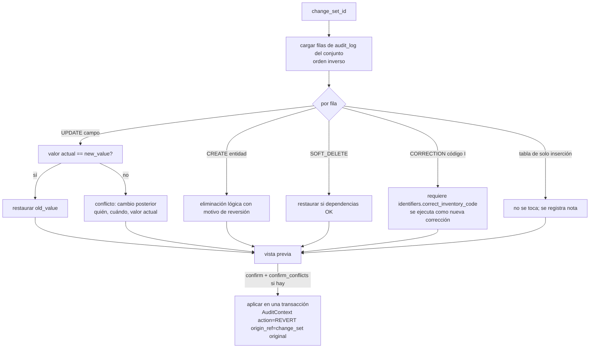

## Context

- `audit_log`: `change_set_id` (indexado), `entity_type`, `entity_id`, `field`, `old_value`, `new_value`, `action` (CREATE, UPDATE, SOFT_DELETE, RESTORE, CORRECTION, MERGE, REVERT), `origin` + `origin_ref`, usuario, `reason`. Triggers de solo inserción en PostgreSQL y SQLite.
- `tracking.py` genera filas por campo en `before_flush` con `AuditContext` obligatorio; `soft_delete.py` y guardas impiden `session.delete`.
- Tablas de solo inserción: `audit_log`, `piece_movement`, `piece_source_record`, `conservation_assessment`.
- Filtro global de eliminados (`include_deleted` explícito para leerlos).

## Goals / Non-Goals

**Goals:**
- Revertir cualquier conjunto de cambios de forma segura y explicable, sin perder historial.
- Hacer imposible (por prueba automática) que un change futuro introduzca borrado físico o tablas no auditadas.
- Detectar alteraciones de la auditoría hechas por fuera de la aplicación.

**Non-Goals:**
- "Deshacer" en tiempo real en el editor (undo local).
- Reconstrucción del estado completo a una fecha arbitraria.

## Decisions

### D1. Reversión por conjunto de cambios

- `revert_change_set(session, change_set_id, ctx, *, confirm_conflicts: bool) -> RevertResult` es la interfaz interna.
- La vista previa devuelve un `preview_token` (hash del plan); `revert` exige ese token y se rechaza (`409 revert_plan_changed`) si el plan cambió.
- Un conjunto ya revertido se rechaza (`409 already_reverted`) salvo que se revierta la reversión (nuevo conjunto).
- Las filas de solo inserción (movimientos, datos de origen, evaluaciones) no se "deshacen": la reversión de un movimiento se hace registrando un movimiento correctivo desde su módulo; aquí solo se informa.
- Permisos: revertir un conjunto propio de edición manual → `pieces.update`; conjuntos de importación → `imports.revert`; cualquier otro → Administrador [SUPUESTO B7].

### D2. Papelera
`GET /trash?entity_type=&deleted_by=&from=&to=` (Administrador y Gestor para sus entidades) lista entidades con `deleted_at` (piezas, identificadores, fotos, colecciones, términos, ubicaciones, plantillas, usuarios desactivados no, porque no se eliminan). Restauración genérica con registro de verificadores de dependencias por tipo:
- término → su vocabulario activo; pieza → su colección activa (o pieza suelta) y código I sin conflicto; foto → pieza activa; ubicación → padre activo; colección → padre activo.
Fallo → `409 restore_dependency` con la dependencia a restaurar primero.

### D3. Consulta agrupada
`GET /audit/change-sets/{id}`: resumen (usuario, fecha, origen, motivo, entidades afectadas, conteo de campos, estado revertido/no). `GET /audit?group_by=change_set` y `format=csv` (streaming) sobre la lectura existente. Enmascara `old_value/new_value` de campos sensibles según el rol (RF-041).

### D4. Prueba transversal
`tests/test_cross_cutting_rules.py` recorre `Base.metadata` y los mappers:
1. Todo modelo tiene `SoftDeleteMixin` **o** está en la lista explícita de solo inserción con trigger verificado, **o** en una lista de exclusiones justificadas (p. ej. `idempotency_key`, `user_session`) con comentario obligatorio.
2. Todo modelo con `SoftDeleteMixin` está registrado en el seguimiento de auditoría.
3. Búsqueda estática (AST) en `apps/api/app`: ninguna llamada a `session.delete(`, `delete(` de SQLAlchemy Core sobre tablas de negocio ni `TRUNCATE`.
4. Toda migración Alembic nueva que cree una tabla de solo inserción crea también su trigger.
La lista de exclusiones vive en `app/core/cross_cutting.py` y cambiarla requiere revisión del Arquitecto (CODEOWNERS propuesto).

### D5. Evidencia de integridad
Tabla `audit_digest (day, row_count, first_id, last_id, sha256, computed_at)`; comando `python -m app.audit.digest` (script `npm run audit:verify`; con Docker `docker compose exec api python -m app.audit.digest`) que calcula el resumen del día anterior (filas ordenadas por `occurred_at, id`, serialización canónica JSON) y en modo `--verify` recalcula todos los días y reporta diferencias. Su programación diaria y el envío de alertas los configura `despliegue-vm-y-respaldos`. Proporciona evidencia de alteración por acceso directo a la base, no prevención.

## Risks / Trade-offs

- **Reversión de cambios encadenados** (una edición sobre datos importados) → conflictos explícitos y confirmación; nunca se pisa silenciosamente.
- **Coste de la prueba transversal** para las células → mensajes de error que indican exactamente qué agregar; lista de exclusiones documentada.
- **Resumen diario sobre tablas grandes** → consulta por rango de fecha indexado; volumen objetivo (~decenas de miles de filas/día en cargas) aceptable.
