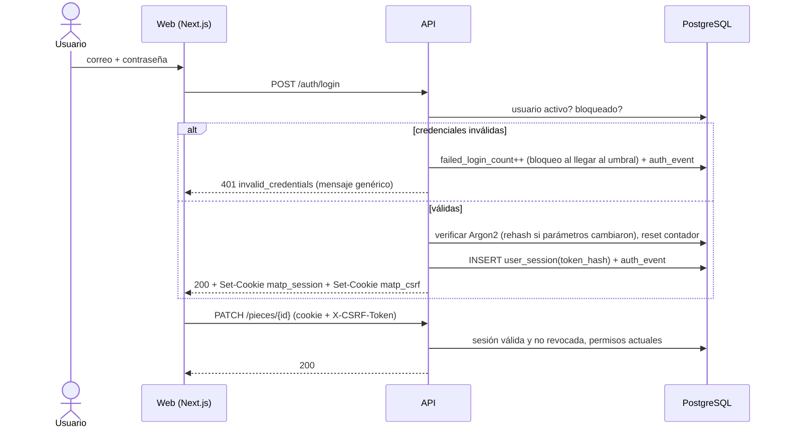

## Context

- `app_user` ya tiene `password_hash`, `is_active`, `is_synthetic`, `external_subject`, `last_login_at`, `failed_login_count`, `locked_until`; roles, permisos y `role_permission`/`user_role` con soft-delete; `Role.is_enabled` (investigador desactivado).
- `app/api/deps.py`: `get_current_user` lee `X-MATP-User` (rechazado con `APP_ENV=production`); `require_permission` consulta la matriz sembrada.
- Web (Next.js) y API se sirven bajo el mismo dominio en la VM detrás de un proxy inverso (`despliegue-vm-y-respaldos`); en la contingencia free tier (Vercel + Render) estarían en dominios distintos.

## Goals / Non-Goals

**Goals:**
- Revocación inmediata de acceso (desactivar usuario, cambiar permisos) sin esperar a que caduque un token.
- Nada de credenciales en `localStorage` ni en logs.
- Migración transparente para las rutas existentes y sus pruebas.

**Non-Goals:**
- SSO PUCP operativo, MFA, recuperación por correo.

## Decisions

### D1. Sesiones opacas en servidor en lugar de JWT
Token aleatorio de 256 bits (`secrets.token_urlsafe(32)`) enviado en cookie `matp_session` (`HttpOnly`, `Secure` salvo `APP_ENV=development`, `SameSite=Lax`, `Path=/`). En BD se guarda solo `SHA-256(token)` en `user_session (id, user_id, token_hash, created_at, last_seen_at, expires_at, revoked_at, revoked_reason, ip, user_agent)`.
- Inactividad `SESSION_IDLE_MINUTES=30`, absoluta `SESSION_MAX_HOURS=12` [SUPUESTO C7]. `last_seen_at` se actualiza como máximo una vez por minuto.
- Desactivar usuario, cambiar su contraseña o sus roles → `revoked_at` en todas sus sesiones.
- Los permisos se leen de la BD en cada petición (con caché por petición), así un cambio de matriz aplica "desde la siguiente operación" (RF-039).
*Alternativa*: JWT de acceso corto + refresh → revocación diferida hasta la expiración o lista negra (que reintroduce estado); descartado.
*Contingencia free tier (dominios distintos)*: `SameSite=None; Secure` + CORS con credenciales restringido al origen web configurado (`WEB_ORIGIN`).

### D2. Contraseñas
`pwdlib` con `Argon2Hasher` (parámetros por defecto de la librería; `needs_rehash` al iniciar sesión). Política: mínimo 12 caracteres, sin requisitos de composición, rechazo de las 1 000 contraseñas más comunes (lista incluida en el repo) y de contraseñas iguales al correo. Contraseñas nunca en logs: filtro de logging que redacta campos `password*` y prueba que lo verifica. Alta por Administrador con contraseña temporal y `must_change_password=true`: mientras esté activo, cualquier ruta distinta de `change-password`, `logout` y `me` responde `403 password_change_required`.

### D3. Bloqueo y eventos
`LOGIN_MAX_FAILED_ATTEMPTS=5`, `LOGIN_LOCK_MINUTES=15` [SUPUESTO C7]. Respuesta siempre `401 invalid_credentials` (usuario inexistente, contraseña errónea, cuenta bloqueada o inactiva) para no revelar existencia; el motivo real queda en `auth_event (occurred_at, user_id nullable, email_attempted_hash, event: LOGIN_OK|LOGIN_FAILED|LOCKED|LOGOUT|SESSION_REVOKED|PASSWORD_CHANGED, ip, user_agent)`. Limitación adicional por IP en memoria (20 intentos/5 min) para reducir fuerza bruta.

### D4. CSRF
Doble envío: cookie `matp_csrf` (no `HttpOnly`) generada al iniciar sesión y cabecera `X-CSRF-Token` obligatoria en `POST/PUT/PATCH/DELETE` con sesión por cookie. Comparación en tiempo constante. `SameSite=Lax` como segunda barrera.

### D5. Administración de usuarios y matriz
- `POST /users` (correo único normalizado, nombre, roles, contraseña temporal generada y mostrada **una sola vez** en la respuesta); `PATCH /users/{id}` (nombre, roles, `is_active`, restablecer contraseña temporal). Nunca `DELETE` físico (RN-005).
- Asignar un rol con `is_enabled=false` (investigador) → `409 role_disabled`.
- `PUT /roles/{role_code}/permissions` reemplaza el conjunto (con auditoría de altas y bajas vía soft-delete en `role_permission`).
- Invariante: siempre debe existir al menos un usuario activo con `users.manage`; cualquier operación que lo rompa → `409 last_administrator`.
- `is_synthetic` se mantiene para los usuarios del seed; en `APP_ENV=production` los usuarios sintéticos no pueden iniciar sesión.

### D6. Registro de accesos a datos sensibles
Cuando una respuesta incluye campos sensibles **sin enmascarar** (el rol tiene el permiso), se registra una fila por petición en `sensitive_access_log (occurred_at, user_id, route, entity_type, entity_ids (hasta 100), fields)`. Se escribe en una transacción separada tras enviar la respuesta (`BackgroundTask`) para no afectar la latencia. Consultable por Administrador con `audit.read` (operación nueva `GET /api/v1/audit/sensitive-access`).

### D7. Identidad provisional y pruebas
`X-MATP-User` solo se acepta con `APP_ENV=test`; en `development` se usa login real con los usuarios sintéticos del seed (contraseña de desarrollo documentada en `.env.example`, `SEED_DEV_PASSWORD`). Fixture de pytest `login_as(role_code)` para todos los changes. ADR-005 pasa a "Reemplazado parcialmente por ADR de autenticación".

### D8. Preparación para cuenta PUCP
Interfaz `IdentityProvider` (`authenticate(request) -> ExternalIdentity`) con `LocalPasswordProvider` implementado y `OidcProvider` como stub documentado; vínculo por `external_subject`. Los roles siguen siendo locales (RNF-012: "sin rehacer la gestión de roles").

### D9. Frontend
Middleware de Next.js redirige a `/login` sin cookie de sesión (comprobación ligera; la autorización real está en la API). En 401 por sesión expirada, el cliente guarda el formulario en `sessionStorage`, redirige a login con `returnTo` y restaura al volver. El selector de rol simulado queda solo en `NEXT_PUBLIC_API_MODE=mock`.

## Risks / Trade-offs

- **Cookies `Secure` requieren HTTPS** → en desarrollo local `Secure` desactivado explícitamente por `APP_ENV`; en la VM, dependencia con `despliegue-vm-y-respaldos`.
- **Cambiar todas las pruebas existentes al fixture de sesión** → se mantiene `X-MATP-User` en `APP_ENV=test` para no romperlas; migración gradual.
- **Contraseña temporal mostrada en pantalla** → se muestra una vez, se obliga a cambiarla, y el evento se audita sin el valor.
- **Parámetros de sesión y bloqueo [SUPUESTO C7]** → configurables por entorno.
