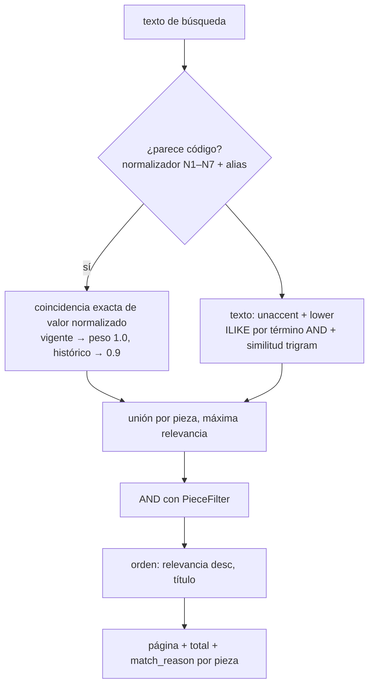

## Context

- Implementado: `GET /api/v1/pieces` con filtros AND iniciales y paginación; `GET /api/v1/search` por código normalizado N1–N7 o denominación (`ilike`), enmascarado RF-041.
- `pg_trgm` e índices GIN de trigramas existen; `unaccent` no está habilitado.
- Stubs: `POST /search/export`, `GET /exports/full`. Permisos: `exports.run`, `exports.full` (solo Administrador) [SUPUESTO C5].
- Objetivo de rendimiento p95 ≤ 2 s con 20 000 piezas y 10 usuarios [SUPUESTO C4].

## Goals / Non-Goals

**Goals:**
- Lo que se ve en pantalla es exactamente lo que se exporta (mismo filtro, mismo orden, mismo enmascarado).
- Búsqueda tolerante a tildes, mayúsculas y formatos de código.
- Rendimiento medido y reproducible, no supuesto.
- El museo puede llevarse todos sus datos sin el sistema.

**Non-Goals:**
- Motor de búsqueda externo (Elasticsearch/Meilisearch/OpenSearch).
- Búsqueda en texto de documentos adjuntos.

## Decisions

### D1. `PieceFilter` único
Modelo Pydantic en `search/filters.py` con `to_where(session) -> ColumnElement` y `describe() -> list[ActiveFilter]` (texto legible para la hoja de filtros y los chips de la UI). Lo usan `GET /pieces`, `GET /search`, `POST /search/export`, los reportes y el reporte de incompletas. Filtros por campos sensibles (p. ej. valorización) se rechazan con `403 filter_not_allowed` si el rol no tiene el permiso (RF-041 escenario "Búsqueda por campo restringido").
- Época: superposición `period_from <= to AND period_to >= from`; la respuesta incluye `excluded_uninterpreted_period` (piezas que cumplen el resto de filtros pero solo tienen `period_text`).
- Colección y ubicación: CTE recursiva de descendientes (PostgreSQL); en SQLite, precálculo en Python para pruebas.
- Alertas: delega en los predicados de `alertas-y-reporte-incompletas`; sin ese change, el filtro responde `501` con `x-change` (se documenta en OpenAPI).

### D2. Búsqueda de texto y códigos

- Se habilita la extensión `unaccent` (migración) y una función `immutable_unaccent` para índices funcionales `GIN (immutable_unaccent(lower(title)) gin_trgm_ops)` sobre `title`, `author`, `provenance`. En SQLite se registra una función Python equivalente (`unicodedata`) para pruebas.
- Términos de vocabulario (material, categoría, estado) se buscan por etiqueta sin tildes y se traducen a IDs antes de filtrar.
- `match_reason`: `{"kind": "identifier", "type": "COLECCION", "original": "M.M.Z. 15", "historical": false}` o `{"kind": "text", "fields": ["title", "provenance"]}`.
- Sin resultados: `suggestions` con acciones (`remove_filter:<name>`, `check_code_format`, `search_historical`).

### D3. Trabajos de exportación
Tabla `export_job (id, kind: results|full|report, requested_by, params JSON, status, row_count, storage_key, sha256, expires_at, error)`.
- `POST /search/export {filter, columns, format: xlsx|csv}`: si el conteo ≤ `EXPORT_SYNC_MAX_ROWS` (5 000 [SUPUESTO C8]) responde el archivo directamente; si no, `202` con `job_id`. Operaciones nuevas: `GET /api/v1/exports/jobs`, `GET /api/v1/exports/jobs/{job_id}` y `GET /api/v1/exports/jobs/{job_id}/download-url` (URL prefirmada; solo el solicitante o Administrador).
- Los archivos se guardan en `exports/<job_id>/` y caducan a las 72 h (`EXPORT_TTL_HOURS`): el objeto se elimina por regla de ciclo de vida del bucket; el registro `export_job` se conserva (es trazabilidad, no se borra).
- Ejecución con el mismo patrón de worker en proceso que importación (latido y recuperación).
- `app/core/xlsx.py`: `write_table(rows_iter, columns, meta_sheet)` con `openpyxl` en modo `write_only` (memoria constante). Primera hoja "Resultados", segunda "Filtros" (filtros activos, fecha, usuario, columnas omitidas por permisos).
- Auditoría: cada exportación registra una entrada `EXPORT` (acción nueva en `AuditAction`, origen manual) con filtros, número de filas y si incluyó columnas sensibles (RNF-014).

### D4. Exportación completa
`GET /exports/full` (se mantiene la ruta del contrato) crea un trabajo `full` y responde `202` (o devuelve el trabajo en curso). Paquete ZIP:
- `csv/<entidad>.csv` (UTF-8 con BOM para Excel, separador `,`) y `matp_export.xlsx` con una hoja por entidad (si una entidad supera el límite de filas de Excel, solo CSV);
- `diccionario.csv` (entidad, columna, tipo, descripción en español — generado desde los modelos y comentarios de columnas);
- `manifest.json` (fecha, versión de esquema Alembic, conteo y SHA-256 por archivo).
Incluye registros eliminados lógicamente con `deleted_at`, `deleted_by`, `deletion_reason`, auditoría completa y metadatos de fotos (no binarios). Solo `exports.full`. Entidades: todas las tablas de negocio salvo credenciales (`password_hash` nunca se exporta).

### D5. Prueba de rendimiento
`scripts/perf/generate_catalog.py` (20 000 piezas sintéticas reutilizando `app.seed.synthetic`, determinista) y `scripts/perf/search_load.py` (10 usuarios concurrentes, mezcla: 40 % código, 30 % texto, 30 % filtros combinados; 5 minutos; reporta p50/p95/p99 y errores en JSON). Script npm `perf:search`. Se ejecuta contra compose; el resultado se adjunta al PR y a `docs/rendimiento.md`. No se ejecuta en CI (costo), pero sí un *smoke* de 30 s con 1 000 piezas.

## Risks / Trade-offs

- **`unaccent` requiere permisos de superusuario para `CREATE EXTENSION`** en algunos proveedores (Neon lo permite; VM propia sí) → migración que detecta y falla con mensaje claro; contingencia: columna `search_text` normalizada en Python y actualizada al guardar.
- **Exportaciones grandes en proceso** → `write_only` y streaming a S3 por partes; límite de un trabajo `full` simultáneo.
- **Filtro por alertas depende de otro change** → respuesta 501 explícita mientras tanto.
- **Rendimiento solo medible con Docker** → tarea marcada como pendiente de entorno si no hay daemon.
