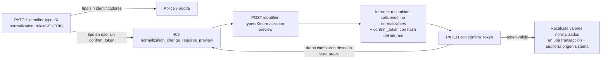

## Context

- Tablas existentes: `vocabulary`, `term` (código, etiqueta, orden, `is_active`, `external_uri`), `collection` (jerárquica, sigla normalizada), `identifier_type` (`normalization_rule`, `is_unique_when_current`, `locks_on_assignment`, `owned_pieces_only`, `allowed_for_temporary_loan`), `conservation_assessment` (solo inserción).
- Implementado: CRUD de colecciones con eliminación lógica y rechazo si tienen piezas; alta/edición/desactivación/eliminación lógica de términos (rechazada si están en uso); lecturas de tipos de identificador.
- Stubs de este change: `POST /vocabularies`, `POST /identifier-types`, `PATCH /identifier-types/{type_code}`.
- Los códigos de vocabulario del sistema están en `VocabularyCode` y los datos sembrados en `app/seed/reference.py`.

## Goals / Non-Goals

**Goals:**
- Toda la configuración del dominio administrable desde la API y la UI sin despliegue de código (RN-010).
- Ningún cambio de configuración puede romper silenciosamente las reglas RN-002/RN-003 ni los valores normalizados existentes.
- Procedimiento repetible para cargar las listas oficiales cuando lleguen.

**Non-Goals:**
- Editor de reglas de normalización arbitrarias (se elige entre las reglas implementadas en `NormalizationRule`: INVENTORY, COLLECTION, INC_RN, GENERIC, que combinan los pasos N1–N7).
- Sincronización con tesauros externos.

## Decisions

### D1. Tipos de identificador "del sistema"
Se añade `identifier_type.is_system` (migración aditiva). Los tipos sembrados `I` (código I, `TYPE_INVENTORY`) y `COLECCION` (`TYPE_COLLECTION`) son de sistema: su `code`, `locks_on_assignment`, `owned_pieces_only`, `is_unique_when_current` y `allowed_for_temporary_loan` no se pueden cambiar por API (`409 system_identifier_type`). Etiqueta, descripción y orden sí.
*Alternativa*: lista fija en código → menos visible para el administrador; la columna permite mostrar el candado en la UI.

### D2. Cambio de regla de normalización en dos pasos

- La vista previa (`POST /identifier-types/{type_code}/normalization-preview`, operación nueva) no escribe nada.
- Si la nueva regla produce **colisiones** entre códigos I vigentes de piezas distintas, la confirmación se rechaza siempre (RN-002): primero deben resolverse por corrección.
- Volúmenes esperados (≤ 20 000 piezas × pocos identificadores) permiten recalcular en una transacción; si supera un umbral configurable se ejecuta por lotes de 1 000 dentro de la misma operación con reintento idempotente.

### D3. Historial de conservación
`GET`/`POST /pieces/{piece_id}/conservation-assessments` (operaciones nuevas en el contrato). Cada `POST` inserta una evaluación (solo inserción, trigger existente) y actualiza `piece.conservation_status_term_id` al término de la evaluación más reciente por `assessed_at` (no por fecha de inserción, para admitir registrar evaluaciones antiguas). Requiere `conservation.assess`. El término debe pertenecer al vocabulario `CONSERVATION_STATUS` y estar activo.

### D4. Precarga idempotente de vocabularios
`python -m app.seed.vocabularies <archivo.csv>` (script npm `vocabularies:load`; con Docker: `docker compose exec api python -m app.seed.vocabularies ...`). Columnas: `vocabulary_code, term_code, label, description, sort_order, external_uri, is_active`. Reglas: inserta términos nuevos; actualiza etiqueta/descripción/orden/URI de los existentes (auditado, origen "sistema", `origin_ref` = nombre y hash del archivo); **nunca** desactiva ni elimina términos ausentes del archivo (informa la lista). Modo `--dry-run` por defecto; `--apply` para escribir.
*Alternativa*: carga desde la UI → se deja para después; el archivo versionado en Git da trazabilidad de la lista oficial.

### D5. Administración web
La pantalla `app/administracion` pasa a leer/escribir por `lib/data/admin.ts` (ramas mock/live como `pieces.ts`). Las acciones destructivas usan `ConfirmButton` existente con texto en lenguaje claro (RNF-010). El candado de tipos de sistema se muestra con explicación.

## Risks / Trade-offs

- **Recalcular valores normalizados puede cambiar resultados de búsqueda y matching** → vista previa obligatoria, auditoría de cada cambio y reversión posible desde `auditoria-y-soft-delete-transversal`.
- **Lista oficial de categorías aún desconocida (B5)** → los CSV de ejemplo en el repo son sintéticos y llevan `[SUPUESTO]` en su cabecera de comentario.
- **Operaciones nuevas en el contrato** (`normalization-preview`, `conservation-assessments`) → se añaden sin romper las existentes (ADR-005: añadir es compatible).
