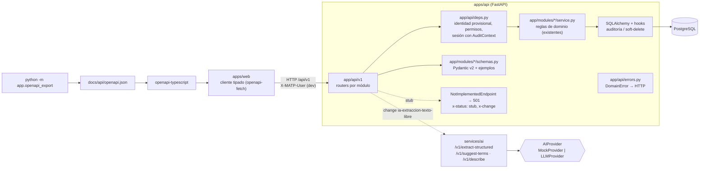

## Context

Ver `proposal.md` (Why). Punto de partida: `setup-monorepo-base` (FastAPI con `app/core` y paquetes por capacidad, servicio IA con `AI_PROVIDER`) y `modelo-datos-nucleo` (23 tablas, servicios de dominio con auditoría automática, seed sintético, matriz de roles y permisos sembrada `[SUPUESTO]`). Restricciones:

- 12 capacidades vigentes en `openspec/specs`; el requirement "API documentada para integraciones futuras" (RNF-009) exige OpenAPI con esquemas, ejemplos y endpoints no implementados marcados.
- La autenticación real pertenece a `autenticacion-y-matriz-permisos`; RF-042 prohíbe cualquier acceso anónimo a datos del catálogo.
- Sin daemon de Docker en la máquina del arranque: el contrato se exporta importando la aplicación (sin base de datos) y las pruebas de rutas usan SQLite en memoria con el seed de referencia.

## Goals / Non-Goals

**Goals:**
- Un contrato OpenAPI completo, estable y reproducible para **todos** los módulos, que las células implementan sin renombrar rutas ni esquemas.
- Implementación real solo de lo trivial (lecturas y CRUD simple), sobre los servicios de dominio existentes, para que la maqueta pueda probarse contra la API real.
- Stubs explícitos (`501` + `x-status: stub` + change responsable + ejemplo) en lugar de errores genéricos.
- Cliente TypeScript tipado generado desde el archivo commiteado.
- Interfaz de proveedor de IA con simulador determinista.

**Non-Goals:**
- Autenticación JWT, login, bloqueo por intentos, administración de usuarios.
- Escritura de piezas, identificadores, fotos, movimientos; pipeline de importación; duplicados; reportes y exportaciones; aplicación de sugerencias de IA.
- Rendimiento de búsqueda (RF-038) y búsqueda por similitud (`pg_trgm`).

## Decisions

### D1. Arquitectura de la API

- Prefijo `/api/v1` para negocio; `/health` y `/health/live` quedan en la raíz, sin datos del catálogo.
- Estructura: `app/api/` (errores, dependencias, utilidades de stub, paginación) y `app/api/v1/<modulo>.py` (routers). Esquemas en `app/modules/<capacidad>/schemas.py` para que cada célula sea dueña de los suyos.
- `create_app` acepta un `engine` inyectado (pruebas con SQLite `StaticPool`).
- Los `operationId` se generan como `<tag>_<nombre_funcion>` estables para que el cliente generado no cambie por reordenamientos.

### D2. Mapa de rutas (contrato)

Estado: **I** = implementado, **S** = stub (change del backlog que lo implementa).

| Módulo (tag) | Método y ruta | Estado | IDs |
|---|---|---|---|
| Autenticación | `POST /auth/login`, `POST /auth/logout` | S `autenticacion-y-matriz-permisos` | RNF-012, RNF-013 |
| Autenticación | `GET /auth/me` (usuario, roles, permisos) | I | RF-039 |
| Usuarios | `GET/POST /users`, `GET/PATCH /users/{id}` | S `autenticacion-y-matriz-permisos` | RF-039 |
| Roles | `GET /roles`, `GET /permissions` | I | RF-039 |
| Roles | `PUT /roles/{code}/permissions` | S `autenticacion-y-matriz-permisos` | RF-039 |
| Piezas | `GET /pieces` (filtros AND, paginación, orden) | I | RF-031, RF-032 |
| Piezas | `GET /pieces/{id}` (ficha con enmascarado) | I | RF-006, RF-041 |
| Piezas | `POST /pieces`, `PATCH /pieces/{id}`, `DELETE /pieces/{id}`, `POST /pieces/{id}/restore`, `POST /pieces/validate` | S `ficha-pieza-crud` | RF-005..009, RF-043, RN-005 |
| Piezas | `GET /pieces/{id}/source-records` | I | RF-008 |
| Identificadores | `GET /pieces/{id}/identifiers` (con historial opcional) | I | RF-002 |
| Identificadores | `POST /pieces/{id}/identifiers`, `POST /pieces/{id}/identifiers/{identifier_id}/correction` | S `ficha-pieza-crud` | RF-002, RF-003, RN-002, RN-003 |
| Identificadores | `POST /identifiers/normalize` (vista previa del normalizador) | I | RF-023 |
| Identificadores | `GET /identifier-types` | I | RN-010 |
| Identificadores | `POST /identifier-types`, `PATCH /identifier-types/{code}` | S `colecciones-y-vocabularios-admin` | RN-010 |
| Multimedia | `GET /pieces/{id}/media` | I | RF-013, RF-014 |
| Multimedia | `POST /pieces/{id}/media/upload-url`, `POST /pieces/{id}/media`, `PATCH`/`DELETE /pieces/{id}/media/{media_id}` | S `fotografias-multiples-por-pieza` | RF-013, RF-014, RNF-005 |
| Ubicaciones | `GET /pieces/{id}/movements` | I | RF-017 |
| Ubicaciones | `POST /pieces/{id}/movements` | S `ubicacion-jerarquica-y-movimientos` | RF-017 |
| Ubicaciones | `GET /locations`, `GET /locations/{id}` | I | RF-016, RF-041 |
| Ubicaciones | `POST /locations`, `PATCH /locations/{id}` | S `ubicacion-jerarquica-y-movimientos` | RF-016 |
| Colecciones | `GET/POST /collections`, `GET/PATCH/DELETE /collections/{id}` | I | RF-010, RN-005 |
| Vocabularios | `GET /vocabularies`, `GET /vocabularies/{code}`, `GET/POST /vocabularies/{code}/terms`, `PATCH/DELETE /vocabularies/{code}/terms/{term_id}` | I | RF-011, RF-012, RN-010 |
| Vocabularios | `POST /vocabularies` | S `colecciones-y-vocabularios-admin` | RN-010 |
| Importación | `GET/POST /imports`, `GET /imports/{id}`, `PUT /imports/{id}/mapping`, `POST /imports/{id}/validate`, `GET /imports/{id}/preview`, `PATCH /imports/{id}/rows/{row_id}`, `POST /imports/{id}/approve`, `GET /imports/{id}/log`, `POST /imports/{id}/revert` | S `importacion-pipeline-reconciliacion` | RF-021, RF-024..RF-029, RNF-007 |
| Importación | `GET/POST /import-templates` | S `plantillas-mapeo-y-normalizacion` | RF-022 |
| Calidad | `GET /quality/incomplete`, `GET /quality/kpis`, `GET /pieces/{id}/alerts` | S `alertas-y-reporte-incompletas` | RF-019, RF-035 |
| Calidad | `GET /quality/duplicates`, `POST /quality/duplicates/{id}/resolve` | S `deteccion-duplicados-y-cola-revision` | RF-030, RIA-02 |
| Búsqueda | `GET /search` (básica: cualquier código o denominación) | I | RF-031 |
| Búsqueda | `POST /search/export` | S `busqueda-avanzada-y-exportacion` | RF-036 |
| Reportes | `GET /reports/{report_type}` | S `reportes-inventario` | RF-033..RF-035, RF-037 |
| Exportación | `GET /exports/full` | S `busqueda-avanzada-y-exportacion` | RF-044 |
| IA asistiva | `GET /ai/suggestions`, `GET /ai/suggestions/{id}` | I | RN-009 |
| IA asistiva | `POST /ai/suggestions`, `POST /ai/suggestions/{id}/approve`, `POST /ai/suggestions/{id}/reject` | S `ia-extraccion-texto-libre` | RIA-01, RIA-03, RN-009 |
| Auditoría | `GET /audit` (filtros por entidad, usuario, origen, fechas) | I | RF-040 |
| Auditoría | `POST /audit/change-sets/{id}/revert` | S `auditoria-y-soft-delete-transversal` | RNF-007 |

### D3. Stubs explícitos

- Helper `stub(change)` añade a la operación `openapi_extra = {"x-status": "stub", "x-change": change}` y documenta la respuesta `501` con el esquema `NotImplementedResponse`.
- El handler declara todos sus parámetros y cuerpo (el contrato queda completo) y lanza `NotImplementedEndpoint(change, example)`; la respuesta es `501 {"code": "not_implemented", "message": "...", "change": "...", "example": {...}}` con un ejemplo sintético válido del esquema de éxito.
- Las operaciones implementadas llevan `x-status: implemented`. Una prueba recorre OpenAPI y exige que toda operación de `/api/v1` tenga `x-status` y que cada stub responda 501 con el change declarado.
- Alternativa descartada: `NotImplementedError` genérico → 500 sin información (viola RNF-009).

### D4. Errores uniformes

`ErrorResponse {code, message, details}` en español. Mapeo: `ValidationFailed` → 422, `NotFound` → 404, `PermissionDenied` → 403, `BusinessRuleViolation` (incluye `ImmutableInventoryCode`, `PhysicalDeleteForbidden`) → 409, `IntegrityError` → 409 `integrity_conflict`, validación de petición → 422 `request_validation_failed` con la lista de campos, falta de identidad → 401 `authentication_required`, stub → 501. Nunca se devuelven trazas ni cadenas de conexión.

### D5. Identidad provisional y permisos (ADR-005)

- Cabecera `X-MATP-User: <correo o UUID>` de un usuario **sintético y activo** (`is_synthetic = true`), declarada en OpenAPI como esquema de seguridad `apiKey` (`DevUserHeader`). Se rechaza con 401 si `APP_ENV=production` (`production_auth_unavailable`).
- `require_permission("<codigo>")` usa la matriz sembrada (`role_permission`). Lecturas: `pieces.read`; auditoría: `audit.read`; colecciones: `collections.manage`; términos: `vocabularies.manage`.
- Escrituras implementadas usan una sesión con `AuditContext(origin=MANUAL, user_id=...)`, por lo que la auditoría y el soft-delete siguen dependiendo de la capa de servicio, no del endpoint.
- Enmascarado (RF-041) en lecturas implementadas: `lender_name`, `loan_agreement_ref` (`sensitive.loan_terms`), `origin_description` de colección (`sensitive.donor_data`), niveles de ubicación por debajo del espacio (`sensitive.exact_location`). La respuesta incluye `masked_fields` para que la UI muestre "restringido". Lista de campos sensibles `[SUPUESTO]` (pregunta B7).
- `autenticacion-y-matriz-permisos` sustituye la dependencia `get_current_user` por JWT sin tocar routers.

### D6. Paginación, filtros y búsqueda básica

- `Page[T] {items, total, page, page_size}`; `page_size` máx. 100 (valor por defecto 20).
- `GET /pieces`: `q`, `collection_id` (incluye subcolecciones), `without_collection`, `tenure_regime`, `category_term_id`, `material_term_id`, `conservation_status_term_id`, `location_id` (incluye descendientes), `has_inventory_code`, `author`, `provenance`, `period_text`, `sort` (`title`, `-title`, `created_at`, `-created_at`). Todos se combinan con AND (RF-032).
- `q` y `GET /search`: el texto se normaliza con el normalizador existente (N1–N7) y coincide con `normalized_value` de cualquier identificador vigente o histórico **o** con el valor original o la denominación por contención sin distinguir mayúsculas. La respuesta indica qué identificador coincidió. La similitud con `pg_trgm` y el objetivo de rendimiento quedan para `busqueda-avanzada-y-exportacion`.

### D7. Exportación del contrato y cliente tipado

- `python -m app.openapi_export [--check]` construye la app con configuración ficticia (sin conexión a BD ni S3; el engine es perezoso) y escribe JSON con claves ordenadas, indentación 2 y salto final. `services/ai` tiene el mismo módulo. Scripts raíz: `npm run openapi` (ambos contratos) y `npm run openapi:client`.
- Prueba `test_openapi_contract.py` compara el archivo commiteado con la app (falla con instrucción de regenerar). La web tiene una prueba equivalente que verifica que `schema.d.ts` se generó desde el `openapi.json` actual (hash en cabecera).
- Dependencias web: `openapi-typescript` (dev) y `openapi-fetch` (runtime, ~6 kB). Alternativas: `orval`/`@hey-api/openapi-ts` (más pesadas, generan código), o solo tipos con `fetch` nativo (contingencia).
- `apps/web/src/lib/api/client.ts`: `createApiClient({ baseUrl, devUser })` que añade `X-MATP-User` y traduce `ErrorResponse`.

### D8. Servicio de IA

- `app/providers/base.py`: `AIProvider` (clase abstracta) con `extract_structured(text) -> ExtractionResult`, `suggest_terms(piece: PieceContext) -> TermSuggestionResult`, `describe(piece: PieceContext) -> DescriptionResult`; `ProviderUnavailable`.
- `MockProvider`: reglas deterministas (expresiones regulares para medidas `alto/ancho/largo/diámetro/profundidad N cm`, exposiciones "muestra/exposición … AAAA", estados "buen/regular/mal estado", marcas "revisado"), términos por palabras clave `[SUPUESTO]` y descripción por plantilla; nunca usa red ni aleatoriedad. Cada campo propuesto incluye `source_fragment` y `confidence` fija.
- `LLMProvider`: stub que valida configuración y lanza `ProviderUnavailable` (503 `ai_provider_unavailable`) hasta que `ia-extraccion-texto-libre` lo implemente; nunca envía campos sensibles (lista en `PieceContext`, que no los incluye).
- Endpoints `/v1/extract-structured`, `/v1/suggest-terms`, `/v1/describe`: responden `{provider, model, requires_human_approval: true, status: "PENDING_REVIEW", ...}`. El servicio no persiste nada; la API registrará `ai_suggestion` en su change.

## Risks / Trade-offs

- [El contrato cambia al implementar] → Las células pueden añadir campos opcionales sin romper; renombrar o quitar requiere change con `MODIFIED` y regenerar cliente (la prueba de contrato lo hace visible en CI).
- [Identidad por cabecera usada por error fuera de desarrollo] → Rechazo en `production`, solo usuarios sintéticos, ADR-005 y reemplazo prioritario en `autenticacion-y-matriz-permisos`.
- [Búsqueda por contención lenta con 20 000 piezas] → Aceptable para el borrador; índices de trigramas ya existen en PostgreSQL y RF-038 se aborda en su change.
- [Diferencias SQLite vs PostgreSQL en consultas] → Consultas solo con SQLAlchemy Core portátil (`ilike`, `exists`), sin funciones específicas; verificación en compose pendiente.

## Migration Plan

Sin migraciones de base de datos. Despliegue: regenerar `docs/api/*.json` y `apps/web/src/lib/api/schema.d.ts` (`npm run openapi && npm run openapi:client`). Rollback: revertir el commit; no hay datos afectados.

## Open Questions

- ¿Qué campos son sensibles y para qué roles? (B7, `[SUPUESTO]` actual).
- ¿El museo necesitará integración SURDOC/Getty con otra versión de API (`/api/v2`) o basta con OpenAPI 3.1 actual? (RNF-009, pregunta nueva E1).
