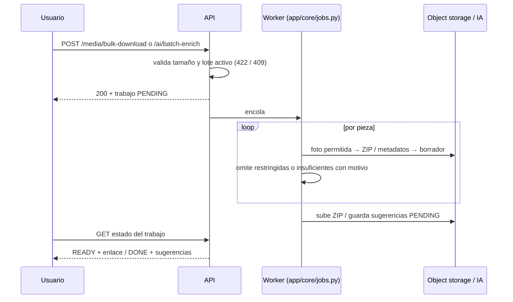

## Context

El documento de interfaces del equipo sitúa en su fase 3 `POST /media/bulk-download` («Archivo ZIP generado», `200`) y `POST /ai/batch-enrich` («Proceso en lote iniciado», `200`), sin esquemas de petición ni de respuesta. La tarea 5.2 de `alinear-api-endpoints-v1` las expone como stubs `501` que citan este change; aquí se fija su forma y cómo se implementan.

Piezas que ya existen o que otros changes dejan listas:

- **Fotografías**: `media_asset` en object storage, enlaces de corta duración y restricción de uso efectiva (foto → pieza → colección en comodato), de `fotografias-multiples-por-pieza`.
- **Sugerencias de IA**: `ai_suggestion` con `function_code` (ya existe `RIA_04` en `AiFunction`) y estado `PENDING`; la aprobación y `ai_suggestions/apply.py` son de `ia-extraccion-texto-libre`.
- **Trabajos en segundo plano**: ADR-010 fija `BackgroundTasks` con estado en base de datos, latido y recuperación al arrancar, en `app/core/jobs.py`, sin Redis ni Celery. Las exportaciones (`busqueda-avanzada-y-exportacion`) y los lotes de términos (`ia-sugerencia-terminos`, D5) siguen ese patrón.

## Goals / Non-Goals

**Goals:**

- Las dos rutas del contrato con verbo, `operationId` y código `200` del documento, y con esquemas propios.
- Ningún paquete incluye una foto restringida (RN-008) y ninguna salida de IA se escribe en la ficha sin aprobación (RN-009).
- Reutilizar los trabajos en segundo plano, los enlaces de corta duración y el flujo de sugerencias existentes, sin infraestructura nueva.

**Non-Goals:**

- Catálogo público o descargas sin autenticación (C2, RF-042).
- Documentos asociados que no sean fotos, conversión de formatos o marcas de agua.
- Enriquecer campos distintos de la descripción (RIA-01 y RIA-03 tienen su change).

## Decisions

### D1. Respuesta `200` con el estado del trabajo

Las dos operaciones responden `200` (como pide el documento) con el estado del trabajo creado o ya terminado, en lugar de `202` o de devolver el ZIP en la misma respuesta. Un paquete de 200 piezas puede pesar cientos de MB y una llamada a la IA por pieza tarda segundos: hacerlo en la petición agotaría el tiempo de espera del proxy en la VM (RNF-002).

- `POST /media/bulk-download` recibe `BulkDownloadRequest {piece_ids: [uuid] (1..200)}` y devuelve `BulkDownloadJob {id, status: PENDING|RUNNING|READY|FAILED, piece_count, included_photos, omitted: [{media_id, piece_id, restriction}], download_url, expires_at}`. El progreso se consulta con `GET /media/bulk-download/{job_id}`, operación añadida que se declara en el mapeo.
- `POST /ai/batch-enrich` recibe `BatchEnrichRequest {piece_ids: [uuid] (1..50)}` y devuelve `AiBatchOut {id, status: PENDING|RUNNING|DONE|PARTIAL|FAILED, processed, skipped: [{piece_id, reason}], suggestion_ids}`.

Alternativa descartada: `202 Accepted`, más preciso en HTTP pero distinto del documento; el contrato manda en la frontera (D1 de `alinear-api-endpoints-v1`).

### D2. ZIP generado con la biblioteca estándar y subido al object storage

El trabajo recorre las fotos permitidas, las lee del object storage y escribe el ZIP con `zipfile` de la biblioteca estándar en un archivo temporal, que luego sube con la misma interfaz de almacenamiento (`exports/` con caducidad). La descarga usa un enlace de corta duración como cualquier otra foto. No se añade ninguna dependencia.

Alternativa descartada: ZIP en streaming directo hacia el cliente (`zipstream`). Ahorra disco, pero obliga a mantener la conexión abierta todo el tiempo de generación y no deja un archivo reutilizable hasta su caducidad.

### D3. La restricción se evalúa al generar, no al pedir

La restricción efectiva de cada foto se calcula dentro del trabajo, justo antes de añadirla al ZIP, con la función de `fotografias-multiples-por-pieza`. Si una restricción cambia entre la petición y la generación, gana la vigente al generar. Las fotos omitidas se guardan en el resultado del trabajo y en la auditoría.

### D4. Un único modelo de lote de IA compartido con `ia-sugerencia-terminos`

El lote de enriquecimiento usa el mismo registro de lote y el mismo worker que el lote de términos (D5 de `ia-sugerencia-terminos`), con `function_code = RIA_04`. El change que se aplique primero crea el modelo en `ai_suggestions` y el otro lo reutiliza; la interfaz es de la célula de IA (ADR-010). Cada pieza procesada genera una `ai_suggestion` `PENDING` con el borrador; la ficha no cambia hasta la aprobación de `ia-extraccion-texto-libre`.

Alternativa descartada: un modelo de lote propio para RIA-04. Duplica la lógica de progreso, de un lote activo por usuario y de recuperación tras caídas.

### D5. Criterio de «sin descripción» y de metadatos suficientes

Una pieza entra al lote si su descripción está vacía. Hay metadatos suficientes si, además de la denominación, tiene al menos dos de: categoría, materiales o técnicas, época y procedencia [SUPUESTO M3]. Con `AI_PROVIDER=mock`, el borrador es un texto determinista construido con esos campos.

## Risks / Trade-offs

- [Paquetes grandes llenan el disco temporal de la VM] → límite de 200 piezas, un paquete activo por usuario y borrado del temporal al subirlo; el límite es configurable.
- [Coste o latencia de la IA real en lotes] → límite de 50 piezas, procesamiento secuencial y proveedor `mock` por defecto (RNF-008).
- [Dos changes de IA creando el modelo de lote a la vez] → D4: dueño único en la célula de IA; el segundo change reutiliza.
- [RIA-04 podría no entrar en la fase 1] → el lote se implementa detrás de la misma configuración que habilite RIA-04; mientras la contraparte no lo confirme (M4), la ruta sigue como stub.

## Migration Plan

1. Tarea 5.2 de `alinear-api-endpoints-v1`: stubs `501` con los esquemas de D1 citando este change.
2. Tras `fotografias-multiples-por-pieza` e `ia-extraccion-texto-libre`: migración del registro de trabajos (si `app/core/jobs.py` aún no lo creó) e implementación.
3. Reversión: las rutas vuelven a stub; los ZIP caducan solos y las sugerencias pendientes no afectan las fichas.

## Open Questions

- M1: tamaño máximo de un paquete de fotos y de un lote de IA.
- M2: caducidad de los paquetes de descarga.
- M3: qué metadatos bastan para generar una descripción preliminar.
- M4: si RIA-04 entra en la fase 1 (ya marcado «por validar» en `ia-asistiva`).
