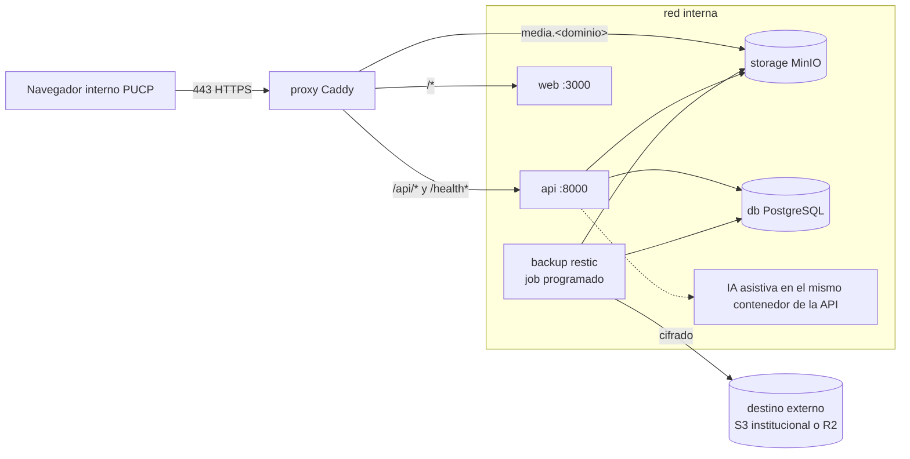

## Context

- `docker-compose.yml` de desarrollo: `db` (`postgres:18-alpine`), `storage` (MinIO `quay.io/minio/minio` con etiqueta fija, ver ADR-003), `api`, `ai`, `web` con healthchecks; puertos 5432/9000/9001 publicados para desarrollo.
- Imágenes Python 3.14 y Next.js `output: standalone`; aún no se han construido por falta de Docker (bloqueo de entorno).
- Datos a proteger: base PostgreSQL (catálogo, auditoría, usuarios con datos personales) y bucket de objetos (fotos originales, archivos de importación, exportaciones temporales).
- Información pendiente de la DTI/contraparte: sistema operativo y recursos de la VM, dominio y certificado, acceso SSH, destino externo de respaldos y correo para alertas [SUPUESTO C6].

## Goals / Non-Goals

**Goals:**
- Un despliegue que otra persona pueda repetir siguiendo un documento (RNF-004).
- RPO ≤ 24 h y RTO ≤ 4 h [SUPUESTO] demostrados con un simulacro real.
- Nada de datos ni credenciales expuestos fuera de la red interna de contenedores.

**Non-Goals:**
- Automatizar la administración del sistema operativo de la VM.
- Escalado horizontal.

## Decisions

### D1. Topología de producción

- Solo `proxy` publica puertos (80 → redirección, 443). `db`, `storage`, `ai` sin puertos publicados.
- Las URL prefirmadas de fotos se publican en un **subdominio propio** `media.<dominio>` con
  `reverse_proxy storage:9000` que **conserva el encabezado Host**; el bucket se expone como
  `S3_PUBLIC_ENDPOINT_URL=https://media.<dominio>`. Motivo: las URL prefirmadas S3 firman host y
  ruta exactos, de modo que reescribir la ruta invalida la firma.
  *Descartada*: publicarlas bajo la ruta `/media-store/*` en el mismo dominio, porque la
  reescritura de ruta cambia el host/ruta firmados y rompe toda URL prefirmada.
- El proxy **no** publica `/ai/*`: la IA solo se invoca dentro del proceso de la API (ADR-008).
- Contenedores con usuario no root, `read_only` donde sea posible, `restart: unless-stopped`, límites de memoria acordes a la VM.
- Secretos en `/opt/matp/.env.production` (permisos 600) fuera del repositorio; nunca en imágenes.
- El overlay de Compose y el `Caddyfile` de referencia (Anexo A del documento de ajustes cap6-8)
  están en [`deploy-reference.md`](deploy-reference.md) de este change.

### D2. Proxy: Caddy
Caddy con configuración declarativa, HTTPS automático (ACME) si el dominio es público o certificado institucional montado si es interno; HSTS, `X-Content-Type-Options`, `Referrer-Policy`, `Content-Security-Policy` básica, `Permissions-Policy`, compresión y límite de tamaño de cuerpo coherente con `IMPORT_MAX_BYTES`.
*Alternativa*: nginx + certbot → más piezas móviles; se documenta como contingencia si la DTI exige nginx.

### D3. Despliegue
- `release.yml` (al crear tag `vX.Y.Z`): construye `api`, `ai`, `web` y publica en GHCR con etiqueta de versión y SHA. Sin secretos de la VM en GitHub.
- `scripts/deploy.sh <version>` en la VM: `pull` → **respaldo previo** → `alembic upgrade head` en contenedor efímero (si falla: se detiene y conserva la versión anterior corriendo) → `up -d` → espera a `/health` 200 en api y web → registra versión desplegada en `/opt/matp/deployments.log`.
- Vuelta atrás: `scripts/deploy.sh --rollback` vuelve a la etiqueta anterior; si la migración no es reversible, se restaura el respaldo previo (documentado; las migraciones deben ser aditivas por convención, ADR-004).

### D4. Respaldos con restic
- Job `backup` (contenedor efímero): `pg_dump --format=custom` en streaming a `restic backup --stdin` + `restic backup` de un espejo local del bucket obtenido con `mc mirror` (o `rclone sync`). Repositorio restic en el destino externo, cifrado con clave guardada fuera de la VM (custodia del Líder y el Implantador; procedimiento documentado).
- Retención `restic forget --keep-daily 30 --keep-weekly 8 --keep-monthly 6 --prune` [SUPUESTO C6].
- Verificación: `restic check --read-data-subset=5%` semanal y resultado registrado.
- Notificación: el script escribe un registro estructurado y, ante fallo, envía un correo por SMTP institucional o un webhook configurable (`ALERT_WEBHOOK_URL`) [SUPUESTO: canal a definir]; además deja un marcador que `/health` de la API expone como `backup_status: stale` si el último respaldo exitoso tiene más de 26 h (visible para el Administrador, sin datos del catálogo).

### D5. Restauración y simulacro
`scripts/backup/restore-test.sh`: restaura el último respaldo en un proyecto compose aislado (`matp-restore-test`) con red propia, ejecuta `alembic current`, cuenta filas de tablas clave, verifica una muestra de fotos por SHA-256 contra `media_asset.content_sha256`, ejecuta `audit:verify` si existe y escribe `docs/despliegue/simulacros/<fecha>.md` con tiempos (RTO medido) y resultado. Frecuencia mensual [SUPUESTO] y antes de cada entrega del curso.

### D6. Programación y monitoreo
- Unidades `systemd` (`deploy/vm/systemd/*.service|*.timer`): `matp-backup` (02:00), `matp-backup-check` (domingo), `matp-kpis-snapshot` (23:50), `matp-audit-digest` (00:30), `matp-disk-check` (cada hora; alerta > 80 %).
*Alternativa*: contenedor con cron → reinicios y zona horaria más difíciles de auditar; systemd queda en el registro del sistema.
- Logs: driver `json-file` con rotación (`max-size 10m`, `max-file 5`).

### D7. Contingencia free tier
`deploy/free-tier/README.md`: web en Vercel Hobby, API y servicio IA en Render Free (arranque en frío documentado), Neon Postgres (PITR del proveedor + `pg_dump` semanal por GitHub Actions programado a R2), Cloudflare R2 para objetos (CORS y URL prefirmadas), cookies `SameSite=None; Secure` y `WEB_ORIGIN`. Tabla de límites conocidos (horas, almacenamiento, suspensión por inactividad) con la fecha de consulta, ya que cambian con frecuencia.

### D8. Entorno de integración (ADR-013)

El entorno de integración (staging) es **AWS Academy Learner Lab**, decidido en
[`ADR-013`](../../../docs/adr/ADR-013-entorno-integracion-aws-academy.md): EC2 t3.medium con
Amazon Linux 2023, IP elástica y `LabInstanceProfile` ejecutando **el mismo overlay de Compose
que producción sin `db` ni `storage`**; RDS for PostgreSQL (db.t3.micro, sin acceso público,
`sslmode=require`), bucket S3 privado con Block Public Access, TLS con Caddy sobre
`<ip-elastica>.sslip.io`, región us-east-1, solo datos sintéticos (RNF-014), operación por
sesiones (se detiene RDS al final para cuidar el crédito). Las credenciales S3 vienen de la
cadena por defecto de boto3 (rol de instancia), sin claves estáticas (tarea 6.1).

### D9. Artefacto web único entre entornos (mismo origen)

`NEXT_PUBLIC_API_URL` vacío o ausente ⇒ el navegador llama a la API por **ruta relativa**
(`/api/v1/...`, mismo origen): en staging y producción Caddy enruta `/api/*` y `/health*` a la
API antes de llegar a la web; en local, Next.js reenvía `/api/*` y `/health` con `rewrites()` a
`API_INTERNAL_URL`. En el servidor (SSR o route handlers) se usa `API_INTERNAL_URL`, porque ahí
no hay origen relativo. Así **una sola imagen del frontend sirve para todos los entornos** y las
cookies de sesión de ADR-009 (mismo origen) funcionan sin ajustes (tarea 6.2).

## Risks / Trade-offs

- **Información de la VM desconocida** → todo parametrizado; checklist de datos a pedir a la DTI en `docs/despliegue/checklist-vm.md` y preguntas registradas.
- **Clave de cifrado de respaldos perdida = respaldos inútiles** → custodia dual documentada y verificación en cada simulacro.
- **URL prefirmadas** → la reescritura de ruta (`/media-store/*`) invalidaba la firma; resuelto en D1 con subdominio propio `media.<dominio>` que conserva el Host (la alternativa queda descartada).
- **Sin Docker en la máquina del arranque** → este change no puede verificarse hasta tener Docker y la VM; tareas marcadas en consecuencia.
