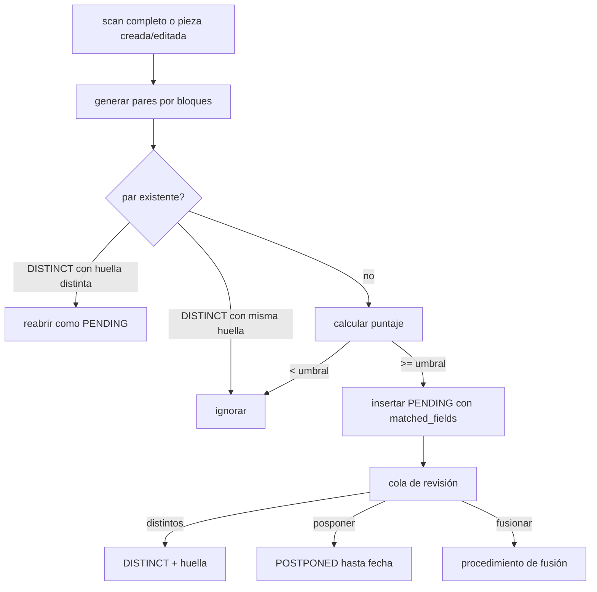

## Context

- `duplicate_candidate`: `piece_a_id`, `piece_b_id` o `import_row_id`, `score` (0–1), `matched_fields`, `status` (`DuplicateStatus`), `compared_fingerprint`, `detected_by`, revisor, nota. `piece.merged_into_id` existe.
- `pg_trgm` e índices GIN de trigramas creados en `0001_core_data_model`.
- Permiso `duplicates.resolve` (Gestor de colecciones, Administrador) [SUPUESTO B7]; la fusión afecta identificadores y fotos de dos piezas.

## Goals / Non-Goals

**Goals:**
- Sospechas explicables (qué campos y por qué) y ajustables sin código.
- Detección completa de 20 000 piezas en minutos, no horas, sin comparar todos contra todos.
- Fusión segura, auditada y reversible que respeta RN-002/RN-003.

**Non-Goals:**
- Aprendizaje automático o embeddings.
- Resolución automática sin humano.

## Decisions

### D1. Generación de candidatos por bloques (blocking) y puntaje
Comparar todos contra todos (≈2·10⁸ pares) no es viable. Se generan pares candidatos por bloques:
1. Mismo valor normalizado de cualquier identificador (vigente o histórico) en piezas distintas.
2. Similitud de trigramas de `title` ≥ 0.45 (`%` de `pg_trgm` con `set_limit`) dentro de la misma colección raíz o piezas sueltas.
3. Mismo autor normalizado + procedencia normalizada + similitud de título ≥ 0.3.

Puntaje ponderado (pesos en `quality_setting`, auditados) [SUPUESTO]:

| Señal | Peso |
|---|---|
| identificador normalizado igual (por tipo; I pesa más) | 0.45 |
| similitud de denominación | 0.25 |
| misma colección (o subcolección) | 0.10 |
| autor / procedencia similares | 0.10 |
| épocas estructuradas superpuestas | 0.05 |
| medidas estructuradas compatibles (±5 %) | 0.05 |

Umbral de cola `DUPLICATE_MIN_SCORE=0.6`. `matched_fields` guarda cada señal con valores comparados. Contradicciones fuertes (dos códigos I vigentes distintos) no descartan el par pero se marcan `blocking_conflict` (la fusión queda bloqueada).

### D2. Huella de comparación
`compared_fingerprint` = SHA-256 de los valores normalizados de los campos comparados de ambas piezas (ordenados por ID de pieza). Un par `DISTINCT` solo se reabre si la huella cambia (RF-030 "no vuelve a proponerse mientras los datos comparados no cambien").

### D3. Ejecución
- `POST /quality/duplicates/scan` (Administrador/Gestor) corre en `BackgroundTasks` con registro en tabla `quality_job` (estado, conteos, duración); un solo scan activo a la vez (`409 scan_in_progress`).
- Incremental: al confirmar la transacción de alta/edición de pieza o identificador se encola la pieza en `quality_job_item` y un worker en proceso la procesa (bloques 1–3 solo para esa pieza). Si falla, el siguiente scan completo lo recupera.
- `SimilarityScorer.score(mapped_row_or_piece) -> list[Candidate]` expone los mismos bloques y pesos para `importacion-pipeline-reconciliacion`.

### D4. Fusión
`resolve {action: "merge", keep_piece_id, field_choices: {field: "a"|"b"}, reason}` en una transacción:
1. Validaciones: ambas piezas activas y no fusionadas (`409 stale_candidate`); códigos I vigentes distintos → `409 merge_blocked_inventory_code` (usar corrección de código I); regímenes distintos → `409 merge_blocked_tenure`.
2. Campos escalares según `field_choices` (por defecto, los de la pieza conservada; los vacíos se completan con los de la otra).
3. Identificadores de la pieza absorbida → pasan a la conservada; duplicados exactos de valor normalizado quedan como **no vigentes** en la conservada con nota "fusión" (nunca se borran). El código I vigente de la absorbida (si la conservada no tiene) se traslada manteniendo el bloqueo.
4. Fotos, movimientos, datos de origen, evaluaciones y sugerencias de IA se reasignan (`piece_id`) con auditoría.
5. Pieza absorbida: `merged_into_id=keep`, eliminación lógica con motivo "fusionada en <id>"; la API devuelve `301`-like `merged_into` en su ficha para redirigir.
6. Otros candidatos que involucran a la absorbida → `SUPERSEDED`. Todo con un `change_set_id` para permitir reversión.

### D5. Posponer
`action: "postpone", until` (máx. 180 días); al vencer vuelve a `PENDING` en la siguiente lectura de la cola (sin cron).

## Risks / Trade-offs

- **Pesos y umbrales [SUPUESTO]** → configurables y visibles; se calibrarán con la muestra real (A1).
- **Similitud de trigramas diferente en SQLite** → pruebas de lógica con `difflib`; calibración y rendimiento solo válidos en PostgreSQL (tarea con Docker).
- **Fusión incorrecta** → confirmación con comparación lado a lado, auditoría completa y reversión por conjunto de cambios.
- **Worker incremental en proceso** → mismo patrón y limitaciones que el pipeline de importación.
