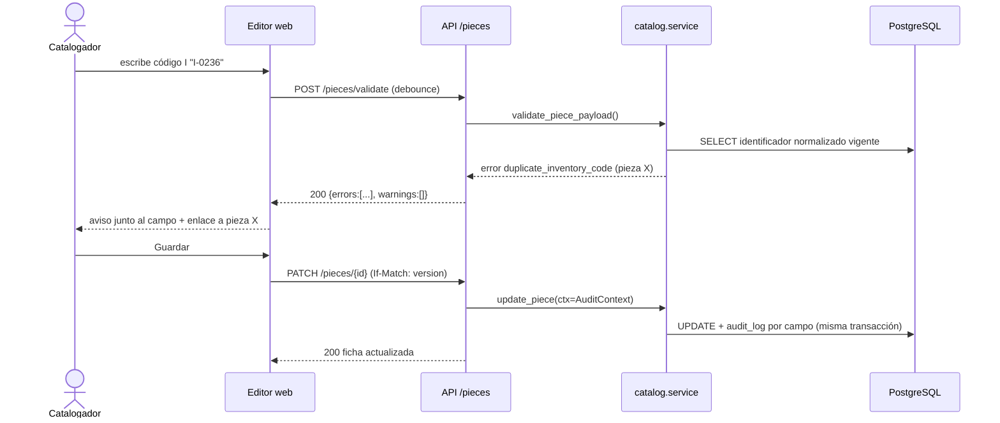

## Context

- El modelo ya existe (`piece`, `piece_identifier`, `identifier_type`, `piece_material`, `audit_log`) con guardas `before_flush`: borrado físico prohibido, código I bloqueado salvo corrección auditada por Administrador, comodato/préstamo temporal sin I, auditoría campo a campo con `AuditContext` obligatorio (ADR-004).
- La API expone lecturas implementadas y los stubs de escritura con esquemas y ejemplos (ADR-005). Las rutas y esquemas no se renombran: solo se reemplaza el stub por la implementación.
- El normalizador N1–N7 (`app/modules/identification/normalization.py`) es `[SUPUESTO]` y ya tiene ~100 casos de prueba.
- La maqueta tiene editor y ficha en modo mock (`useReducer`), y `lib/data/pieces.ts` ya tipa las lecturas `live`.

## Goals / Non-Goals

**Goals:**
- Alta, edición, eliminación lógica y restauración de piezas completamente auditadas y con las reglas de dominio aplicadas en el servidor.
- Validación idéntica en cliente y servidor (una sola fuente: el servidor).
- Registro de identificadores y corrección del código I por la API.
- Editor web conectado a la API real, usable por personas con baja alfabetización digital.

**Non-Goals:**
- Reversión genérica de ediciones (la hace `auditoria-y-soft-delete-transversal`).
- Edición masiva (la cubre la importación).
- Fotos, ubicaciones, alertas, duplicados.

## Decisions

### D1. La validación vive solo en el servidor; el cliente la consulta
`POST /pieces/validate` ejecuta exactamente la misma función `validate_piece_payload()` que usan `POST`/`PATCH`, dentro de una transacción que siempre se revierte. El editor la llama con *debounce* (~400 ms) por campo modificado. Devuelve `errors` (bloquean guardar) y `warnings` (no bloquean: formato de código no reconocido, código I de una pieza eliminada, etc.).
*Alternativa descartada*: duplicar las reglas en Zod en el cliente → divergencia garantizada con las reglas `[SUPUESTO]` que cambiarán tras la validación con la contraparte. Zod se usa solo para tipos/formato local (campos vacíos, números).

### D2. Concurrencia optimista con `version`
Se añade a `piece` una columna entera `version` (migración Alembic nueva, `server_default 1`) incrementada por SQLAlchemy `version_id_col`. `PATCH` exige la cabecera `If-Match` con la versión leída; si no coincide → `409 edit_conflict` con los valores actuales en `details`. Sin `If-Match` → `428 precondition_required`.
*Alternativa*: comparar `updated_at` → frágil con precisión de timestamps en SQLite/PostgreSQL.

### D3. Semántica de `PATCH`
JSON merge (campos ausentes = sin cambio; `null` explícito = vaciar, salvo campos obligatorios). Guardar sin cambios no genera auditoría (ya garantizado por `tracking.py`) y no incrementa `version`.

### D4. Transiciones de régimen de tenencia
Tabla de transiciones en `catalog/tenure.py`:

| Desde → Hasta | Regla |
|---|---|
| propiedad → comodato | rechazada si tiene I vigente (RN-003) |
| comodato → propiedad | requiere `reason` + `supporting_document_ref` y permiso `pieces.update` de Gestor/Administrador [SUPUESTO B3] |
| * → préstamo temporal | rechazada si tiene I o código de colección vigente (RN-004) |
| préstamo temporal → propiedad/comodato | requiere motivo; el número temporal pasa a identificador no vigente |

`legal_owner` se fija a "PUCP" en propiedad y es de solo lectura (RN-006).

### D5. Identificadores concatenados
`POST /pieces/{id}/identifiers` con un valor que el normalizador detecta como concatenado (`I 2362 / RA 28`) responde `422 concatenated_identifier` con `details.proposals` (tipo, valor original, normalizado). El cliente muestra la propuesta y reenvía **cada** identificador por separado con `confirmed_split: true`. Nunca se separan automáticamente (RF-023).

### D6. Corrección de código I
`POST .../identifiers/{identifier_id}/correction` con `{new_value, reason}`; requiere `identifiers.correct_inventory_code`. En una transacción: el identificador actual pasa a `is_current=false`, `replaced_by_id` apunta al nuevo, el nuevo queda `is_locked=true`; auditoría con acción `CORRECTION` y `reason`. Si `new_value` normalizado pertenece a otra pieza (activa o eliminada) → `409` con referencia a esa pieza (A6).

### D7. Eliminación y restauración
`DELETE` exige cuerpo `{reason}` (no vacío); usa `soft_delete.py`. `restore` requiere `pieces.restore` y falla con `409` si al restaurar se duplicaría un código I vigente de otra pieza activa.

### D8. Editor web
Formulario por secciones (Identificación, Descripción, Procedencia y época, Medidas y materiales, Conservación, Observaciones) con etiquetas visibles y botón grande "Guardar". Se propone `react-hook-form` + `zod` (dependencias nuevas; versiones estables consultadas al instalar). *Contingencia*: formulario controlado con `useReducer` como en la maqueta. El borrador se guarda en `sessionStorage` antes de enviar para recuperarlo si la sesión expira (RNF-012 escenario "Sesión expirada"). Registrar la elección en un ADR Propuesto.

## Risks / Trade-offs

- **Reglas `[SUPUESTO]` (A2, A5, A6, B1, B3, B8, B11)** pueden cambiar → se concentran en `tenure.py`, el normalizador y `validate_piece_payload()`, con pruebas que las fijan explícitamente.
- **Migración de `version`** toca la tabla más grande → aditiva, con default; coordinar el orden de migraciones con otros changes (numerar al abrir el PR).
- **Debounce de validación en conexión lenta (RNF-005)** → el cliente cancela peticiones anteriores (`AbortController`) y nunca bloquea la escritura.
- **Consultas `ilike`/`exists` solo probadas en SQLite** → la tarea de verificación en PostgreSQL es obligatoria cuando Docker esté disponible.

## Open Questions

- Campos obligatorios adicionales (B1) y formato del código derivado de componentes (B8): se implementan como configuración; no bloquean las tareas.
