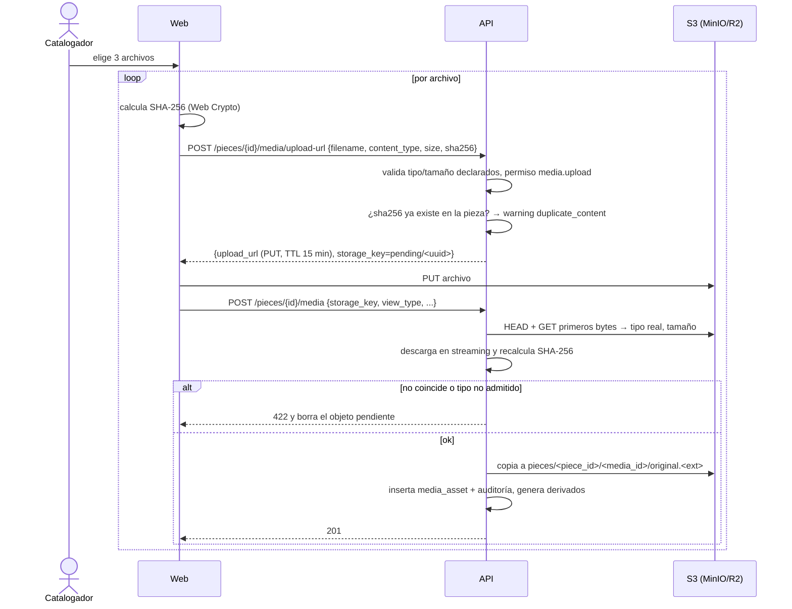

## Context

- `media_asset` ya tiene `storage_key` único, `content_type`, `size_bytes`, `content_sha256` (índice con `piece_id`), dimensiones, tipo de vista (vocabulario `PHOTO_VIEW_TYPE`), orden, principal, autor, fecha, restricción (`USAGE_RESTRICTION`) y soft-delete.
- `app/core/storage.py` envuelve boto3 con `put_bytes`, `check` y `ensure_bucket`; `.env.example` ya separa `S3_ENDPOINT_URL` (interno) de `S3_PUBLIC_ENDPOINT_URL` (navegador) para URL prefirmadas.
- Destino productivo: VM PUCP con MinIO, o Cloudflare R2 en contingencia (RNF-002). Ambos soportan URL prefirmadas `PUT`/`GET` S3 v4.
- Permisos sembrados: `media.upload`, `media.retire`.

## Goals / Non-Goals

**Goals:**
- Subir fotos grandes sin pasar el binario por la API (conexión lenta, límites de memoria del free tier).
- Integridad: lo registrado es exactamente lo subido (tipo real, tamaño, SHA-256).
- Restricciones de comodato aplicadas en el servidor.
- Estimación de volumen para decidir almacenamiento.

**Non-Goals:**
- Edición de imágenes, recortes o marcas de agua.
- CDN pública (fase 1 es interna, RF-042).

## Decisions

### D1. Subida directa con URL prefirmada en dos pasos

- El objeto `pending/` que nunca se registra se elimina por regla de ciclo de vida del bucket (24 h) — es un archivo temporal no registrado, no información del catálogo, por lo que no contradice RN-005.
- *Alternativa*: `multipart/form-data` a la API → más simple, pero duplica ancho de banda y memoria en la API; queda como **contingencia** si el proveedor S3 no admite URL prefirmadas (flag `MEDIA_UPLOAD_MODE=proxy`).

### D2. Validación del tipo real
Se leen los primeros bytes y se abre con Pillow (`Image.open(...).verify()`); se aceptan JPEG, PNG y TIFF [SUPUESTO C1] configurables en `MEDIA_ALLOWED_TYPES`. Límite por defecto `MEDIA_MAX_BYTES=52428800` (50 MB) [SUPUESTO]. Se registran ancho/alto.

### D3. Derivados
Tras registrar, se generan `thumb.webp` (lado mayor 320 px) y `display.webp` (1600 px) en `pieces/<piece_id>/<media_id>/`. Se ejecuta en un `BackgroundTask` de FastAPI; si falla, la foto queda registrada con `extra_metadata.derivatives="failed"` y la UI muestra el original escalado. Los listados usan `thumb` (RNF-005). Un comando `python -m app.media.rebuild_derivatives` regenera derivados faltantes.
*Alternativa*: cola dedicada (Celery/RQ) → dependencia y servicio extra no justificados para ≤10 usuarios (RNF-002).

### D4. Foto principal única y orden
`PATCH` con `is_primary=true` desmarca la anterior en la misma transacción. Orden: `PATCH` acepta `sort_order`; se añade `PUT /pieces/{piece_id}/media/order` (operación nueva) con la lista completa de IDs para reordenar en una sola transacción. Si se retira la principal, pasa a ser principal la de menor `sort_order`.

### D5. Restricciones de uso
Precedencia: restricción de la foto > restricción por defecto de la pieza > restricción por defecto de la colección en comodato (campo nuevo `collection.default_usage_restriction_term_id`, migración aditiva). La restricción efectiva se calcula en el servidor y se devuelve como `effective_restriction` con su origen. Los términos del vocabulario `USAGE_RESTRICTION` tienen un atributo `blocks_external_download` (en `term.extra`/metadatos, [SUPUESTO B2]).
- `GET /pieces/{piece_id}/media/{media_id}/download-url?purpose=internal|external`: `external` se rechaza con `409 usage_restricted` si la restricción lo bloquea. `internal` (ver en pantalla) siempre se permite a usuarios con `pieces.read`.
- Las URL de lectura son prefirmadas con TTL `MEDIA_URL_TTL_SECONDS=300`; el bucket nunca es público (RF-042).

### D6. Estimación de volumen
`GET /api/v1/media/storage-estimate?pieces=&photos_per_piece=&mb_per_photo=` devuelve volumen actual (suma de `size_bytes` de originales activos y derivados estimados), promedio real de fotos por pieza y MB por foto, y proyección. Requiere `reports.view` o Administrador. Sin fotos, el promedio real es `null` y la proyección usa solo parámetros.

## Risks / Trade-offs

- **CORS del bucket** para `PUT` desde el navegador → documentar configuración de MinIO y R2 en `docs/despliegue/` (coordinado con `despliegue-vm-y-respaldos`).
- **Recalcular SHA-256 en la API** descarga el archivo: costo de red interna aceptable en la VM; en R2 implica egreso gratuito. Si fuera costoso, se confía en `ChecksumSHA256` de S3 cuando el proveedor lo soporte.
- **TIFF grandes** pueden agotar memoria al generar derivados → `Image.MAX_IMAGE_PIXELS` configurado y derivado marcado como fallido sin afectar el registro.
- **Restricciones [SUPUESTO B2]** → vocabulario configurable; ninguna regla fija en código salvo el bloqueo de descarga externa.
