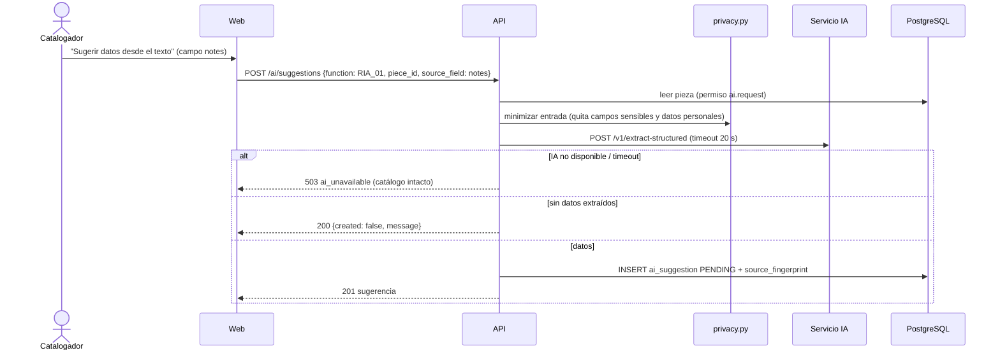

## Context

- Servicio IA (`services/ai`): `AIProvider` con `extract_structured(text) -> ExtractionResult(fields: [ProposedField(field, value, source_fragment, confidence)])`, `MockProvider` determinista, `LLMProvider` stub (503), sobre `SuggestionEnvelope` con `status: PENDING_REVIEW` y `requires_human_approval: true`. `PieceContext` rechaza campos sensibles.
- API: `ai_suggestion` con `function_code`, `status` (PENDING, APPROVED, PARTIALLY_APPROVED, REJECTED), `input_data`, `output_data`, `approved_data`, revisor, motivo; CHECK de RN-009 en BD; lecturas implementadas.
- Permisos: `ai.request` (Catalogador, Gestor, Conservación), `ai.review` (Gestor, Administrador) [SUPUESTO B7]. `AuditOrigin.AI` representa el origen "IA aprobada" (solo se usa desde el flujo de aprobación).

## Goals / Non-Goals

**Goals:**
- Ningún dato de IA en el catálogo sin una aprobación humana registrada, verificable en BD y en código.
- Flujo genérico reutilizable por RIA-03/RIA-04.
- Demos sin red ni credenciales (proveedor simulado).

**Non-Goals:**
- Proveedor real, costos, *prompt engineering*.
- Procesamiento masivo o asíncrono de muchas piezas.

## Decisions

### D1. Solicitud síncrona con tiempo límite

- La entrada guardada (`input_data`) es exactamente lo enviado al proveedor (trazabilidad de qué datos salieron).
- `privacy.py`: lista blanca de campos enviables por función; los campos sensibles (`users/sensitive.py`) nunca se envían; patrones simples de datos personales (correos, teléfonos, DNI de 8 dígitos) se reemplazan por marcadores cuando el proveedor no es `mock` [SUPUESTO B12].
- Límite por usuario: 30 solicitudes/10 min (en memoria) para proteger costos futuros.

### D2. Estructura de la sugerencia y destinos RIA-01
`output_data.items[]`: `{item_id, kind, target, value, source_fragment, confidence}`.

| `kind` | Destino al aprobar |
|---|---|
| `dimension` | `piece.dimensions` (lista estructurada: dimensión, valor, unidad); el texto original se conserva |
| `conservation_status` | nueva evaluación en `conservation_assessment` con término activo del vocabulario (si el valor no corresponde a un término activo, el ítem no puede aprobarse sin elegir uno) |
| `exhibition` | se guarda en `approved_data` con `pending_application=true` hasta que exista el módulo de exposiciones (RF-018) [SUPUESTO] |
| `revision_mark` | se añade a `piece.notes` como línea "Marca de revisión (IA aprobada): ..." |

El mapeo `ProposedField.field` del servicio IA → `kind`/`target` vive en `ai_suggestions/apply.py`.

### D3. Aprobación y rechazo
- `approve {items: [{item_id, value?}], confirm_stale?: bool}`: requiere `ai.review`; ítems no incluidos se consideran no aprobados. Todos → `APPROVED`; subconjunto → `PARTIALLY_APPROVED`; `was_edited=true` si algún valor difiere del propuesto (la spec vigente llama a esto "aprobada con cambios").
- Aplicación en una transacción usando los servicios de dominio (mismas validaciones que el ingreso manual; un valor editado inválido → `422` y nada se aplica) con `AuditContext(origin=AuditOrigin.AI, origin_ref=suggestion_id)` (etiqueta visible "IA aprobada").
- `reject {reason}`: motivo obligatorio; nada se aplica; la sugerencia se conserva.
- Una sugerencia ya revisada no puede revisarse de nuevo (`409 suggestion_already_reviewed`).
- Guarda adicional en código: `apply.py` es el **único** punto que escribe datos provenientes de IA y exige `suggestion.status in {APPROVED, PARTIALLY_APPROVED}` y `reviewed_by_id` antes de escribir (complementa el CHECK de BD); prueba que intenta escribir sin aprobación y falla.

### D4. Obsolescencia
`source_fingerprint` = SHA-256 de los valores actuales del campo de origen y de los campos destino al crear la sugerencia. Al aprobar se recalcula; si difiere y no viene `confirm_stale=true` → `409 suggestion_stale` con valores actuales vs. los del momento de la sugerencia.

### D5. Indicadores
Operación nueva `GET /api/v1/ai/metrics?from=&to=`: por función, número de sugerencias por estado, porcentaje de ítems aprobados, editados y rechazados, y motivos de rechazo más frecuentes. Solo lectura, sin datos de piezas.

## Risks / Trade-offs

- **Llamada síncrona** bloquea una petición hasta 20 s → aceptable para uso individual; RIA masivo quedaría para un change asíncrono.
- **Exposiciones sin módulo** → retenidas y visibles; riesgo de olvido mitigado con un indicador "aprobadas pendientes de aplicar".
- **Minimización de datos por patrones** no es perfecta → con `mock` no sale nada de la red; un proveedor real exige ADR y validación B12 antes de activarse.
