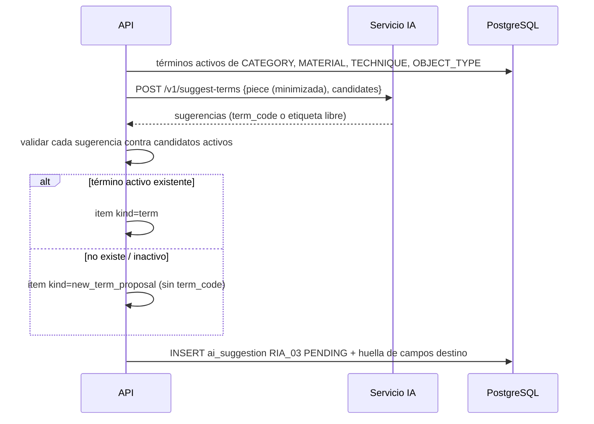

## Context

- Servicio IA: `suggest_terms(piece: PieceContext) -> TermSuggestionResult(suggestions: [TermSuggestion(vocabulary_code, term_code, label, source_fragment, confidence)])`; hoy el `MockProvider` no conoce los vocabularios reales de la API.
- API: vocabularios `CATEGORY`, `MATERIAL`, `TECHNIQUE`, `OBJECT_TYPE` con términos (`is_active`, `external_uri`); `piece.category_term_id`, `piece.object_type_term_id`, `piece_material` (relación múltiple); técnica: **no existe** relación por pieza en el modelo actual (solo el vocabulario `TECHNIQUE`), por lo que se añade `piece_technique` análoga a `piece_material`.
- Flujo genérico de sugerencias (`ia-extraccion-texto-libre`): solicitud, huella, `apply.py`, aprobación parcial/edición, rechazo, métricas.

## Goals / Non-Goals

**Goals:**
- La IA nunca inventa términos que entren al catálogo sin pasar por un Gestor.
- Sugerencias útiles con el proveedor simulado para demostrar el flujo.
- Normalizar tipologías a escala (lotes) sin perder el control humano.

**Non-Goals:**
- Construir o importar un tesauro.
- Clasificación automática sin revisión.

## Decisions

### D1. La API envía los candidatos
`POST /v1/suggest-terms` del servicio IA pasa a recibir `{piece: PieceContext, candidates: [{vocabulary_code, term_code, label, alt_labels[]}], max_per_vocabulary}`. La API construye `candidates` con términos **activos** de los vocabularios pedidos (por defecto los cuatro), limitados a 2 000 por solicitud [SUPUESTO: tamaño esperado de vocabularios]. Cambio compatible: si `candidates` falta, el servicio responde como hoy (solo para pruebas del servicio aislado).
*Alternativa*: que el servicio IA consulte la base de datos → acopla el servicio a la BD y rompe el desacoplamiento de RNF-008.

### D2. Proveedor simulado
Coincidencia determinista: normaliza (minúsculas, sin tildes) el texto de `title`, `description`, `materials`, `technique` y busca etiquetas y `alt_labels` de candidatos como palabras completas; confianza según longitud y número de apariciones. Palabras de una lista fija de ejemplo sin candidato (p. ej. "maguey" si no existe) se devuelven como etiqueta libre para ejercitar "término nuevo".

### D3. Aplicación por tipo de vocabulario

| Vocabulario | Cardinalidad | Al aprobar |
|---|---|---|
| `CATEGORY`, `OBJECT_TYPE` | uno | si la pieza no tiene valor, se asigna; si tiene otro, el ítem exige `replace=true` explícito |
| `MATERIAL`, `TECHNIQUE` | varios | se agrega si no está; nunca se quitan los existentes |

Todo mediante `apply.py` (único punto de escritura de IA) con auditoría de origen IA. La huella de obsolescencia cubre los campos destino.

### D4. Término nuevo
Ítem `new_term_proposal {vocabulary_code, label, source_fragment}`. Aprobarlo exige `vocabularies.manage` además de `ai.review` y un cuerpo `{create: {code, label, description?, external_uri?}}`:
1. Se normaliza la etiqueta (minúsculas, sin tildes, espacios) y si coincide con un término existente (activo o inactivo) → `409 term_exists` con el término para usarlo o reactivarlo por la vía de administración.
2. Se crea el término y se aplica a la pieza en la misma transacción; auditoría de ambos con referencia a la sugerencia.
Un Catalogador con `ai.review` pero sin `vocabularies.manage` puede aprobar los ítems de términos existentes y dejar pendiente el término nuevo (la sugerencia queda `PARTIALLY_APPROVED` con el ítem pendiente visible para un Gestor) [SUPUESTO: permite repartir la revisión].

### D5. Solicitud por lote
`POST /ai/suggestions/batch {function: RIA_03, piece_ids (≤ 50), vocabularies}` → `202` con `batch_request_id`; procesamiento secuencial en segundo plano (mismo patrón de worker en proceso) con una sugerencia por pieza; piezas sin coincidencias no generan sugerencia; progreso por `GET /ai/suggestions/batch/{id}`. Límite de un lote activo por usuario. Si el servicio IA cae a mitad, el lote queda `PARTIAL` con las piezas procesadas.

## Risks / Trade-offs

- **Candidatos grandes** en la petición → límite de 2 000 y filtrado por vocabularios pedidos; con proveedor real se evaluará preselección por similitud.
- **Reemplazo de categoría** puede ocultar una clasificación previa correcta → requiere `replace=true` y queda en auditoría (reversible).
- **Dependencia bloqueante con `ia-extraccion-texto-libre`** → misma célula; secuenciar en el tablero.
