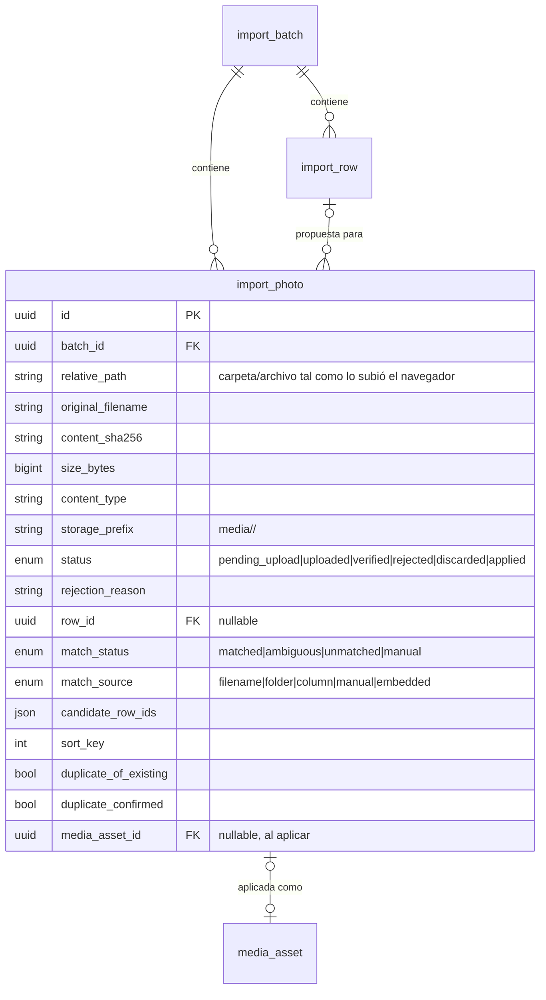

## Context

- **Pedido del cliente** (validación del prototipo v3, 2026-10): al importar varios Excel de piezas nuevas, cargar a la vez sus fotos y no subirlas una por una desde la ficha.
- **Volumen**: ≈ 10 000 piezas y ≈ 25 000 imágenes [SUPUESTO: estimación del equipo con el museo]. Una foto de cámara pesa entre 3 y 8 MB, es decir, entre 75 y 200 GB de originales; la cuota de nube de la universidad es limitada y está por confirmar.
- **Nombres de archivo**: el museo no sabe hoy cómo están nombradas sus fotos. Cada pieza tiene varias fotos.
- **Datos reales revisados (solo estructura)**: ninguna de las bases entregadas trae imágenes incrustadas, por lo que la D8 de `importacion-pipeline-reconciliacion` no resuelve el pedido. Los códigos aparecen con muchas variantes (`I-99999`, `MMZ 999`, `RA-999`, INC/RN de 5 y 6 dígitos, números convertidos a `1234.0`), así que el emparejamiento debe usar el normalizador de identificadores.
- **Lo que ya existe o está diseñado**:
  - `media_asset` con `storage_key`, `content_sha256`, `original_filename`, `extra_metadata` y soft-delete.
  - `app/modules/identification/normalization.py` (`normalize(rule, raw)`, `canonical`, `is_absence_marker`).
  - `import_batch` / `import_row` con `mapped_data`, `decision` y `target_piece_id`.
  - `fotografias-multiples-por-pieza`: subida con URL prefirmada, verificación de tipo real y SHA-256, derivados `thumb.webp` (320 px) y `display.webp` (1600 px), restricción efectiva.
  - `importacion-pipeline-reconciliacion`: estados del lote, worker en proceso con latido, aplicación en una transacción y reversión vía `revert_change_set()`.

## Goals / Non-Goals

**Goals:**
- Cargar las fotos de un lote en una sola acción del usuario, tolerando cortes de conexión y miles de archivos.
- Proponer automáticamente la fila de cada foto y dejar al humano solo los casos ambiguos o sin coincidencia.
- Aplicar piezas y fotos de forma atómica, y revertirlas juntas.
- Mantener el volumen dentro de una cuota limitada sin perder la posibilidad de conservar originales.

**Non-Goals:**
- Carga masiva de fotos a piezas ya existentes sin un Excel.
- Reconocer el tipo de vista con IA.
- Migrar el archivo fotográfico histórico del museo.
- Elegir el proveedor de almacenamiento (`despliegue-vm-y-respaldos`).

## Decisions

### D1. Modelo `import_photo` (migración aditiva)



- Índice único `(batch_id, content_sha256)`: es lo que permite **reanudar** una subida, porque la misma foto no se registra dos veces en el lote.
- Las filas de `import_photo` son datos intermedios del lote, igual que `import_row`. No son información del catálogo hasta aplicar.
- *Alternativa*: crear `media_asset` directamente con una marca «pendiente». Se descartó porque mezcla datos no aprobados con el catálogo y complica las consultas de galería y las alertas de «sin fotografía».

### D2. Subida reanudable por tandas, directa al almacenamiento

```mermaid
sequenceDiagram
    actor U as Catalogador
    participant W as Web (asistente)
    participant A as API
    participant S as S3 (MinIO/R2)
    participant J as Worker del lote
    U->>W: arrastra carpeta(s) o elige con selector de carpeta
    W->>W: lista archivos (ruta relativa), filtra extensiones, SHA-256 en Web Worker
    loop tandas de hasta 100 archivos
        W->>A: POST /imports/{batch_id}/photos/upload-urls [{relative_path, size, content_type, sha256}]
        A->>A: valida lote no aprobado, límites; ya existe (batch, sha256)? → already_registered
        A-->>W: por archivo: upload_url (PUT, TTL 15 min) o already_registered
        par concurrencia limitada (4)
            W->>S: PUT media/<photo_id>/upload.<ext>
        end
        W->>A: POST /imports/{batch_id}/photos/complete [photo_ids]
        A->>J: encola verificación
    end
    J->>S: HEAD + lectura en streaming: tipo real, tamaño, SHA-256
    J->>S: genera thumb.webp y display.webp en media/<photo_id>/
    J->>A: import_photo → verified | rejected(motivo)
```

- **Reanudar**: si se corta la conexión, el usuario vuelve a soltar la misma carpeta. Los archivos ya registrados vuelven como `already_registered` y no se suben otra vez. Las URL vencidas se piden de nuevo.
- **Claves definitivas desde el inicio** (`media/<photo_id>/…`): la aplicación del lote no copia objetos, solo inserta filas en la base, y por eso puede ser atómica.
- El SHA-256 se calcula en el navegador dentro de un Web Worker. Así la interfaz no se congela con miles de archivos.
- Límites configurables: `IMPORT_MAX_PHOTOS` por lote (5 000 [SUPUESTO]) y `MEDIA_MAX_BYTES` (el de `fotografias-multiples-por-pieza`). Se aceptan JPEG, PNG y TIFF (`MEDIA_ALLOWED_TYPES`). Se ignoran en silencio `Thumbs.db`, `.DS_Store` y los archivos ocultos.
- La verificación y los derivados se ejecutan en el worker en proceso del lote (patrón de `app/core/jobs.py`, ADR-010) con su latido. Las fotos que quedan en `uploaded` se vuelven a encolar al reiniciar.
- *Alternativa*: subir un ZIP a la API. Se descartó porque duplica el ancho de banda, obliga a la API a tener el ZIP entero en disco y no permite reanudar. Queda como contingencia `MEDIA_UPLOAD_MODE=proxy`, igual que en `fotografias-multiples-por-pieza`.

### D3. Emparejamiento propuesto en tres vías

El emparejamiento se ejecuta al terminar la validación del lote, cuando ya existen los identificadores normalizados de cada fila. Se vuelve a ejecutar cuando llegan fotos nuevas o cambia el mapeo, y nunca pisa una asignación manual.

1. **Índice del lote**: `{(tipo, valor_normalizado) → [row_id]}` con todos los identificadores mapeados de las filas (I, colección, INC/RN, PUCP, otros).
2. **Candidatos del nombre**: se toma el nombre del archivo sin extensión y se quitan los sufijos de secuencia y de vista: ` (2)`, `_2`, `-a`, `_frontal`, `copia`. Del texto restante se extraen los fragmentos que parecen códigos y se normalizan con `normalize(rule, raw)` para cada regla de tipo de identificador.
3. **Vías, en orden**: nombre de archivo, después cada carpeta de la ruta relativa (de la más cercana a la más lejana) y, por último, la columna de archivo del mapeo (campo `photo_filename` del `MappingSpec`, comparando sin distinguir mayúsculas ni extensión). Se detiene en la primera vía que da al menos un candidato.
4. **Resultado**:
   - un solo `row_id` → `matched`;
   - más de uno → `ambiguous`, con `candidate_row_ids`;
   - ninguno → `unmatched`.
5. **Orden** dentro de la fila: orden natural del nombre (`foto2` antes que `foto10`), guardado en `sort_key`.

- Las fotos extraídas de imágenes incrustadas (D8 del change hermano) pueden entrar en la misma tabla con `match_source=embedded` y su fila de anclaje. Así hay una sola bandeja.
- *Alternativa*: exigir una convención de nombres fija. Se descartó porque el museo no conoce la suya y no se puede renombrar 25 000 archivos a mano.

### D4. Bandeja y decisiones

- `GET /imports/{batch_id}/photos?status=&match_status=&row_id=&page=&limit=` y `GET /imports/{batch_id}/photos/summary` (conteos por estado). Las miniaturas se sirven con URL firmadas de corta duración.
- `PATCH /imports/{batch_id}/photos` acepta operaciones en lote:
  - `assign {photo_ids, row_id}` → `match_status=manual`;
  - `unassign {photo_ids}`;
  - `discard {photo_ids, reason}`;
  - `confirm_duplicate {photo_ids}`;
  - `reorder {row_id, photo_ids}`.
  Cada operación registra una entrada en la bitácora del lote. Asignar a una fila de otro lote responde `422`.
- **Duplicados**: si la huella ya está en otra foto del lote, la segunda se rechaza como repetida en el lote. Si la fila es de actualización y la huella ya existe en `media_asset` de la pieza destino, se marca `duplicate_of_existing` y no se aplica salvo `confirm_duplicate`.
- Permiso `imports.prepare` para subir y decidir. La aprobación sigue siendo `imports.approve`.

### D5. Aplicación y reversión

- Dentro de la transacción de aplicación del lote, después de crear o actualizar la pieza de cada fila aceptada, se llama a un servicio de `media`: `register_from_import(piece, import_photo, change_set)`. Reutiliza la validación, la restricción efectiva y la auditoría de `fotografias-multiples-por-pieza`, pero **sin verificar ni copiar de nuevo**, porque eso ya ocurrió en D2.
- En piezas nuevas, la foto con menor `sort_key` queda como principal. El tipo de vista queda en el término «sin especificar» del vocabulario `PHOTO_VIEW_TYPE` (término nuevo en el seed).
- Antes de abrir la transacción se ejecuta `HEAD` sobre los objetos de todas las fotos a aplicar. Si falta uno, el lote pasa a `FAILED_APPLY` indicando la foto y la fila, sin tocar el catálogo.
- `media_asset.extra_metadata.import_batch_id` guarda la referencia al lote. La reversión del lote (motor de `auditoria-y-soft-delete-transversal`) incluye esas fotos en su `change_set` y las retira lógicamente. Los archivos se conservan.

### D6. Originales y cuota

- `MEDIA_KEEP_ORIGINALS` (por defecto `true` [SUPUESTO]). Si es `false`, después de aplicar se borra `upload.<ext>`, que es un archivo temporal del área de carga y no un dato del catálogo, y `media_asset.storage_key` apunta a `display.webp`. `size_bytes` y `content_sha256` del original se guardan en `extra_metadata.original`.
- Con `false`, una foto cuyo derivado falla queda `rejected` en el lote. No se puede aplicar sin una copia visible.
- La estimación de volumen de `fotografias-multiples-por-pieza` (`GET /media/storage-estimate`) agrega el campo `keeps_originals` y desglosa el volumen por tipo de archivo (original, display, thumb).
- Cálculo orientativo para 25 000 fotos: originales de 75 a 200 GB; `display` de 1600 px a unos 300 KB más `thumb` a unos 20 KB, unos **8 GB**.

### D7. Objetos huérfanos

Las fotos de lotes **abandonados** o descartadas se conservan `IMPORT_PHOTO_RETENTION_DAYS` días (30 [SUPUESTO]). Pasado ese plazo, un comando (`python -m app.imports.purge_photos`) elimina sus objetos y deja la fila `import_photo` como registro en la bitácora. Esto no contradice RN-005, porque esos archivos nunca fueron información del catálogo. Lo mismo aplica a los `PUT` que nunca se completaron.

### D8. Frontend

- Paso «Fotografías» en el asistente de importación, entre mapeo y previsualización, tomando como referencia de UX la pantalla «Importar» del prototipo v3. Permite seleccionar carpeta (`<input webkitdirectory>`) y arrastrar carpetas (`DataTransferItem.webkitGetAsEntry`). Muestra el avance global y por archivo, y un botón «reanudar».
- En la previsualización, cada fila muestra sus miniaturas propuestas. La bandeja lateral tiene filtros (ambiguas, sin emparejar, repetidas), selección múltiple y la acción «asignar a fila».
- Sin librerías nuevas: `fetch` con concurrencia limitada y reintentos con espera exponencial.

## Risks / Trade-offs

- **Nombres de archivo sin ningún código** → todo cae en la bandeja manual. *Mitigación*: la vía por carpeta y la columna de archivo del mapeo; además, pedir al museo un pantallazo de sus carpetas (pregunta abierta) para afinar los sufijos en D3.
- **Falsos positivos** (un número corto como `245` coincide con varios tipos de código) → se marcan como ambiguas, nunca se asignan por adivinanza. Opcionalmente se restringe el emparejamiento a ciertos tipos de identificador por lote.
- **Generar 25 000 derivados con Pillow** (unos 0,3 s por foto) → se procesa por lote en segundo plano con el worker en proceso. Si medimos más de 10 minutos para 1 000 fotos en la VM, se activa la contingencia de cola externa documentada en ADR-010.
- **CORS y URL prefirmadas** en R2 y MinIO → misma configuración que `fotografias-multiples-por-pieza`, documentada en `docs/despliegue/almacenamiento.md`.
- **Navegadores sin selector de carpeta** → se admite la selección múltiple de archivos (se pierde la vía «carpeta»). Navegador objetivo: Chrome o Edge en el museo [SUPUESTO].
- **Cuota insuficiente incluso sin originales** → la estimación de volumen alerta antes de aprobar un lote que supere el umbral configurable `MEDIA_QUOTA_BYTES`.

## Migration Plan

1. Migración aditiva: tabla `import_photo`, enums y término «sin especificar» en `PHOTO_VIEW_TYPE`. No toca datos existentes. Se revierte con `downgrade`.
2. Variables nuevas en `.env.example`: `IMPORT_MAX_PHOTOS`, `MEDIA_KEEP_ORIGINALS`, `IMPORT_PHOTO_RETENTION_DAYS`, `MEDIA_QUOTA_BYTES`.
3. Se despliega detrás del paso nuevo del asistente. Un lote sin fotos se comporta igual que antes.

## Open Questions

- ¿Cómo nombra el museo hoy sus archivos y carpetas de foto? Basta un pantallazo de una carpeta, sin imágenes.
- ¿Cuál es la cuota de almacenamiento que ofrece la PUCP y hay que conservar los originales? Eso define `MEDIA_KEEP_ORIGINALS`.
- ¿Cuánto pesa una foto típica y en qué formato está (JPEG, TIFF, RAW)?
- ¿Las fotos de una pieza permiten distinguir el tipo de vista por nombre? Si es así, D3 puede proponer la vista además de la fila.
