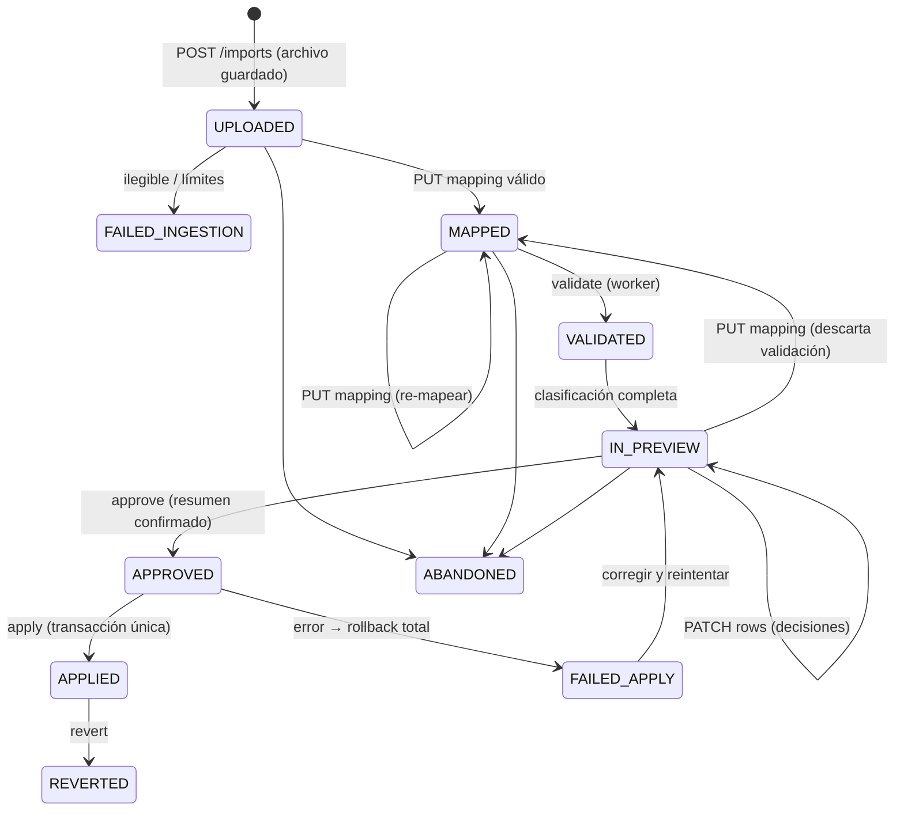

## Context

- Modelo existente: `import_batch` (estado `ImportBatchStatus`, archivo, plantilla, cargador, aprobador, marcas por etapa, conteos), `import_row` (`raw_data`, `mapped_data`, `classification`, `validation_errors`, `matches`, `diff`, `decision`, `decision_reason`, `target_piece_id`), `piece_source_record` (payload de origen por lote), `duplicate_candidate` (con `import_row_id`).
- Seed: un lote sintético en previsualización y `data/fixtures/sabana_sintetica_v1.xlsx` con imágenes incrustadas y el "caos de codificación".
- Normalizador N1–N7 y búsqueda por identificador normalizado ya implementados.
- Permisos: `imports.prepare` (Catalogador, Gestor), `imports.approve` (Gestor, Administrador), `imports.revert` (Administrador) [SUPUESTO B7].
- Sin cola de trabajos externa y objetivo free tier (RNF-002).

## Goals / Non-Goals

**Goals:**
- Ningún dato llega al catálogo sin aprobación (RF-021) y la aplicación es todo o nada (RF-027).
- Toda decisión (automática o humana) es explicable y queda en la bitácora.
- Lotes de hasta 20 000 filas procesables en la VM sin bloquear la API.

**Non-Goals:**
- Plantillas y transformaciones (change hermano).
- Formatos distintos de `.xlsx`/`.csv`.

## Decisions

### D1. Máquina de estados y etapas idempotentes

- Transiciones en `imports/state.py` con `SELECT ... FOR UPDATE` del lote; una transición no permitida → `409 invalid_batch_transition`.
- Cada etapa pesada (ingesta de filas, validación/matching, aplicación) es **idempotente**: borra y recalcula sus propios resultados intermedios del lote (`import_row` antes de la aprobación no es información del catálogo) y registra `stage_timestamps`.
- Worker en proceso: `BackgroundTasks` + marca `processing_started_at`/`heartbeat_at` en el lote. Al arrancar la API, los lotes con latido vencido (> 5 min) vuelven a su estado estable anterior con `status_reason="interrumpido; reintente"`.
- *Alternativa*: Celery/RQ + Redis → servicio adicional sin justificación para ≤ 10 usuarios; queda como contingencia documentada si los tiempos medidos superan 10 min por lote.

### D2. Ingesta
- `POST /imports` (multipart, permiso `imports.prepare`): guarda el original en `imports/<batch_id>/original.<ext>` (nunca se modifica) y crea el lote `UPLOADED`.
- Límites configurables: `IMPORT_MAX_BYTES` (50 MB), `IMPORT_MAX_ROWS` (20 000) [SUPUESTO].
- `.xlsx`: `openpyxl` en modo `read_only`, `data_only=True` (valores calculados de fórmulas); hoja elegida por el usuario (por defecto la primera no vacía); fila de cabeceras detectable o indicada; celdas combinadas → el valor se propaga a las filas cubiertas y se marca en `raw_data.__merged`. `.csv`: detección de codificación UTF-8/UTF-8-BOM/Latin-1 y separador `;`/`,` con `csv.Sniffer`.
- Filas totalmente vacías se omiten y se cuentan en la bitácora.

### D3. Interfaz con `plantillas-mapeo-y-normalizacion`
El pipeline solo depende de dos funciones (contrato fijado en el design del change hermano):
- `apply_mapping(raw_row: dict, mapping: MappingSpec) -> MappedRow` (campos de ficha, identificadores con valor original/normalizado/estado, payload de origen, errores de transformación).
- `validate_mapping(mapping, headers) -> list[MappingError]`.
Mientras el change hermano no esté aplicado, `PUT /imports/{id}/mapping` acepta un `MappingSpec` literal y una implementación mínima (copia directa de columna a campo + normalizador existente para identificadores).

### D4. Matching y clasificación
`imports/matching.py`: por cada identificador normalizado de la fila busca en `piece_identifier` (vigentes e históricos, piezas no eliminadas), agrupa por pieza y registra en `matches` `{piece_id, identifier_type, via: current|historical}`. `imports/classify.py` aplica reglas en orden:
1. Errores de validación (sin denominación, I en comodato RN-003, préstamo temporal con I/colección RN-004, código I inválido) → `has_validation_errors`.
2. Candidatos en ≥ 2 piezas distintas, o cambio de código I existente → `CONFLICT`.
3. Una sola pieza por código I, o por otro código sin contradicciones → `UPDATE` (+ `diff`).
4. Sin candidatos y puntaje de similitud ≥ umbral (`SimilarityScorer`) → `POSSIBLE_DUPLICATE` (+ `duplicate_candidate` con `import_row_id`).
5. Resto → `NEW`.
Las reglas y umbrales se exponen en `GET /imports/{id}/preview` como `classification_rules` para que sean visibles al usuario (RF-025). También se detectan duplicados **dentro del mismo lote** (dos filas con el mismo código I normalizado → ambas `CONFLICT`).

### D5. Diff y decisiones
- `diff[field] = {current, incoming, default_action}`; entrante vacío con valor actual → `default_action=keep` [SUPUESTO B10].
- `PATCH /rows/{row_id}`: `decision` (ACCEPTED/EXCLUDED/REJECTED + `reason` obligatorio en REJECTED), `field_decisions` (aceptar/excluir por campo) y para `CONFLICT`/`POSSIBLE_DUPLICATE`: `resolution = {target_piece_id}` o `{as_new: true}`. Filas `CONFLICT` sin resolución o con errores de validación no pueden quedar `ACCEPTED`.

### D6. Aprobación y aplicación atómica
- `POST /approve` exige `imports.approve`, estado `IN_PREVIEW` y `summary_token` (hash de conteos crear/actualizar/omitir mostrado al usuario); si cambió → `409 summary_changed` con el resumen nuevo.
- Aplicación en **una transacción**: por fila aceptada crea/actualiza pieza e identificadores (vía servicios de `catalog`/`identification`, nunca SQL directo, para reutilizar las guardas), inserta `piece_source_record` con columnas no mapeadas (RF-008) y `source_row_number`, y usa un único `AuditContext(origin=IMPORT, origin_ref=batch_id, change_set_id=batch_change_set)`. Cualquier excepción → rollback total, lote `FAILED_APPLY` con fila y motivo.
- Para 20 000 filas se usan `flush` por bloques de 500 dentro de la misma transacción.

### D7. Reversión
`POST /revert` (`imports.revert`) delega en el motor de `auditoria-y-soft-delete-transversal` con el `change_set_id` del lote: piezas creadas → eliminación lógica con motivo; campos actualizados → valor anterior; conflictos por ediciones posteriores → `409` con lista y `confirm_conflicts=true` para forzar. Estado `REVERTED`.

### D8. Imágenes incrustadas
En la ingesta de `.xlsx` se leen las imágenes del libro (`ws._images`, anclaje `from.row`) y se guardan en `imports/<batch_id>/images/<n>.<ext>` con fila de anclaje. En la previsualización cada imagen aparece como "pendiente de revisión" en su fila o en la bandeja "sin asignar". Tras aplicar el lote, `POST /imports/{batch_id}/images/{image_id}/associate` (operación nueva) registra la foto en la pieza reutilizando el servicio de registro de `fotografias-multiples-por-pieza` (o, si aún no existe, una inserción mínima de `media_asset` con verificación de tipo y SHA-256). Nunca se asocian automáticamente.
*Riesgo*: `ws._images` es API privada de openpyxl → prueba de regresión con la sábana sintética y alternativa de leer `xl/drawings/*.xml` del ZIP.

## Risks / Trade-offs

- **Columnas reales desconocidas (A1)** → todo el comportamiento dependiente de columnas está en el mapeo; las pruebas usan sábanas sintéticas con el caos de codificación.
- **Worker en proceso se pierde al reiniciar** → etapas idempotentes y recuperación por latido.
- **Transacción larga al aplicar** → bloqueo de filas de piezas afectadas; se recomienda aplicar lotes fuera de horario y se mide en PostgreSQL (tarea de verificación con Docker).
- **Dependencia de tres changes hermanos** → interfaces fijadas y dobles provisionales; la reversión se implementa al final.
