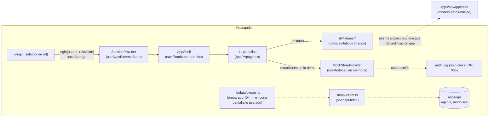

## Context

Ver `proposal.md` (Why). Punto de partida: `setup-monorepo-base` (Next.js 16 + TypeScript + Tailwind 4 en `apps/web`, sin pantallas de negocio todavía, solo `/` con el estado de los servicios) y `contratos-api-borrador` (contrato OpenAPI completo con 57 rutas/76 operaciones, 28 implementadas de verdad y 48 como stub, cliente tipado `apps/web/src/lib/api/{schema.d.ts,client.ts}` generado con `openapi-typescript`/`openapi-fetch`). Restricciones:

- Sin daemon de Docker en la máquina del arranque: la maqueta debe recorrerse completa con `next dev`/`next build` + `next start`, sin API, sin PostgreSQL y sin MinIO.
- El objetivo de la próxima reunión con Gabriela y Claudio es validar **alcance y flujos**, no el modelo de datos exacto ni el rendimiento: los datos son sintéticos y las mutaciones no persisten.
- 11 pantallas (PROMPT_BASE Fase 6) más `docs/maqueta/recorrido-demo.md`. Prioridad si falta tiempo: Búsqueda, Ficha de pieza, Asistente de importación, Cola de duplicados, Revisión de IA.

## Goals / Non-Goals

**Goals:**
- Las 11 pantallas navegables con datos sintéticos coherentes entre sí (mismas colecciones, siglas y problemas de codificación que el seed real de `apps/api`, para que la demo cuente una sola historia).
- Expresar en la interfaz las reglas de negocio no negociables (RN-001..010): código I bloqueado y sin edición libre, comodato sin I, préstamo temporal sin I ni inventario permanente, ninguna acción destructiva sin confirmación y sin "borrar" definitivo, ninguna sugerencia de IA aplicada sin aprobación humana.
- Una capa de datos (`lib/data/*`) que separe "qué pantalla necesita" de "de dónde viene el dato", para poder apuntar a la API real cuando exista sin reescribir pantallas.
- Guion de demo con preguntas a validar por pantalla.

**Non-Goals:**
- Paridad completa modo mock/modo conectado en las 11 pantallas: se preparó `lib/data/pieces.ts` (async, tipado contra el contrato real de `contratos-api-borrador`, únicas operaciones de piezas ya implementadas de verdad: listado con `q` y ficha por id) para que conectar búsqueda/ficha a la API real sea un cambio pequeño y localizado — pero **ninguna pantalla lo consume todavía**: `app/busqueda` y `app/piezas/[id]` siguen leyendo `lib/fixtures` de forma directa y síncrona en este change, porque ya están verificadas en modo mock y conectarlas requeriría poder probarlas contra Postgres (Docker no disponible en esta máquina). Queda como pendiente explícito (D4). El resto de pantallas en modo `live` deben informar que la función no está disponible en vez de simular datos, una vez conectadas.
- Persistencia de cualquier acción en modo mock (aprobar IA, fusionar duplicado, decidir fila, editar pieza, registrar movimiento): vive en memoria del navegador durante la sesión y se pierde al recargar. Es una decisión deliberada para no fingir una fuente de verdad que no existe todavía.
- Pulido visual fino, animaciones, tema oscuro, i18n: el criterio de aceptación es navegabilidad funcional (ver PROMPT_BASE Fase 6).
- Autenticación real, subida real de archivos, cálculo real de similitud/KPI: eso es contrato de `contratos-api-borrador` (ya resuelto como stub) y de los changes de backlog de Fase 7.

## Decisions

### D1. Estructura de `apps/web` y flujo de datos

- `lib/fixtures/`: datos sintéticos tipados con `ApiSchemas` (de `lib/api/client.ts`), sin dependencia de red. 14 piezas que reproducen a propósito el "caos de codificación" (códigos con puntos/espacios, celdas con dos códigos, sin I, comodato con I asignado por error y corregido, préstamo temporal, conjunto/componente, código ilegible), 6 colecciones (mismas siglas que el seed real: MMZ, RA, RAB, MBB, AJB en comodato, LRM), vocabularios/tipos de identificador/roles/permisos **copiados literalmente** de `apps/api/app/seed/reference.py` para que la matriz de permisos de la maqueta sea la misma que la de la API.
- `lib/auth/session.tsx`: sesión simulada (`{userId, roleCode}`) en `localStorage`, leída con `useSyncExternalStore` (evita el `useEffect`+`setState` que el linter del proyecto marca como error, `react-hooks/set-state-in-effect`, y sincroniza entre pestañas vía el evento `storage`). Expone `hasPermission(code)` contra la misma matriz de `PERMISSIONS`/`ROLE_PERMISSIONS` del seed.
- `lib/data/mock-store.tsx`: único lugar con estado mutable de la demo (`useReducer`), para que aprobar una sugerencia de IA en la Ficha y en la cola de Sugerencias IA muestren lo mismo. Cada acción (aprobar/rechazar IA, fusionar/marcar distinto un duplicado, decidir/aplicar una fila o lote de importación, registrar movimiento/verificación, corregir código I, editar una pieza) agrega una entrada a `auditLog` (nunca se modifica ni se borra una entrada existente, RN-005) y nunca "elimina" una pieza o sugerencia, solo cambia su estado.
- `lib/data/mode.ts` + `lib/data/masking.ts`: `NEXT_PUBLIC_API_MODE` (`mock` por defecto) selecciona la fuente; `maskPieceForRole` aplica en el cliente la misma restricción de campos sensibles que describe RF-041 (ubicación exacta, comodante, convenio de comodato) según los permisos del rol activo, para poder demostrarla sin backend.
- `NEXT_PUBLIC_API_MODE`/`NEXT_PUBLIC_API_URL` son variables `NEXT_PUBLIC_*`: se incrustan en el bundle al compilar, no en tiempo de ejecución. Por eso son build args del `Dockerfile` (no solo variables de `docker compose`): en `docker compose up --build` (pila completa) la maqueta se compila en modo `live` apuntando a `http://localhost:${API_PORT}`.

### D2. Pantallas, rutas y estado

| # | Pantalla | Ruta(s) | Notas |
|---|---|---|---|
| 1 | Login | `/` | Selector de "persona sintética" (rol fijo por persona); redirige a `/inicio` si ya hay sesión. |
| 2 | Inicio/tablero | `/inicio` | KPIs de completitud (`computeCompletenessKpis`), últimas cargas, pendientes de duplicados/IA. |
| 3 | Búsqueda | `/busqueda` | Barra única + filtros AND; `?incompleteOnly=1` desde los KPIs del tablero (via `useSearchParams`, con `<Suspense>`). |
| 4 | Ficha de pieza | `/piezas/[id]` | 7 pestañas (estado local, sin sub-rutas) + enmascarado por rol. |
| 5 | Editor de pieza | `/piezas/[id]/editar` | Validación en tiempo real (RF-043) sobre un subconjunto de campos no sensibles al I. |
| 6 | Asistente de importación | `/importacion` | 6 pasos (RF-021) sobre un lote fijo de demostración con filas "sucias". |
| 7 | Cola de duplicados | `/duplicados` | Comparación lado a lado; incluye un candidato pieza-vs-fila de importación. |
| 8 | Revisión de sugerencias IA | `/ia/sugerencias` | Editar el JSON antes de aprobar; `?resaltar=<id>` desde la Ficha. |
| 9 | Reportes | `/reportes` | 4 reportes calculados de `lib/fixtures` + exportación simulada. |
| 10 | Administración | `/administracion` | 4 pestañas de solo lectura (usuarios/roles, vocabularios, tipos de identificador, ubicaciones). |
| 11 | Vista móvil de depósito | `/deposito` | Una columna, botones grandes, sin filtros; reutiliza `registerMovement`. |

El código I nunca aparece editable fuera del flujo de corrección auditada (pestaña Identificadores de la ficha, solo visible con el permiso `identifiers.correct_inventory_code`, con confirmación y motivo obligatorio) — ni el editor de pieza (5) ni el asistente de importación (6) lo tocan directamente.

### D3. Confirmaciones y "nunca borrar" (RNF-010, RN-005)

`components/ConfirmButton.tsx` es el único punto de entrada para una acción irreversible o masiva: abre un `<dialog>` nativo con el resumen en lenguaje claro, botón de motivo obligatorio cuando aplica (rechazar sugerencia/fila, fusionar duplicado, corregir código I) y dos botones (`Cancelar`/confirmar). Ningún texto de botón dice "eliminar": "retirar foto", "fusionar", "marcar como distinto", "corregir código I", "rechazar". El "retiro" de una foto en esta maqueta es solo un botón de demostración (no cambia el estado real) para no complicar el store con un caso de uso que ningún flujo prioritario necesita.

### D4. Módulo de datos preparado para modo conectado, pantallas aún sin cablear

`lib/data/pieces.ts` expone `fetchPieces({q, page, pageSize})` y `fetchPieceDetail(id)`, ambas `async` y con la misma forma en los dos modos (`Page<PieceSummary>`, `{status: "ok"|"not_found"|"unavailable", ...}`); en modo `live` llaman a `client().GET("/api/v1/pieces", ...)` / `GET("/api/v1/pieces/{piece_id}", ...)` con los nombres de parámetro reales del contrato (`q`, `page`, `page_size`, `piece_id`), verificado con `tsc --noEmit` contra `schema.d.ts` y con pruebas unitarias de la rama mock (`lib/data/pieces.test.ts`). No se pudo probar la rama `live` de extremo a extremo (necesita `apps/api` con PostgreSQL, Docker no disponible). Pendiente explícito: reemplazar las lecturas directas de `lib/fixtures` en `app/busqueda/page.tsx` y `app/piezas/[id]/page.tsx` por este módulo (con estado de carga) y probarlo contra la API real antes de ofrecer la maqueta en modo `live` a la contraparte.

### D5. Qué queda como aproximación deliberada

- El buscador del modo mock (`lib/fixtures/index.ts#matchesQuery`) es una aproximación simple (minúsculas + quitar puntos/espacios) para fines de demostración; **no** es el normalizador real de `apps/api/app/modules/identification/normalization.py` (reglas N1–N7) y no se le exige el mismo nivel de robustez (p. ej. no reconcilia guiones faltantes). Se documenta en el propio comentario del código para que nadie lo confunda con el contrato.
- Los reportes y KPIs se recalculan en cada render a partir de `lib/fixtures` (sin caché ni paginación real): con 14 piezas es instantáneo; no valida RF-038 (rendimiento con 20 000 piezas), que es responsabilidad de la API real.
- `docs/api/openapi.json` ya no se usa como texto para escribir los fixtures a mano: se leyeron los tipos generados en `schema.d.ts` para que cada fixture tenga exactamente la forma del contrato (evita que la maqueta "mienta" sobre cómo luce un `PieceDetail`, `ImportRowOut`, etc.).

## Risks / Trade-offs

- **Un solo store en memoria compartido entre pantallas** (en vez de que cada pantalla lea sus propios fixtures estáticos) fue necesario para que aprobar/rechazar en la Ficha y en la cola de Sugerencias IA se reflejen mutuamente; a cambio, toda la app depende de un `Provider` de cliente en el layout raíz, por lo que ninguna pantalla puede ser un Server Component puro. Se acepta: el volumen de datos es pequeño (14 piezas) y la prioridad es la navegabilidad, no el rendimiento de render.
- **Carrera de hidratación con `useSyncExternalStore`**: se detectó en pruebas manuales que un efecto de redirección (`RequireSession`) podía leer el `session` del contexto un renderizado antes de que se sincronizara con `localStorage` tras la hidratación, y redirigir por error al login. Se corrigió leyendo `localStorage` directamente (`getStoredSession()`) dentro del efecto de redirección, documentado en el propio archivo; verificado manualmente navegando de forma directa a cada una de las 11 rutas.
- **Sin Suspense global de Next**: `useSearchParams` obliga a envolver en `<Suspense>` las pantallas que lo usan (Búsqueda, Sugerencias IA) para no romper el prerenderizado estático; el resto de pantallas no lo necesitan porque no leen la URL.

## Migration Plan

No aplica (no hay datos ni usuarios reales que migrar). Al llegar `contratos-api-borrador` a más endpoints reales, cada pantalla puede migrar de `lib/fixtures` a `lib/api/client.ts` de forma independiente sin tocar las demás, porque cada una ya pasa por su propia función de `lib/data`/`lib/fixtures` y no importa fixtures de otra pantalla directamente.

## Open Questions

- ¿La demostración a Gabriela y Claudio se hace en modo mock (sin instalar nada) o conectada a un `apps/api` real levantado ad hoc? Si es lo segundo, falta ejercitar el build de Docker (pendiente por el daemon caído) antes de la reunión.
- ¿El "retiro" de fotos y "posponer" un duplicado deben pasar a ser parte del store con estado persistente, o siguen fuera de alcance? Quedan documentados como aproximación deliberada (D5) hasta que la contraparte priorice esas acciones.
