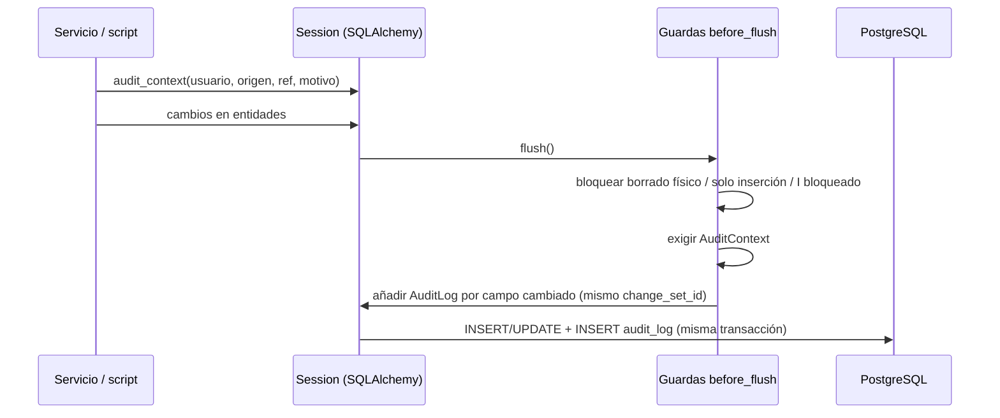

## Context

Ver `proposal.md` (Why). Punto de partida: esqueleto de `setup-monorepo-base` (FastAPI con `app/core` y paquetes por capacidad, PostgreSQL 18 en compose). Restricciones:

- Las specs vigentes (12 capacidades) fijan reglas duras: RN-001 (ningún código externo es PK), RN-002 (I inmutable), RN-003/RN-004 (comodato y préstamo temporal sin I), RN-005 (nunca se borra), RN-009 (IA con aprobación humana), RN-010 (vocabularios como datos).
- Sin muestras reales del museo: todos los formatos de códigos, vocabularios y niveles de ubicación son `[SUPUESTO]` (preguntas A2–A8, B4–B8, D1–D7 en `docs/preguntas-contraparte.md`).
- Sin daemon de Docker en la máquina del arranque: la verificación sin PostgreSQL real se hace con SQLite y con el SQL de PostgreSQL generado en modo offline.

## Goals / Non-Goals

**Goals:**
- Modelo físico completo para las capacidades núcleo con una única migración inicial reproducible.
- Reglas RN-001..RN-005 imposibles de saltar desde cualquier ruta de código (servicios, importación futura, scripts), no solo desde los endpoints.
- Normalizador puro, exhaustivamente probado y con reglas documentadas.
- Seed sintético determinista útil para la maqueta y las pruebas de las demás células.

**Non-Goals:**
- Endpoints REST, autorización por permiso y OpenAPI (`contratos-api-borrador` y change de usuarios).
- Lógica del pipeline de importación, detección de duplicados, alertas de calidad, préstamos/exposiciones, valorización, documentos asociados.

## Decisions

### D1. Modelo entidad-relación

```mermaid
erDiagram
    COLLECTION ||--o{ COLLECTION : "subcolección (parent_id)"
    COLLECTION ||--o{ PIECE : agrupa
    PIECE ||--o{ PIECE : "conjunto (parent_piece_id) / fusión (merged_into_id)"
    PIECE ||--o{ PIECE_IDENTIFIER : "tiene 0..N códigos"
    IDENTIFIER_TYPE ||--o{ PIECE_IDENTIFIER : "tipo (code)"
    PIECE_IDENTIFIER |o--o| PIECE_IDENTIFIER : "replaced_by_id"
    VOCABULARY ||--o{ TERM : contiene
    TERM ||--o{ PIECE : "categoría, tipo de bien, adquisición, conservación, disponibilidad"
    PIECE ||--o{ PIECE_MATERIAL : materiales
    TERM ||--o{ PIECE_MATERIAL : material
    PIECE ||--o{ CONSERVATION_ASSESSMENT : "historial (solo inserción)"
    PIECE ||--o{ PIECE_SOURCE_RECORD : "datos de origen (solo inserción)"
    LOCATION ||--o{ LOCATION : "sede > espacio > mueble > nivel > contenedor"
    LOCATION ||--o{ PIECE : "ubicación actual"
    PIECE ||--o{ PIECE_MOVEMENT : "movimientos (solo inserción)"
    PIECE ||--o{ MEDIA_ASSET : "fotos (archivo en S3)"
    TERM ||--o{ MEDIA_ASSET : "tipo de vista, restricción"
    IMPORT_MAPPING_TEMPLATE ||--o{ IMPORT_BATCH : plantilla
    IMPORT_BATCH ||--o{ IMPORT_ROW : filas
    IMPORT_BATCH ||--o{ PIECE_SOURCE_RECORD : origen
    IMPORT_ROW }o--o| PIECE : "pieza objetivo"
    PIECE ||--o{ DUPLICATE_CANDIDATE : "par A/B"
    IMPORT_ROW ||--o{ DUPLICATE_CANDIDATE : "fila vs pieza"
    PIECE ||--o{ AI_SUGGESTION : sugerencias
    APP_USER ||--o{ USER_ROLE : roles
    ROLE ||--o{ USER_ROLE : asignado
    ROLE ||--o{ ROLE_PERMISSION : permisos
    PERMISSION ||--o{ ROLE_PERMISSION : otorgado
    APP_USER ||--o{ AUDIT_LOG : "autor del cambio"

    PIECE {
        uuid id PK
        string title "denominación (obligatoria)"
        string tenure_regime "OWNED | LOAN_FOR_USE | TEMPORARY_LOAN"
        string legal_owner "PUCP si OWNED (RN-006)"
        string period_text "texto original"
        string period_type
        int period_from
        int period_to
        text dimensions_text
        jsonb dimensions "estructuradas"
        uuid collection_id FK
        uuid current_location_id FK
        timestamptz deleted_at "soft-delete"
    }
    PIECE_IDENTIFIER {
        uuid id PK
        uuid piece_id FK
        string identifier_type_code FK
        text original_value "nunca se modifica"
        string normalized_value
        string normalization_status
        string detected_format
        bool is_current
        bool is_locked "I bloqueado (RN-002)"
        string source
    }
    IDENTIFIER_TYPE {
        uuid id PK
        string code UK "I, COLECCION, INC_RN, PUCP, PROPIETARIO, OTRO"
        string normalization_rule
        bool is_unique_when_current
        bool locks_on_assignment
        bool owned_pieces_only
        bool allowed_for_temporary_loan
    }
    MEDIA_ASSET {
        uuid id PK
        uuid piece_id FK
        string storage_key UK "clave en S3"
        string content_sha256
        int sort_order
        bool is_primary
    }
    AUDIT_LOG {
        uuid id PK
        uuid change_set_id
        string entity_type
        uuid entity_id
        string field
        jsonb old_value
        jsonb new_value
        string action "CREATE | UPDATE | SOFT_DELETE | RESTORE | CORRECTION | MERGE | REVERT"
        string origin "MANUAL | IMPORT | AI | SYSTEM"
        string origin_ref "lote o sugerencia"
        uuid user_id FK
        text reason
    }
    AI_SUGGESTION {
        uuid id PK
        string function_code "RIA_01..RIA_05"
        string status "PENDING | APPROVED | PARTIALLY_APPROVED | REJECTED"
        jsonb output_data
        jsonb approved_data
        uuid reviewed_by_id FK
    }
```

Todas las entidades de negocio llevan `created_at`/`updated_at` y, salvo las de solo inserción, `deleted_at`/`deleted_by_id`/`deletion_reason`. El detalle columna a columna está en `docs/modelo-datos.md`.

Desviaciones respecto de la lista mínima del prompt base (justificadas por las specs):
- `source_payload` no es una columna JSONB de `piece` sino la tabla `piece_source_record`, porque la spec exige conservar **por separado** los datos de cada carga (RF-008, escenario "Varias cargas sobre la misma pieza").
- Se añaden `conservation_assessment` (historial exigido por RF-012), `piece_material` (materiales múltiples) y `user_role`.
- `import_row` no tiene soft-delete: las filas pertenecen al lote, que sí lo tiene.

### D2. Claves y tipos

- **UUIDv7** (`uuid.uuid7` de Python 3.14; UUIDv4 como respaldo) generados en la aplicación: localidad de índice y ningún significado de negocio (RN-001). Alternativa: `BIGSERIAL` (expone orden y cantidad; complica fusiones e importaciones) y UUIDv4 (peor localidad).
- `identifier_type.code` es la clave foránea de `piece_identifier`: es un código de sistema estable y parametrizable, no un código del museo; permite el índice parcial `WHERE identifier_type_code = 'I'` sin desnormalizar.
- **Enums como VARCHAR + CHECK** (`native_enum=False`): añadir valores no requiere `ALTER TYPE` y funciona igual en SQLite para pruebas. Alternativa: enums nativos de PostgreSQL.
- **JSONB** en PostgreSQL (JSON en SQLite) para `dimensions`, payloads, diffs y auditoría.

### D3. Unicidad del código I

Índice único parcial `uq_piece_identifier_current_inventory_code (normalized_value) WHERE identifier_type_code = 'I' AND is_current AND deleted_at IS NULL`. La condición es sobre el **identificador**, no sobre la pieza: al eliminar lógicamente una pieza sus identificadores no se eliminan, por lo que su código I sigue reservado y no se reutiliza en silencio (spec auditoria-trazabilidad, escenario "Código I de pieza eliminada"; pregunta A6). La corrección administrativa marca el anterior como no vigente y libera el valor.

### D4. Reglas de dominio en dos capas

1. **Servicios** (`app/modules/*/service.py`): validan con mensajes claros en español y códigos de error estables (`duplicate_identifier`, `absence_marker`, `identifier_not_allowed_for_tenure`...).
2. **Guardas de sesión** (`before_flush`): se ejecutan en todo `flush`, venga de donde venga el cambio:
   - borrado físico de entidades con soft-delete o de solo inserción → `PhysicalDeleteForbidden`;
   - modificación de tablas de solo inserción (`audit_log`, `piece_movement`, `piece_source_record`, `conservation_assessment`) → `AppendOnlyViolation`;
   - cambio de campos protegidos de un identificador bloqueado sin el contexto de corrección → `ImmutableInventoryCode`;
   - identificador de tipo "solo propiedad" en pieza no propia, o pieza con I vigente que deja de ser propia → `BusinessRuleViolation`;
   - cualquier escritura auditable sin `AuditContext` → `MissingAuditContext`.

   Alternativas: triggers de PostgreSQL para todo (lógica duplicada y no probable sin contenedores) o validación solo en endpoints (se puede olvidar; lo prohíbe CLAUDE.md).

3. **Base de datos**: índice parcial de I, CHECK de rango de época, CHECK de RN-009 en `ai_suggestion` (no hay aprobación/rechazo sin revisor; rechazo con motivo), y **triggers de solo inserción** en las cuatro tablas históricas (PostgreSQL: `BEFORE UPDATE OR DELETE` + `BEFORE TRUNCATE`; SQLite: `RAISE(ABORT)`), que cubren el escenario "Alteración directa de auditoría en la base de datos".

### D5. Auditoría automática y soft-delete

- El contexto vive en `session.info` (`AuditContext`: usuario u proceso del sistema, origen `MANUAL|IMPORT|AI|SYSTEM`, referencia obligatoria para importación e IA, motivo, acción forzada y permiso de corrección). La futura capa HTTP lo fijará por petición a partir del usuario autenticado.
- Altas: un registro por campo no nulo; modificaciones: un registro por campo realmente cambiado; `deleted_at` determina `SOFT_DELETE`/`RESTORE`. Se excluyen `created_at`, `updated_at` y secretos (`password_hash`).
- Consultas: un `do_orm_execute` añade `with_loader_criteria(deleted_at IS NULL)` a todo SELECT ORM salvo `execution_options(include_deleted=True)`.
- `soft_delete()` exige motivo; `restore()` exige rol Administrador.
- Trade-off: el volumen de auditoría crece (~20 000 filas para 300 piezas del seed); aceptable para 20 000 piezas (RNF-015) con índice `(entity_type, entity_id, occurred_at)`; se puede particionar por fecha más adelante.

### D6. Normalizador de identificadores

Funciones puras en `app/modules/identification/normalization.py`, seleccionadas por `identifier_type.normalization_rule` (`INVENTORY`, `COLLECTION`, `INC_RN`, `GENERIC`), de modo que un tipo nuevo reutiliza una regla sin código. Reglas N1–N7 documentadas en el módulo y marcadas `[SUPUESTO]` (preguntas A2, A4, A5, A8, B8, D1–D3). El valor original nunca se altera; los valores no interpretables se guardan con estado `UNPARSEABLE` salvo en tipos que se bloquean al asignarse (I), donde el ingreso manual se rechaza (D6 en preguntas). Alternativa descartada: normalizar en la base (funciones SQL), menos portable y más difícil de probar.

### D7. Migraciones

Alembic con `env.py` que solo necesita `DATABASE_URL` (o `-x url=`). La revisión `0001_core_data_model` se generó renderizando las operaciones de autogenerate desde los modelos y se completó a mano con: índice por expresión `lower(email)`, extensión `pg_trgm` e índices GIN de trigramas (búsqueda RF-031 y duplicados RF-030), y triggers de solo inserción. Pruebas: `upgrade`/`downgrade` en SQLite, `compare_metadata` sin diferencias y SQL de PostgreSQL generado offline con aserciones sobre índice parcial, JSONB, `pg_trgm` y triggers.

### D8. Datos semilla

`python -m app.seed` (`npm run seed` dentro del contenedor `api`) con `random.Random(semilla)`; se niega a ejecutarse si existen piezas. Genera: tipos de identificador, 9 vocabularios, 7 roles (investigador externo desactivado), 29 permisos y matriz `[SUPUESTO]`, 6 usuarios sintéticos (`@matp.local`, admin con contraseña de `SEED_ADMIN_PASSWORD` en hash Argon2), 6 colecciones ficticias (MMZ, RA, RAB, MBB, AJB en comodato, LRM), jerarquía de ubicaciones, ~300 piezas con códigos sucios, historial INC 4→6 dígitos, valores `???`, conjuntos con componentes, 10 pares de duplicados con candidatos, fotos placeholder (Pillow, JPEG) subidas a S3, un lote de importación en previsualización, sugerencias de IA pendientes, una corrección de I y dos eliminaciones lógicas. También escribe `data/fixtures/sabana_sintetica_v1.xlsx` (openpyxl) con problemas reales e imágenes incrustadas.
Dependencias nuevas: `pwdlib[argon2]` (contingencia: `argon2-cffi` directo), `Pillow` (contingencia: fotos estáticas en fixtures), `openpyxl` (contingencia: CSV). Similitud del seed con `difflib` (sin `rapidfuzz` hasta el change de calidad).

## Risks / Trade-offs

- [Migración no ejecutada contra PostgreSQL real] → SQL offline verificado por pruebas; ejecutar `npm run migrate` y `npm run seed` en cuanto haya Docker (pendiente en `docs/estado-arranque.md`).
- [Guardas ORM no cubren SQL crudo] → triggers de solo inserción y restricciones en la base; los servicios nunca deben usar `UPDATE` masivo sin sesión ORM (regla para revisores).
- [Supuestos de normalización erróneos] → reglas aisladas por tipo y probadas; el valor original se conserva y se puede renormalizar con una migración de datos.
- [SQLite en pruebas difiere de PostgreSQL] → índices parciales y CHECK equivalentes en ambos; pruebas de integración con PostgreSQL en CI cuando se habilite un servicio de base en el workflow.
- [Volumen de auditoría] → índices y posible particionado futuro.

## Migration Plan

1. `npm run dev` (compose) → `npm run migrate` → `npm run seed`.
2. Reversión: `alembic downgrade base` (solo entornos de desarrollo; elimina el esquema) o recrear volúmenes con `npm run down -- -v`.
