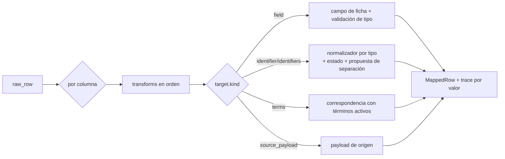

## Context

- `import_mapping_template` ya existe (`name`, `source_name`, `header_signature` indexado, `mapping` JSON, soft-delete).
- `normalization.py` implementa N1–N7 con constantes en código: marcadores de ausencia (`S/N`, `s/c`, `-`, `0`) [SUPUESTO A5], separadores (`/`, `;`, `|`, `,`, salto de línea) [SUPUESTO A8].
- `importacion-pipeline-reconciliacion` necesita un contrato estable para avanzar en paralelo.

## Goals / Non-Goals

**Goals:**
- Un mapeo declarativo, serializable y versionado que explique cada valor transformado.
- Reutilizar la configuración entre cargas de la misma fuente.
- Sacar del código los parámetros de normalización `[SUPUESTO]`.

**Non-Goals:**
- Lenguaje de scripting de transformaciones (solo operaciones predefinidas).
- Detección automática de la semántica de columnas con IA.

## Decisions

### D1. `MappingSpec` v1 (contrato)

```json
{
  "version": 1,
  "sheet": "Inventario",
  "header_row": 3,
  "columns": [
    {"source": "DENOMINACIÓN", "target": {"kind": "field", "name": "title"}, "transforms": ["trim"]},
    {"source": "CÓDIGOS", "target": {"kind": "identifiers", "default_type": "COLECCION"},
     "transforms": ["trim", "split_concatenated"]},
    {"source": "N° INV", "target": {"kind": "identifier", "type": "I"}, "transforms": ["absence_markers"]},
    {"source": "ÉPOCA", "target": {"kind": "field", "name": "period_text"}, "transforms": ["propose_period"]},
    {"source": "MATERIAL", "target": {"kind": "terms", "vocabulary": "MATERIAL"},
     "transforms": ["split:,", "value_map"], "value_map": {"madera policromada": "WOOD"}},
    {"source": "OBS. CONSULTORÍA", "target": {"kind": "source_payload"}}
  ],
  "defaults": {"tenure_regime": "OWNED", "source_name": "Sábana consultoría 2024/25"}
}
```

- Columnas del archivo no listadas → `source_payload` automáticamente (RF-008: nada se pierde).
- Pydantic `MappingSpec` con `version: Literal[1]`; versiones futuras se migran con una función explícita.
- Ejemplo con nombres de columna **ilustrativos** [SUPUESTO A1].

### D2. Motor de transformación



- Firma: `apply_mapping(raw_row: dict[str, Any], spec: MappingSpec, ctx: MappingContext) -> MappedRow`; `validate_mapping(spec, headers) -> list[MappingError]`. `MappingContext` precarga términos activos, tipos de identificador y parámetros de normalización (una sola consulta por lote).
- Cada valor transformado lleva `trace: [{"transform": ..., "before": ..., "after": ...}]` para explicar el resultado en la previsualización.
- Transformaciones v1: `trim`, `upper`, `absence_markers`, `split_concatenated`, `split:<sep>`, `date:<formato>` (por defecto `dd/mm/yyyy`, `yyyy`), `propose_period` (reutiliza la interpretación de época de `catalog`), `propose_dimensions` (patrones `alto 23 cm`, `23 x 15 cm`), `value_map`, `default:<valor>`.
- Las propuestas (`propose_*`) nunca sobrescriben el texto original: generan campos estructurados marcados como propuesta.
- `validate_mapping`: denominación mapeada (o `default`), columnas de la plantilla ausentes del archivo, destino duplicado para campos escalares, tipo de identificador o vocabulario inexistente.

### D3. Sugerencia de plantilla
`header_signature` = SHA-256 de cabeceras normalizadas (N1 + sin tildes) **ordenadas**. `POST /import-templates/suggest {headers}`: coincidencia exacta por firma → `score=1`; si no, similitud Jaccard sobre el conjunto de cabeceras normalizadas combinada con `difflib.SequenceMatcher` por cabecera; devuelve hasta 3 plantillas con `score ≥ 0.6`, columnas faltantes y columnas nuevas.

### D4. Vista previa de normalización por columna
`POST /import-templates/{id}/dry-run` (o con `spec` literal) sobre una muestra (hasta 200 filas de un lote `UPLOADED`/`MAPPED`, referenciado por `batch_id`): por columna, conteos de `NORMALIZED`, `UNPARSEABLE` (estados de `NormalizationStatus`) y de las categorías de vista previa `ABSENT` y `SPLIT_PROPOSED`, valores sin término correspondiente (top 20) y ejemplos con `trace`. No escribe nada.

### D5. Parámetros de normalización como datos
Tabla nueva `normalization_setting` (clave, valor JSON, auditada, soft-delete) con `absence_markers` y `concatenation_separators`; tabla `collection_acronym_alias` (alias normalizado → `collection_id`, p. ej. una sigla histórica). El normalizador recibe los parámetros por inyección (`NormalizationParams`) con los valores actuales como defaults, de modo que las ~100 pruebas existentes siguen pasando sin cambios. Cambiar un parámetro reutiliza el flujo de vista previa + confirmación de `colecciones-y-vocabularios-admin` (recalcular valores normalizados afectados); si ese change no está aplicado, la edición de parámetros solo se permite mientras no haya identificadores afectados.

## Risks / Trade-offs

- **Contrato compartido con el pipeline** → cualquier cambio de `MappingSpec` exige incrementar `version` y coordinar con la célula; prueba de contrato compartida en `tests/imports/test_mapping_contract.py`.
- **Alias de siglas mal configurados** pueden unir colecciones distintas → alias único por valor normalizado y vista previa obligatoria.
- **Formatos de fecha ambiguos** (`03/04/1998`) → formato explícito por columna; sin adivinar.
