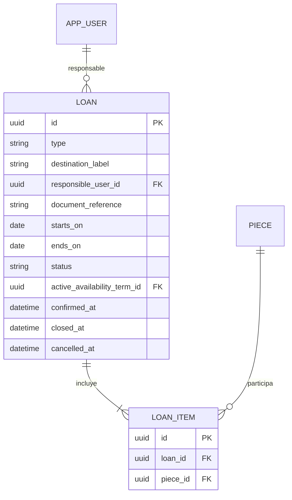

## Context

El modelo vigente solo conserva en `piece` los datos de comodato y el número temporal; no existe una entidad que represente una salida, retorno o exposición, ni puede relacionar varias piezas con el mismo expediente. La auditoría automática y el borrado lógico ya se aplican a los modelos que heredan los mixins compartidos. Ver `proposal.md` y el delta de `ubicacion-movimientos`.

## Goals / Non-Goals

**Goals:**

- Representar un préstamo o exposición como expediente con varias piezas y conservar su historial.
- Mantener la disponibilidad de una pieza consistente con participaciones vigentes, sin sobrescribir su ubicación.
- Integrarse con las guardas de auditoría y borrado lógico existentes.

**Non-Goals:**

- Gestión de curaduría, salas, seguros, transporte, firmas digitales o notificaciones.
- Sustituir los datos de comodato que ya pertenecen a la ficha de la pieza.
- Implementar las pantallas finales o la operación pública de préstamos en este primer change.

## Decisions

### D1. Expediente y participaciones normalizadas

Se crearán `loan` y `loan_item`. `loan` almacenará el tipo, destino (institución o sala), responsable, referencia documental, fechas y estado; `loan_item` relacionará una pieza con el expediente. Ambas entidades tendrán UUID interno, timestamps y borrado lógico.

Una relación directa `loan.piece_id` no permite la exposición de varias piezas exigida por RF-018. Se descarta un modelo polimórfico para exposiciones porque ambos comparten el mismo ciclo de vida y controles.

### D2. Estados y vocabularios configurables

El tipo y estado se almacenarán como códigos de vocabularios controlados, no como valores fijos de código. Los valores iniciales de préstamo, exposición y estados de borrador, vigente, cerrado y cancelado son [SUPUESTO] y se registrarán para validación con la contraparte. Esta decisión cumple RN-010 y evita una migración para añadir un estado.

### D3. Confirmación transaccional y disponibilidad derivada

El servicio validará al confirmar un expediente que todas sus piezas están activas y no tienen otra participación vigente con fechas superpuestas. La vigencia se determina por las marcas técnicas `confirmed_at`, `closed_at` y `cancelled_at`, mientras el estado visible sigue siendo un término configurable. En la misma transacción actualizará cada disponibilidad con el término configurado en el expediente; al cancelar o cerrar, recalculará la disponibilidad a partir de participaciones vigentes y ubicación.

Se descarta guardar la disponibilidad solo como dato manual, porque permitiría incoherencias. La ubicación no se cambia automáticamente: el retorno exige registrar la ubicación mediante el flujo de movimientos.

### D4. Auditoría y eliminación lógica reutilizadas

`loan` y `loan_item` heredarán `SoftDeleteMixin` y quedarán bajo los eventos de auditoría ya instalados para SQLAlchemy. Una cancelación es un cambio de estado auditado; una eliminación por registro erróneo usa `soft_delete` con motivo. Se descarta el borrado físico y una bitácora particular porque duplicarían RN-005 y RF-040.

### D5. Rutas y alcance de API

El modelo y servicio se implementarán primero. Las rutas `/loans` y `/loans/{id}/status` conservarán la forma del contrato, pero se expondrán como stubs `501` hasta que su esquema de solicitudes y respuestas esté aprobado en este change. Así no se publica una API con campos inventados.

## Risks / Trade-offs

- [Dos solicitudes concurrentes pueden intentar comprometer la misma pieza] → la confirmación consulta participaciones vigentes dentro de una transacción; las pruebas cubrirán el conflicto y se evaluará una restricción PostgreSQL adicional cuando se incorpore la prueba de migraciones real.
- [Los vocabularios de estado aún no fueron validados] → se documentan como [SUPUESTO] y se incluyen en `preguntas-contraparte.md`; no se codifican como enumerados rígidos.
- [Una migración paralela puede generar más de una cabeza Alembic] → antes del merge se rebasará sobre `main` y se verificará `alembic heads`.

## Migration Plan

1. Agregar los modelos y generar una migración Alembic posterior a la cabeza vigente al abrir el PR.
2. Ejecutar upgrade, downgrade y comparación de metadata en SQLite; repetir contra PostgreSQL cuando esté disponible el job de migraciones.
3. No hay datos existentes que migrar: los campos de comodato en `piece` permanecen sin cambios.
4. Para revertir, ejecutar el downgrade de la migración; los expedientes creados deben preservarse mediante respaldo antes de cualquier operación de despliegue.
