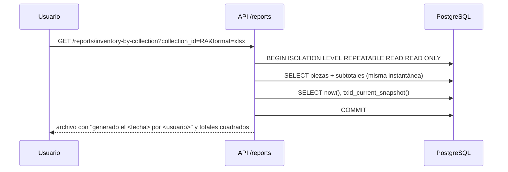

## Context

- La ruta `GET /api/v1/reports/{report_type}` existe como stub con esquema de ejemplo; permiso `reports.view` sembrado para todos los roles de lectura; `sensitive.valuation` sembrado pero no hay campo de valorización en el modelo.
- `piece_movement` con `VERIFICATION` y ubicación jerárquica ya modelados.
- Reportes deben respetar RF-041 (enmascarado) igual que la búsqueda.

## Goals / Non-Goals

**Goals:**
- Inventarios coherentes aunque se estén registrando cambios durante la generación.
- Reutilizar filtros y exportación en lugar de crear rutas paralelas.
- Impresión digna sin dependencias de PDF en el servidor (free tier).

**Non-Goals:**
- Diseñador de reportes configurable.
- Reportes históricos a fecha pasada.

## Decisions

### D1. Catálogo cerrado de reportes
`reports/registry.py` define `ReportDefinition(type, title, params_model, permission, columns(role), query(params))`. `report_type` es un `Enum` en OpenAPI: `inventory`, `inventory-by-collection`, `by-location`, `valuation`. Tipo desconocido → `404 report_not_found`; parámetros inválidos → `422`. Cada definición declara sus columnas y cuáles son sensibles, para enmascarar igual que la búsqueda.

### D2. Instantánea consistente

Sobre el umbral de filas se delega a un trabajo de exportación (`export_job`, `kind=report`) que abre la misma transacción `REPEATABLE READ` en el worker. En SQLite (pruebas) se usa la transacción por defecto.

### D3. Inventario permanente
- Incluye regímenes `OWNED` y `LOAN_FOR_USE` [SUPUESTO: las piezas en comodato forman parte del inventario que custodia el museo, con subtotal separado; confirmar con la contraparte] y excluye `TEMPORARY_LOAN` (RN-004), eliminadas y fusionadas.
- Columnas: códigos vigentes (I, colección, INC/RN, PUCP), denominación, colección (ruta), régimen, forma de adquisición, fecha de ingreso, autor, procedencia, época (texto), tipo de bien, materiales, medidas (texto), estado de conservación, ubicación (enmascarada según rol). Propietario legal: siempre "PUCP" en propiedad (RN-006).
- Subtotales por colección (con subcolecciones anidadas) y por régimen; total general.
- Orden: colección (ruta) → código de colección normalizado (orden natural numérico) → denominación.

### D4. Reporte por ubicación
Parámetros: `location_id` (incluye descendientes), `not_verified_since_days` opcional. Por pieza: ruta de ubicación, fecha de la última verificación o movimiento (el más reciente de ambos cuenta como "visto"), días desde la última verificación. Ubicación sin piezas → respuesta vacía con `message` explícito (escenario existente). Requiere `sensitive.exact_location` para ubicaciones por debajo del espacio; sin ese permiso, solo se permite `location_id` de nivel sede o espacio y se agregan conteos por espacio.

### D5. Vista imprimible
`app/reportes/imprimir/[tipo]` renderiza el reporte con CSS `@media print` (cabecera con título, fecha, usuario y filtros; saltos de página por colección; numeración de páginas del navegador). Límite de filas para impresión (`2 000`); por encima se sugiere Excel.
*Alternativa*: WeasyPrint/ReportLab en el servidor → dependencias nativas pesadas en la imagen; descartado para fase 1.

### D6. Valorización (RF-037, *Could*)
- Tabla `piece_valuation (piece_id, amount, currency, valued_on, source, notes)` solo inserción; la vigente es la de `valued_on` más reciente.
- `FEATURE_VALUATION_REPORT=false` por defecto: el tipo `valuation` responde `404` si está desactivado.
- Requiere `sensitive.valuation`; totales por colección y moneda, número de piezas sin valorización. No se hace conversión de monedas.
- Carga inicial mínima por comando `python -m app.reports.load_valuations <csv>` (dry-run por defecto), para no construir UI de captura sin validar la necesidad [SUPUESTO: pregunta nueva registrada en `docs/preguntas-contraparte.md`, sección G].

## Risks / Trade-offs

- **Inclusión de comodatos en el inventario [SUPUESTO]** → parámetro `include_loans_for_use` con valor por defecto configurable.
- **Orden natural de códigos** con formatos sucios → se ordena por valor normalizado con números extraídos; los no normalizables al final.
- **Valorización es dato muy sensible (RNF-014)** → desactivada por defecto, auditoría de cada generación del reporte.
