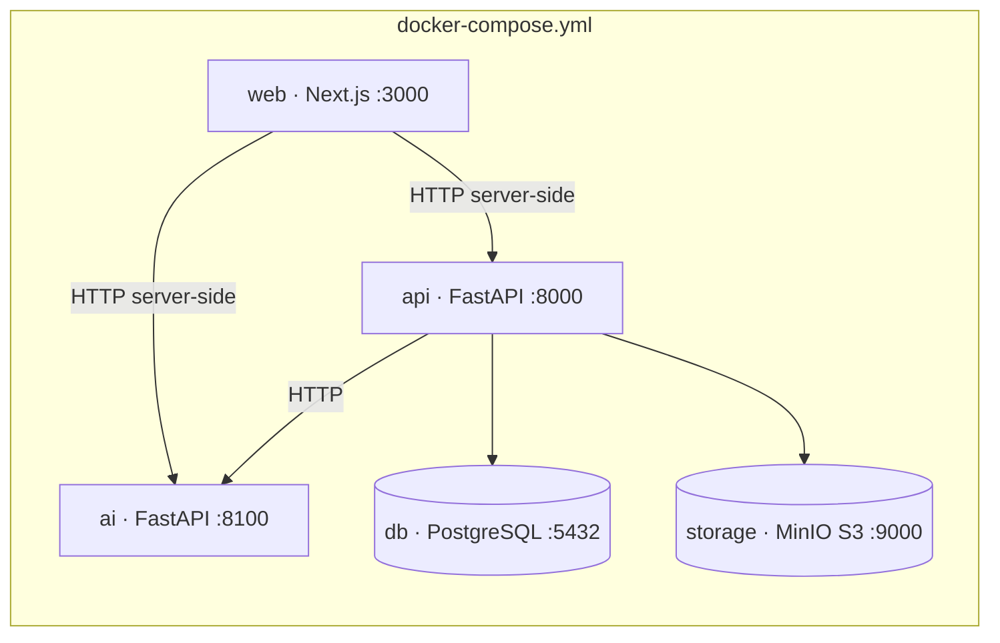

## Context

Ver `proposal.md` (Why). Restricciones que condicionan el enfoque:

- Entorno de referencia Windows 11 + Git Bash/PowerShell, **sin `make`** (ADR-000) y con finales de línea LF forzados por `.gitattributes` (salvo `*.ps1`).
- Python 3.14 y Node 24 LTS disponibles localmente; `uv` no instalado.
- En la máquina del arranque el **daemon de Docker no responde**: los artefactos de contenedores se escriben pero su verificación queda pendiente.
- Stack decidido (no se reabre): Next.js, FastAPI, PostgreSQL, S3-compatible, Docker Compose, GitHub Actions.
- MinIO dejó de publicar imágenes de la edición comunitaria en Docker Hub (el repositorio `minio/minio` ya no existe allí); la última imagen disponible está en `quay.io/minio/minio`.

## Goals / Non-Goals

**Goals:**
- Un solo comando (`npm run dev`) levanta los 5 servicios con healthchecks encadenados.
- Los mismos scripts (`npm run lint`, `npm test`) se ejecutan en Windows, Linux y en CI.
- Configuración tipada con fallo temprano y mensaje claro si falta una variable obligatoria.
- Estructura de paquetes por capacidad en `apps/api/app/modules/` para minimizar conflictos entre células.

**Non-Goals:**
- Modelo de datos, migraciones y seed (change `modelo-datos-nucleo`).
- Autenticación real, routers de negocio, OpenAPI exportado, cliente tipado (`contratos-api-borrador`).
- Despliegue productivo (VM PUCP, free tier), TLS, respaldos.

## Decisions

### D1. Estructura del monorepo (ADR-001)

Directorios: `apps/web`, `apps/api` (`app/core`, `app/modules/<capacidad>`, `alembic`, `tests`), `services/ai` (`app/`, `tests`), `data/fixtures`, `scripts`. Los módulos se nombran en inglés (ADR-002): `identification`, `catalog`, `collections`, `media`, `locations`, `imports`, `quality`, `search`, `users`, `audit`, `ai_suggestions`.
*Alternativas*: repos separados por servicio (más fricción para 11 personas y para specs compartidas); Nx/Turborepo (sobredimensionado para 3 proyectos).

### D2. Orquestación de comandos: npm workspaces + runner de Python multiplataforma

La raíz tiene `package.json` con `workspaces: ["apps/web"]` y los scripts del proyecto. Para Python se usa un pequeño script Node (`scripts/py.mjs`) que localiza el intérprete del `venv` de cada proyecto (`.venv/Scripts/python.exe` en Windows, `.venv/bin/python` en Linux/macOS) y ejecuta el módulo pedido; así `npm run test:api` funciona igual en ambos sistemas y en CI. `scripts/setup.mjs` crea los `venv` e instala dependencias. `scripts/*.ps1` solo envuelven a `npm run` para quien prefiera PowerShell.
*Alternativas*: Makefile (sin `make` en Windows, ADR-000); comandos `cross-env`/`shx` (no resuelven la ruta del `venv`); `just`/`task` (binario extra).

### D3. Herramientas de Python: pip + venv, `pyproject.toml` PEP 621 (ADR-003)

Cada proyecto Python declara dependencias en `pyproject.toml` estándar con extra `dev`; se instala con `pip install -e ".[dev]"`. `uv` no está instalado en el entorno de referencia; como `pyproject.toml` es estándar, quien use `uv` puede hacer `uv pip install -e ".[dev]"` sin cambios. Lint y formato con **ruff**; pruebas con **pytest** + **httpx** (`TestClient`). Versiones mínimas fijadas con `>=` a la estable vigente consultada al instalar; el bloqueo reproducible (lockfile) se decide cuando el Arquitecto ratifique uv vs pip-tools.
*Contingencia*: si una dependencia no publica wheels para Python 3.14, bajar a 3.13 en `requires-python` y en la imagen.

### D4. Configuración con pydantic-settings y fallo temprano

`app/core/config.py` define `Settings` con campos obligatorios sin valor por defecto (`DATABASE_URL`, `S3_*`, `JWT_SECRET`) y opcionales con valor por defecto seguro (`AI_PROVIDER=mock`). Al arrancar, un `ValidationError` se traduce a un mensaje en español con el nombre de cada variable faltante y el proceso termina con código ≠ 0. `AI_PROVIDER` es un `Literal` (`mock`, `llm`) para rechazar valores desconocidos.
*Alternativa*: `os.environ` manual (sin tipado ni mensajes uniformes).

### D5. Verificación de salud

- `GET /health` (API): comprueba BD (`SELECT 1` con timeout corto) y almacenamiento (`head_bucket`). Responde `200` con `status: "ok"` o `503` con `status: "degraded"` y el detalle por dependencia, sin secretos. `GET /health/live` responde siempre `200` (liveness, sin dependencias).
- `GET /health` (IA): `200` con `provider` activo.
- La API crea el bucket al arrancar si `S3_AUTO_CREATE_BUCKET=true` (solo local), evitando un contenedor extra de cliente `mc`.

### D6. Frontend

`create-next-app` (TypeScript, App Router, Tailwind, ESLint, `src/`), `output: "standalone"` para imagen Docker pequeña. La página inicial es un Server Component que consulta `API_INTERNAL_URL/health` y `AI_INTERNAL_URL/health` y muestra el estado en español. Pruebas unitarias con **Vitest** sobre la lógica de resumen de estado. shadcn/ui, TanStack Query, React Hook Form + Zod y `openapi-typescript` se incorporan en `contratos-api-borrador` / `maqueta-ui-navegable`.

### D7. Docker Compose

Imágenes base consultadas el 2026-09-17: `postgres:18-alpine` (volumen en `/var/lib/postgresql`, cambio de PostgreSQL 18), `quay.io/minio/minio:RELEASE.2025-09-07T16-13-09Z.hotfix.7aa24e772`, `python:3.14-slim`, `node:24-alpine` (LTS). Healthchecks: `pg_isready` (db), `/minio/health/live` (storage), `/health/live` (api), `/health` (ai) y `depends_on: condition: service_healthy`. Todos los puertos y credenciales vienen de `.env`.
*Contingencia S3*: RustFS (`rustfs/rustfs`, Apache 2.0) o Garage, solo cambiando variables; en la nube Cloudflare R2. El código solo usa la API S3 vía boto3.

### D8. Integración continua

`.github/workflows/ci.yml` con jobs paralelos `api`, `ai`, `web` y `openspec`, usando `actions/checkout@v7`, `actions/setup-python@v7`, `actions/setup-node@v7`. Cada job invoca los mismos scripts de npm que se usan en local. El job `openspec` instala `@fission-ai/openspec` y ejecuta `openspec validate --all --strict`.

## Risks / Trade-offs

- [Docker no verificado en la máquina del arranque] → artefactos escritos con sintaxis de Compose vigente; validación estática con `docker compose config` en cuanto haya daemon; tarea marcada como pendiente.
- [MinIO comunitario sin nuevas imágenes] → etiqueta fijada y alternativas documentadas en ADR-003; el código es agnóstico al proveedor S3.
- [Versiones con `>=` sin lockfile de Python] → builds pueden variar; se mitiga fijando rangos mayores y decidiendo lockfile en ADR-003.
- [TypeScript/Next con cambios mayores recientes] → se usa la combinación que genera `create-next-app` vigente, no versiones de memoria.
- [Python 3.14 en contenedor] → si alguna dependencia falla, contingencia a 3.13 (D3).

## Migration Plan

No aplica (greenfield). Reversión: el change solo añade archivos; revertir el commit elimina el esqueleto.
