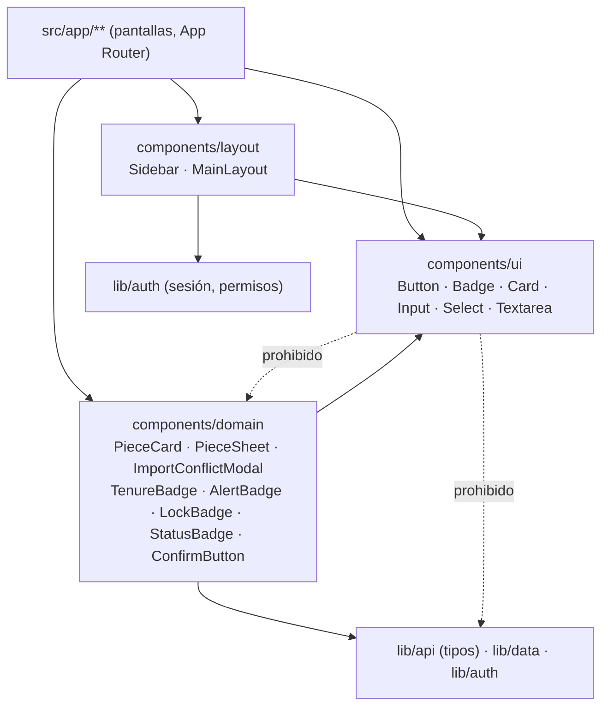
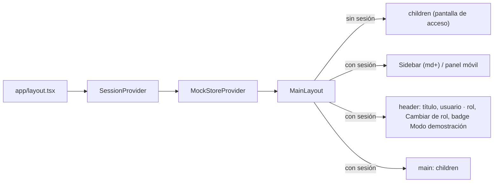

## Context

Ver `proposal.md` (Why). Estado actual de `apps/web` (medido al 2026-09-23):

- Next.js 16.3.5, React 19.2.8, **Tailwind 4** (`@tailwindcss/postcss`, sin `tailwind.config.js`), Vitest 5 en entorno `node` con pruebas solo `*.test.ts`.
- `src/app/globals.css` solo define `--font-sans` con fuentes del sistema; `layout.tsx` monta `SessionProvider` → `MockStoreProvider` → `AppShell`.
- `src/components/` tiene 4 archivos planos: `AppShell` (cabecera con navegación horizontal filtrada por permiso), `Badges` (`TenureBadge`, `AlertBadge`, `LockBadge` con emoji 🔒, `StatusBadge`), `ConfirmButton` (diálogo nativo `<dialog>` con motivo opcional) y `RequireSession`.
- 12 rutas (`/` acceso, `/estado`, `/inicio`, `/busqueda`, `/piezas/[id]`, `/piezas/[id]/editar`, `/importacion`, `/duplicados`, `/ia/sugerencias`, `/reportes`, `/administracion`, `/deposito`) con ~350 clases de paleta genérica (`stone` ≈ 350, además `amber`, `emerald`, `red`, `sky`), 28 `<button>` y varios `<input>`/`<select>` con estilos repetidos. No hay hex en `.tsx`.
- Sin librería de iconos. ADR-006 punto 1 decidió «sin librería de componentes».

La fuente del diseño es el documento del equipo `SYSTEM_DESIGN.md` (fuera del repo; se versiona en la tarea 1.1). Ese documento está escrito para React + Tailwind 3 con `tailwind.config.js`, nombres en español y tokens de color; varios de sus pares de color no cumplen contraste AA (ver D3).

## Goals / Non-Goals

**Goals:**
- Adoptar la estructura Atomic Design, los tokens y los componentes del documento, adaptados a Next.js App Router, Tailwind 4, ADR-002 (código en inglés) y RNF-010 (accesibilidad y baja alfabetización digital).
- Migrar las 12 rutas sin cambiar flujos, textos de negocio ni reglas (RN-002, RN-003, RN-005, RN-009) ya expresadas por `maqueta-ui-navegable`.
- Dejar protecciones automáticas para que el sistema no se degrade: contraste, clases prohibidas, dirección de dependencias.

**Non-Goals:**
- Nuevas pantallas o flujos, conexión a la API real, librerías de formularios o de fetching (siguen según ADR-006 puntos 2 a 4).
- Modo oscuro, Storybook, i18n, logotipo institucional.
- Pruebas visuales de regresión (capturas); se verifica manualmente con el guion de demo.

## Decisions

### D1. Estructura de carpetas y dirección de dependencias



- `ui/` solo depende de React, `lucide-react` y utilidades puras de `lib/cn.ts`. Recibe todo por props.
- `domain/` puede importar tipos del contrato (`lib/api/client.ts` → `ApiSchemas`) y funciones puras de `lib/data`; así `PieceCard` recibe un `PieceSummary` real y no un objeto ad hoc.
- `layout/` puede leer la sesión (`lib/auth`) para filtrar la navegación por permiso (RF-039), pero no contiene reglas de inventario.
- `ConfirmButton` se mueve a `domain/` porque encarna la regla de confirmación de RNF-010/RN-005; `RequireSession` pasa a `layout/`.
- El documento proponía `pages/` y `utils/`: en App Router las pantallas viven en `src/app/`, y las funciones puras ya viven en `src/lib/`; se mantienen para no mover código sin beneficio. Alternativa descartada: crear `src/utils/` en paralelo a `src/lib/` (dos lugares para lo mismo).
- La regla se verifica con una prueba Vitest que recorre `src/components/ui/**` y falla si encuentra importaciones de `@/components/domain`, `@/components/layout`, `@/lib/fixtures`, `@/lib/data` o `@/lib/auth`. Alternativa: regla `no-restricted-imports` de ESLint por carpeta; se prefiere la prueba porque da un mensaje en español y corre en `npm test`, y se puede sumar la regla de ESLint después.

### D2. Nombres en inglés (decisión del equipo, ADR-002)

| Documento del equipo | Implementación | Props (documento → implementación) |
|---|---|---|
| `Button` | `Button` | `variant`, `icon`, `className` (sin cambios) + `size` (`md` por defecto, `lg` para depósito) |
| `Badge` / `OpcionesBadge` | `Badge` / `BadgeProps` | `intent` (sin cambios) + `icon` opcional |
| `CardPieza` | `PieceCard` | `codigo` → `inventoryCode`, `denominacion` → `title`, `coleccion` → `collectionName`, `ubicacion` → `locationLabel`, `estado`/`textoEstado` → `tenureRegime` + `alerts` (el intent se deriva, no se pasa a mano), `tieneFoto` → `hasPhoto`, + `href` |
| `FichaPieza` | `PieceSheet` | recibe `PieceDetail` del contrato |
| `ModalImportacion` | `ImportConflictModal` | fila en conflicto + `onDecide(decision)` |
| `MainLayout`, `Sidebar` | iguales | — |

Los textos visibles siguen en español. Los tokens de color conservan los nombres del documento (`terracota`, `tinta`…): son nombres de la identidad visual, no identificadores de dominio, y así el documento y el código se leen igual.

### D3. Tokens en `@theme` de Tailwind 4 y contraste

Tailwind 4 no lee `tailwind.config.js`; los tokens se declaran en `globals.css`:

```css
@import "tailwindcss";
@theme {
  --color-terracota: #A23C16; --color-terracota-dark: #852F0F; --color-terracota-light: #F0DAD0;
  --color-tinta: #0C0F14; --color-crema: #F5F0DA; --color-crema-light: #FAF7EE;
  --color-borde: #E3DECB; --color-gris-texto: #5B534C;
  --color-verde-exito: #007438; --color-verde-bg: #E1EFD8;
  --color-ambar-alerta: #C8791E; --color-ambar-bg: #F5E4CC; --color-ambar-texto: #8A4F0C;
  --color-carmin-peligro: #DA2A4E; --color-carmin-bg: #F7D9DF; --color-carmin-texto: #A3183A;
  --font-heading: var(--font-poppins), system-ui, sans-serif;
  --font-sans: var(--font-inter), system-ui, "Segoe UI", Roboto, sans-serif;
}
```

Esto genera `bg-terracota`, `text-tinta`, `font-heading`, etc., igual que el documento. Contraste medido (WCAG 2.2):

| Par (texto / fondo) | Contraste | Uso |
|---|---|---|
| blanco / `terracota` | 6.57 | Botón primario ✅ |
| blanco / `carmin-peligro` | 4.75 | Botón de peligro ✅ |
| `tinta` / `crema` | 16.78 | Texto general ✅ |
| `gris-texto` / `crema` | 6.59 | Texto secundario ✅ |
| `verde-exito` / `verde-bg` | 4.93 | Badge `success` ✅ |
| `terracota-dark` / `terracota-light` | 6.49 | Badge `info` ✅ |
| `gris-texto` / `borde` | 5.59 | Badge `default` ✅ |
| `ambar-alerta` / `ambar-bg` | **2.71** | ❌ → se usa `ambar-texto` / `ambar-bg` = 5.26 |
| `carmin-peligro` / `carmin-bg` | **3.61** | ❌ → se usa `carmin-texto` / `carmin-bg` = 5.80 |

`ambar-alerta` y `carmin-peligro` se conservan para bordes, iconos y fondos sólidos. El hover del botón de peligro usa `carmin-texto` en lugar del `red-700` del documento (evita una clase genérica). Una prueba (`design-tokens.test.ts`) parsea `globals.css`, calcula el contraste de cada par declarado en `lib/design/contrast-pairs.ts` y exige ≥ 4.5.

### D4. Desviaciones deliberadas del documento por RNF-010

- Badges: `text-sm` y sin mayúsculas forzadas (el documento usa `text-xs uppercase tracking-wider`): la maqueta ya usa `text-sm`, y el texto pequeño en mayúsculas es más difícil de leer para el público objetivo.
- Botones: altura mínima de 44 px (`min-h-11`), estado `disabled` visible y anillo de foco `focus-visible:ring-terracota`; `size="lg"` para las acciones grandes de depósito.
- Barra lateral: en móvil el documento solo la oculta (`hidden md:block`); aquí se añade un botón «Menú» con texto visible que abre un panel (requirement de navegación responsive).

### D5. Fuentes autoalojadas con Fontsource

Opciones evaluadas:

| Opción | Pros | Contras |
|---|---|---|
| `next/font/google` | Integración nativa, sin CLS | **Descarga en build**: falla si la VM o CI compilan sin internet; el arranque ya evitó Google Fonts |
| **`@fontsource-variable/inter` + `@fontsource/poppins` (elegida)** | Archivos dentro de `node_modules`, build y ejecución sin internet (RNF-008), licencia OFL | Un par de dependencias más; se importan pesos concretos (Poppins 600/700) para acotar tamaño |
| `next/font/local` con `.woff2` en el repo | Sin dependencias | Binarios versionados a mano y actualizaciones manuales |

Se importan en `layout.tsx` y se exponen como `--font-inter`/`--font-poppins`, con `font-display: swap` (lo trae Fontsource) y respaldo `system-ui`. **Contingencia**: si Fontsource da problemas, pasar a `next/font/local` con los mismos `.woff2`; sin cambios en componentes porque todo usa `font-heading`/`font-sans`.

### D6. `lucide-react` como única librería de iconos

Justificación: la pide el documento, es tree-shakeable (cada icono es un componente), licencia ISC y sin dependencias en tiempo de ejecución. Los iconos decorativos van con `aria-hidden`; los botones solo con icono exigen `aria-label` (tipado en `Button`: si hay `icon` y no hay `children`, `aria-label` es obligatorio). **Contingencia**: los iconos se usan a través de las props `icon` de `Button`/`Badge`, así que cambiar de librería se limita a esos puntos y a los imports. Versiones: se instala la estable vigente al aplicar (guardrail 4), sin fijar de memoria.

### D7. Pruebas de componentes sin jsdom

Vitest corre en entorno `node`. Para no sumar `jsdom` ni Testing Library, los átomos se prueban con `renderToStaticMarkup` de `react-dom/server` (ya instalado) sobre el HTML resultante: clases por variante/intent, `aria-label`, `disabled`, texto visible. Se amplía `include` a `src/**/*.test.{ts,tsx}`. La lógica interactiva (abrir/cerrar menú, decisión en el modal) se extrae a funciones o *reducers* puros y se prueba directamente. Alternativa: `jsdom` + `@testing-library/react`; se deja para cuando haya formularios reales (backlog), y se documenta en ADR-012.

### D8. Prueba de clases prohibidas

`no-generic-palette.test.ts` recorre `src/**/*.tsx` y falla si encuentra `(bg|text|border|ring|divide|outline|from|to|via|fill|stroke)-(slate|gray|zinc|neutral|stone|red|orange|amber|yellow|lime|green|emerald|teal|cyan|sky|blue|indigo|violet|purple|fuchsia|pink|rose)-\d{2,3}` o un hex literal, informando archivo, línea y el token sugerido. Se permiten `white`, `black` y `transparent`. Esta prueba se activa al final de la migración (tarea 5.x); antes, cada pantalla migrada se verifica con la misma función filtrando por archivo.

### D9. `MainLayout` reemplaza a `AppShell`



`NAV_ITEMS` y el filtro por permiso se mueven tal cual a `layout/navigation.ts` (función pura `visibleNavItems(permissions)` con prueba). El estado del menú móvil es un `useState` local; se cierra al cambiar `pathname` y con Escape.

## Risks / Trade-offs

- [La migración visual de 12 rutas choca con changes del backlog que editan las mismas pantallas] → Mergear este change primero; las tareas están ordenadas por pantalla para PRs pequeños si hace falta; los demás changes solo reemplazan clases por componentes al rebasar.
- [Los colores del documento no son la identidad oficial del museo] → [SUPUESTO] registrado en `docs/preguntas-contraparte.md`; al estar en tokens, cambiarlos es editar un bloque.
- [Poppins/Inter aumentan el peso de la primera carga (RNF-005, conexión lenta)] → Solo Inter variable latin + Poppins 600/700 latin; `font-display: swap`; medir el peso total de fuentes en la tarea de verificación (< 150 KB objetivo).
- [Pruebas con `renderToStaticMarkup` no cubren interacción real] → Lógica interactiva en funciones puras con prueba; recorrido manual con `docs/maqueta/recorrido-demo.md` en escritorio y 360 px.
- [La prueba de clases prohibidas puede dar falsos positivos en textos] → Solo analiza atributos `className`/cadenas de clases con el patrón completo `prefijo-color-número`.

## Migration Plan

1. Tokens, fuentes, dependencias y átomos (`ui/`), sin tocar pantallas: todo sigue funcionando.
2. `layout/` y cambio de `AppShell` → `MainLayout` en `app/layout.tsx`.
3. `domain/` (badges reescritos, `ConfirmButton` movido, `PieceCard`, `PieceSheet`, `ImportConflictModal`) con reexport temporal desde las rutas antiguas.
4. Migración pantalla por pantalla; al terminar, se eliminan los reexports y `AppShell.tsx` y se activa la prueba de clases prohibidas.
5. Rollback: revertir el PR (sin migraciones de datos ni cambios de API); no hay estado persistente afectado.

## Open Questions

- ¿Los colores Terracota/Tinta/Crema son la paleta oficial de la Dirección de Cultura o una propuesta del equipo? ¿Hay logotipo autorizado para la barra lateral? (se registran como preguntas a la contraparte).
- ¿El Arquitecto prefiere mantener los nombres de tokens en español (`terracota`) o traducirlos (`terracotta`, `ink`, `cream`)? Este diseño propone mantenerlos por coincidir con el documento del equipo.
