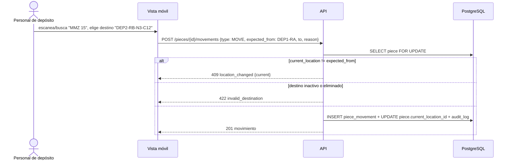

## Context

- `location` (árbol con `parent_id`, `level` SITE/SPACE/FURNITURE/SHELF_LEVEL/CONTAINER, `code` único, `is_active`, soft-delete) y `piece_movement` (solo inserción: MOVE, VERIFICATION, CORRECTION; origen, destino, motivo, responsable, fecha) ya existen, con `piece.current_location_id` desnormalizado.
- Niveles y codificación reales son `[SUPUESTO A7]`.
- Permisos sembrados: `locations.manage`, `movements.register`, `sensitive.exact_location`. `PUBLIC_LOCATION_LEVELS = {SITE, SPACE}` en `users/sensitive.py`.
- La vista móvil de la maqueta (`app/deposito`) ya define el flujo: buscar pieza → verificar o mover.

## Goals / Non-Goals

**Goals:**
- Ubicación actual siempre coherente con el historial (una sola fuente de verdad).
- Operación rápida desde el móvil con conexión lenta y sin pérdida silenciosa de movimientos.
- Reorganizar depósitos (mover un rack entero) sin perder trazabilidad por pieza.

**Non-Goals:**
- Préstamos y exposiciones (RF-018).
- Modo offline, QR, geolocalización.

## Decisions

### D1. Reglas de jerarquía por nivel
Padre permitido por nivel: SPACE→SITE, FURNITURE→SPACE, SHELF_LEVEL→FURNITURE, CONTAINER→FURNITURE|SHELF_LEVEL [SUPUESTO D4 vigente del modelo: una caja no cuelga directamente de un espacio; si la contraparte confirma cajas en el piso, se agrega SPACE a la tabla]. SITE sin padre. La regla vive en `locations/hierarchy.py` como tabla para ajustarla cuando la contraparte confirme niveles. El `code` se normaliza (mayúsculas, sin espacios dobles) y es único entre ubicaciones no eliminadas. `full_path` se calcula en lectura (CTE recursiva en PostgreSQL; bucle en SQLite para pruebas).

### D2. Ubicación actual derivada del movimiento

- `VERIFICATION` exige `to == current_location_id` y no cambia la ubicación.
- `CORRECTION` (permiso `locations.manage`) registra un movimiento que corrige un registro erróneo previo (`corrects_movement_id`, columna nueva); nunca edita el anterior.
- `expected_from` evita que dos personas registren movimientos cruzados sobre la misma pieza.
- *Alternativa*: calcular la ubicación actual con una vista sobre el último movimiento → consultas más caras en búsqueda y reportes; se mantiene la columna desnormalizada con prueba de consistencia.

### D3. Movimiento en lote
`POST /api/v1/movements/batch {type, to, reason, items:[{piece_id, expected_from}]}` en una única transacción; si alguna pieza falla, responde `409/422` con la lista de fallos por pieza y no registra ninguno. Límite de 200 piezas por lote. Idempotencia con cabecera `Idempotency-Key` (tabla `idempotency_key` con respuesta almacenada 24 h) para reintentos en conexión lenta (RNF-005).
*Alternativa*: resultados parciales → confunden a usuarios con baja alfabetización digital (RNF-010).

### D4. Reubicación de un nodo con piezas
`PATCH /locations/{id}` con nuevo `parent_id` cuando el subárbol contiene piezas exige `confirm_affected_count` igual al número de piezas afectadas; registra para cada pieza un `MOVE` con motivo "reubicación de <código>" y `origin_ref` común. Rechaza ciclos y padres de nivel no permitido. Desactivar o eliminar lógicamente una ubicación con piezas se rechaza (`409 location_not_empty`).

### D5. Tipo de espacio y disponibilidad
Columna nueva `location.space_kind` (DEPOSIT, EXHIBITION_ROOM, WORKSHOP, OTHER) solo para nivel SPACE [SUPUESTO]. Al mover a un espacio de tipo sala se propone la disponibilidad "en sala"; a depósito, "en depósito" (términos del vocabulario `AVAILABILITY` mapeados por configuración). Un cambio manual incoherente (p. ej. "en sala" con ubicación actual en depósito) se rechaza con `409 availability_incoherent`. La coherencia con préstamos queda para `prestamos-y-exposiciones`.

### D6. Enmascarado
El historial de movimientos y las respuestas de lote aplican el mismo enmascarado que la ficha: sin `sensitive.exact_location` solo se ven SITE y SPACE del origen y destino.

## Risks / Trade-offs

- **Niveles reales desconocidos (A7)** → tabla de reglas configurable y códigos libres.
- **Tabla de idempotencia** es infraestructura nueva → pequeña, con limpieza periódica; reutilizable por otros changes (documentar en ADR Propuesto).
- **Reubicar un rack con cientos de piezas** genera muchos registros → aceptable en volumen objetivo (RNF-015); una sola transacción.
- **CTE recursiva solo en PostgreSQL** → la verificación en compose es obligatoria cuando Docker esté disponible.
